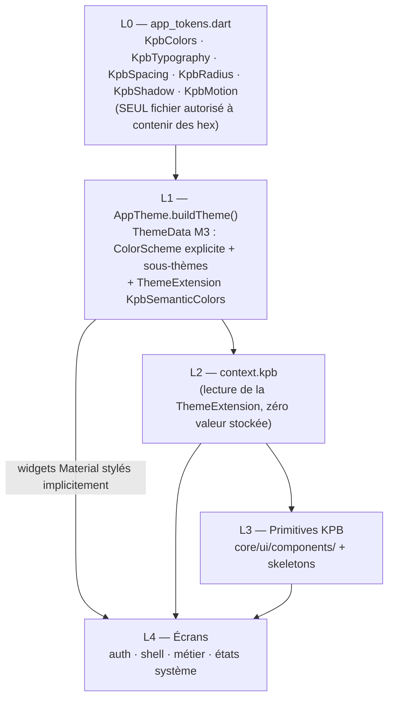

# Architecture — Système de thème global « KPB Intelligence » (app Flutter)

Statut : architecture de référence, prête à exécuter
Date : 16 juillet 2026
Auteur : Fable (audit mesuré sur le dépôt réel)
Complète : `docs/fable-global-theme-implementation-plan.md` (processus, phases, gates) et `design-qa.md` (source visuelle validée)
Périmètre : app Flutter (étudiant, parent, commercial). Hors périmètre : `backend/`, `admin/`, logique métier, dark mode (compilable mais non conçu), déploiement.

Ce document est la **spécification technique** : quelles couches, quels tokens avec quelles valeurs, quelles API de composants, quels mécanismes anti-régression, dans quel ordre, et avec quel modèle Claude. Le plan d'implémentation reste la référence pour les règles de travail et les gates opérationnels.

---

## 1. Résumé exécutif

1. **Deux lignées « KPB Intelligence » divergentes coexistent** : `main` (polices #134, restyling partiel #139–#144 avec hex locaux) et le checkout principal `codex/production-launch` (15 commits derrière `main`, 0 devant) portant ~4 000 lignes non commitées (écran d'entrée validé, tokens `engagement*`, module bourses V2, backend/admin/deploy). **Une décision de réconciliation Git est le préalable n°0** (§3) — c'est une décision humaine, pas une décision de Fable.
2. La migration est **beaucoup plus mécanique que prévu** : les ~30 écrans restylés sur `main` définissent des palettes locales (`_Palette`, `_C`, `_Amb`, `_P`) qui contiennent **déjà les valeurs KPB Intelligence** (`#0F172A`, `#2563EB`, `#E2E8F0`, `#F8FAFC`…). Les migrer = supprimer la palette locale et pointer les tokens centraux, à valeurs identiques.
3. Le **levier principal** est le *re-pointage des tokens existants* (`KpbColors.blue → #2563EB`, neutres gray → slate, `bgPage → #F8FAFC`…) : les 385 références `KpbColors.*` et tout le `ThemeData` basculent d'un coup, sans toucher les écrans (§6.2).
4. Architecture cible en **5 couches** : tokens → `ThemeData` (+ `ThemeExtension`) → `context.kpb` → primitives KPB → écrans. Chaque couche ne lit que la couche du dessous ; **seul `app_tokens.dart` a le droit de contenir des hexadécimaux** (§5).
5. `context.kpb` devient une **`ThemeExtension` Material** (`KpbSemanticColors`) : les 370 call-sites restent inchangés, la duplication d'hex de `kpb_theme_ext.dart` disparaît, le dark reste compilable (§8).
6. Anti-régression outillée : **test « ratchet » des couleurs** (budget d'hex par fichier, ne peut que décroître), tests tokens/thème/primitives, goldens tagués, contrastes WCAG calculés et verrouillés en test (§11).
7. Volumes mesurés (cette date, baseline `main`) : 625 occurrences `Color(0x` dans `lib/` (dont 488 dans 37 fichiers features), 121 refs `KpbColors.blue` (25 fichiers), 370 refs `context.kpb` (36 fichiers), 5 fichiers seulement avec branches dark.
8. Découpage en **10 lots livrables** (0bis + 1–9), chacun avec fichiers, risques et gates (§12).
9. **Modèle recommandé : Fable pour les fondations (lots 0bis–3) et la QA finale (lot 9) ; Opus 4.8 pour les lots d'écrans (4–8)**. Si un seul modèle pour tout : Fable. Sonnet 5 uniquement en exécutant supervisé de lots mécaniques (§14).

---

## 2. État réel du dépôt (audit mesuré du 16/07/2026)

### 2.1 Les deux lignées à réconcilier

| | `main` (HEAD `5d04173`) | Checkout principal : `codex/production-launch` (`8ae67f2`) + WIP |
|---|---|---|
| Position Git | référence | **15 commits derrière `main`, 0 devant** (ancêtre strict) |
| Polices Inter + PJS | **présentes** (#134, commit `0db3c40` : TTF + `pubspec.yaml` + `headingFamily`) | absentes (`assets/fonts/` vide, pubspec sans bloc fonts) |
| Tokens KPB Intelligence | absents de `core/ui` | **présents** : `engagementNavy #0F172A`, `engagementBlue #2563EB`, `engagementCanvas #F8FAFC`, `engagementBorder #E2E8F0`, `engagementMuted #64748B` (WIP `app_tokens.dart`) |
| Écran d'entrée KPB Intelligence | non | **oui, validé** (`design-qa.md` : passed ; `auth_welcome_screen.dart` +243 lignes WIP) |
| Écrans restylés KPB Intelligence | **~30 écrans** via palettes locales (#139 et autres) : profile, cases, universités, parcours, ambassador… | home/onboarding/notifications/live_scholarships/explore/program_detail/parent_case_view retouchés en WIP (versions divergentes de celles de `main`) |
| Bourses V2 | non (`scholarships/` : 2 écrans) | **oui, WIP** : `scholarship_detail_screen`, `scholarship_guide_info_screen`, `scholarship_video_player_screen`, `how_to_apply_sheet`, `scholarship_alert_button` + backend alerts/videos |
| Autre WIP | — | backend (migrations Prisma, scholarships-index…), admin, CI, iOS/Android config, logos PNG, docs (dont le plan lui-même, non tracké) |
| Volume WIP | — | **71 fichiers modifiés + 41 non trackés ≈ +4 000 / −1 273 lignes** |

Conséquence : le plan d'implémentation a été rédigé contre la lignée de droite. Quatre fichiers bourses listés au plan (§11 lot 5B) **n'existent que dans le WIP**, tandis que les polices que le plan demande de restaurer **sont déjà sur `main`**. L'architecture ci-dessous est valable pour les deux lignées ; seul le point de départ change (§3).

### 2.2 Inventaire quantitatif (baseline `main`)

Méthode : `grep -rEo 'Color\(0x' lib --include='*.dart'` et variantes ; comptages du 16/07/2026. (Les chiffres du plan — 463 hex, 115 `KpbColors.blue` — correspondaient à un instantané antérieur ; ordres de grandeur confirmés.)

| Mesure | Valeur |
|---|---|
| Occurrences `Color(0x` dans `lib/` | **625** (45 fichiers) |
| — dont `core/ui/` (tokens 47, ext 25, theme 20, composants/skeletons ~45) | ~137 |
| — dont `features/` | **488** (37 fichiers sur 84) |
| Fichiers features avec **palette locale** (`class _Palette`/`_C`/`_Amb`/`_P`) | **32** |
| Références `KpbColors.blue` | **121** (25 fichiers) |
| Références `KpbColors.*` (total) | 385 |
| Références `context.kpb` | **370** (36 fichiers) |
| Fichiers avec branches dark (`isDark ?`) | 5 (flight 7×, housing 4×, deadlines 4×, app_shell 2×, academy_course 1×) |
| Tests existants | 63 fichiers ; **aucun** test tokens/thème ; 1 seul test composant direct (`verified_badge_a11y_test.dart`) |
| CI | Flutter `stable` non pinné ; gate `dart format --set-exit-if-changed` |

Top des fichiers features par hex locaux : commercial_surface **38**, ambassador **37**, case_detail **23**, community **22**, profile **21**, parent_surface **21**, live_scholarships **20**, premium **19**, program_detail **19**, country_detail **19**, universities **18**, interview_simulator **18**, post_decision **18**, institution_compare **17**, notifications **16**, cases **16**, home **15**, ai_chat **15**.

Répartition par feature (hex) : cases **80**, explore **45**, commercial **38**, referral **37**, community **34**, tools **30**, parent **22**, profile **21**, scholarships **20**, premium **19**, universities **18**, compare **17**, notifications **16**, ai_advisor/home **15**, budget/onboarding **12**, parcours **11**, matches/travel **8**, search **7**, salon **2**, destinations **1**. Zéro hex : academy, alumni, auth, deadlines, eligibility, france, housing, legal, orientation, partners, saved, services, shell.

### 2.3 Constat clé : les palettes locales sont déjà la cible

Échantillons réels (`main`) :

```dart
// profile_screen.dart                    // cases_screen.dart
class _Palette {                          class _Palette {
  static const navy  = Color(0xFF0F172A);   static const navy   = Color(0xFF0F172A);
  static const blue  = Color(0xFF2563EB);   static const blue   = Color(0xFF2563EB);
  static const slate = Color(0xFF64748B);   static const slate  = Color(0xFF64748B);
  static const border= Color(0xFFE2E8F0);   static const border = Color(0xFFE2E8F0);
  static const page  = Color(0xFFF8FAFC);   static const page   = Color(0xFFF8FAFC);
  ...                                       static const chipBg = Color(0xFFEFF6FF);
```

Les ~30 écrans « déjà beaux » n'ont **pas besoin de redesign**, seulement de **dé-duplication** (palette locale → tokens centraux, valeurs identiques, rendu inchangé). Le vrai travail de re-skin porte sur les ~25 fichiers encore sur l'ancienne palette (`KpbColors.blue #004AAD`) — et il est obtenu quasi gratuitement par le re-pointage des tokens (§6.2).

### 2.4 État des fondations (`main`)

- `lib/main.dart` : `GetMaterialApp`, `theme: AppTheme.buildTheme()`, `themeMode: ThemeMode.light`, `darkTheme` **non branché** ; `textScaler` clampé **1.0–1.3** (déjà conforme à l'exigence a11y du plan) ; transition Cupertino 280 ms.
- `app_theme.dart` : `ThemeData` M3 complet (light + dark builders) — AppBar, Card, Chip, Input, 3 boutons, NavigationBar, Divider, ListTile, BottomSheet, Switch, Checkbox, Progress, TextTheme — mais sur l'**ancienne palette** (`primary #004AAD`, scaffold `#F4F6FB`). Sous-thèmes absents : SnackBar, Dialog, TabBar, Tooltip, PopupMenu, Radio, Slider, Drawer, FAB, SegmentedButton, IconButton, ElevatedButton.
- `app_tokens.dart` : `KpbColors` (brand, sémantique AA, neutres gray, dark surfaces, field accents d01..d12, gradients), `KpbSpacing`, `KpbRadius`, `KpbShadow`, `KpbTextStyles` (PJS titres + Inter corps, **déjà branchés** sur `main`).
- `kpb_theme_ext.dart` : `KpbThemeColors` switch light/dark avec **25 hex dupliqués** — c'est la duplication à éliminer (§8).
- Shell étudiant : nav flottante **custom** (`_KpbFloatingNavBar`, verre blanc .85, actif `KpbColors.blue`) — le `navigationBarTheme` du ThemeData est **mort** pour ce shell ; le composant devra consommer les tokens directement.
- `navigationBarTheme` reste utile pour d'éventuelles `NavigationBar` Material futures ; à maintenir aligné.

---

## 3. Décision n°0 — Réconciliation Git (gate bloquant, décision utilisateur)

Implémenter 9 lots de thème sur une branche 15 commits derrière `main`, pendant que `main` continue d'avancer, garantit des conflits massifs au retour (les mêmes écrans sont touchés des deux côtés : home, onboarding, notifications, live_scholarships, explore, program_detail, parent_case_view).

**Étape préalable inconditionnelle (quelle que soit l'option)** : sanctuariser le WIP — `git add -A && git commit` sur `codex/production-launch` (ou une branche `wip/production-launch-snapshot`). Une seule commande, réversible, protège 4 000 lignes contre toute fausse manipulation. *Le plan interdit à Fable de committer sans demande explicite : c'est donc une action à demander/valider par l'utilisateur avant le lot 1.*

| Option | Description | Avantages | Inconvénients | Verdict |
|---|---|---|---|---|
| **A — Atterrir le WIP d'abord** (recommandée) | Commit du WIP → PR(s) `codex/production-launch → main` (éventuellement découpée : visuel Flutter / bourses V2 / backend / deploy) → résolution des conflits → le thème part de `main` à jour | Une seule lignée ; les lots de thème deviennent des PRs propres contre `main` ; bourses V2 disponibles pour le lot 5 | Résolution de conflits immédiate (home, onboarding, notifications… divergents) ; le backend WIP doit être au moins compilable | ✅ le plus sain |
| B — In-place sur le WIP (lecture littérale du plan) | Thème implémenté directement dans le checkout `codex/production-launch` + WIP, sans réconciliation | Zéro friction au démarrage ; respecte le plan mot à mot | La dette de fusion **grossit à chaque lot** ; il faudra re-merger #134–#144 + 9 lots ; polices à restaurer depuis `0db3c40` ; double maintenance des écrans déjà restylés différemment sur `main` | ⚠️ acceptable seulement si la fusion vers `main` est planifiée très vite |
| C — Cherry-pick visuel seulement | Extraire du WIP la partie visuelle (entrée + tokens engagement + bourses V2 UI) vers une branche de `main` ; le backend/deploy WIP reste sur sa branche | Le thème part de `main` sans attendre le backend | Découpage délicat (bourses V2 UI dépend d'APIs du backend WIP) ; deux livraisons à suivre | ✅ bon plan B si le backend WIP n'est pas prêt |

L'architecture des §4–11 est **identique dans les trois options**. Différences résiduelles : en option B, ajouter au lot 1 la restauration des polices depuis `0db3c40` (fichiers listés au plan §7.1 — ne pas cherry-pick le commit en bloc) ; en options A/C, cette étape disparaît (polices déjà sur `main`).

---

## 4. Sources de vérité visuelle

1. `design-qa.md` (racine du checkout principal) — QA validée de l'écran d'entrée : navy `#0F172A`, action `#2563EB`, canvas `#F8FAFC`, border `#E2E8F0`, copy slate ; logo `assets/images/logo/kpb-education-logo-full.png` (non tracké, à embarquer avec le WIP).
2. Le tableau des rôles du plan §3 (repris et étendu en §6.1).
3. Les palettes locales des écrans déjà restylés (§2.3) — elles révèlent des rôles supplémentaires devenus canoniques : `#EFF6FF` (fond soft d'action/chip sélectionnée), `#F1F5F9` (surface muted/lignes), `#CBD5E1` (bordure forte), `#94A3B8` (texte faible/placeholder), `#1E3A8A` (fin de dégradé hero), `#38BDF8` (accent ciel décoratif).
4. **Le projet Claude Design « App engagement design »** (`claude.ai/design/p/b5611b41-d8d2-4243-a689-9acce03804d3`) — le handoff source. `KPB Prototype.dc.html` est la coquille interactive qui importe les cinq surfaces (`Student App[.EN]`, `Parent App`, `Commercial App`, `Ambassadeur App`, `Admin App` en `.dc.html`) ; le kit React (`uploads/…/src/index.css`, `tailwind.config.js`) porte les mêmes tokens. Vérifié le 16/07/2026 : palette et typo **identiques** à ce document (`--primary #2563EB`, `--foreground #0F172A`, `--border #E2E8F0`, `--muted #F1F5F9`, `--muted-foreground #64748B`, `#F8FAFC`, Inter + Plus Jakarta Sans, Button `primary|secondary|ghost|destructive` + loading/fullWidth ≈ `KpbButtonVariant`).

**Écarts assumés vs le kit design** (normalisations volontaires, cohérentes avec les tokens « WCAG AA tuned » déjà en place dans le repo) :

| Rôle | Kit design (web) | App Flutter (ce doc) | Raison |
|---|---|---|---|
| success | `#16A34A` | `#047857` | 3,30:1 sur blanc = échec AA texte (§10.2) |
| warning | `#F59E0B` | `#B45309` (`#F59E0B` reste `gold` accent) | 2,15:1 sur blanc = échec AA texte |
| error/destructive | `#DC2626` | `#B91C1C` | standard repo existant, 6,47:1 |
| info | `#0EA5E9` | `actionPrimary`/`actionPrimarySoft` (KpbStatusChip) | `#0EA5E9` reste `businessSky` (accent domaine) |
| radius / hauteurs boutons | sm 6 · md 10 · lg 16 ; h 32/40/48 (échelle web/admin) | `KpbRadius` (8/12/16/20/28) ; CTA 52 px | les maquettes **mobiles** `.dc.html` et l'écran d'entrée validé utilisent l'échelle mobile |

⚠️ Pièges du projet design : (a) les fichiers `lib/**/*.dart` qu'il embarque sont un **instantané de l'ancien repo** (palette `#004AAD`, sans `headingFamily`) fourni comme contexte au designer — ne jamais les « importer » comme implémentation ; (b) la surface `Admin App` correspond à l'admin Next.js, **hors périmètre** de ce chantier Flutter ; (c) les maquettes utilisent Material Symbols **Rounded** — préférer les variantes `Icons.*_rounded` lors des migrations quand l'écran en utilise déjà.

Le bleu historique `#004AAD` est **rétrogradé** : conservé uniquement comme `brandBlueLegacy` pour un visuel de marque explicitement validé (logo, PDF générés — `eligibility_pdf.dart` l'utilise). Il ne doit plus être une couleur d'action. *(Note : ceci remplace la consigne mémoire « primary = #004AAD » ; la direction KPB Intelligence est la décision la plus récente.)*

---

## 5. Architecture cible — vue en couches



Règles de dépendance (opposables en revue et par le test ratchet §11.1) :

| Couche | A le droit de | N'a JAMAIS le droit de |
|---|---|---|
| L0 tokens | définir des hex, des familles, des tailles | dépendre de `BuildContext`, de widgets, du métier |
| L1 ThemeData | lire L0 | contenir un hex hors L0 (exception : `Colors.transparent/white/black` utilitaires) |
| L2 `context.kpb` | lire la ThemeExtension de L1 | stocker une valeur ; brancher sur `brightness` avec des hex |
| L3 primitives | lire L2/L1, exposer des **variantes sémantiques** | hex en dur ; couleur arbitraire par paramètre non justifié métier |
| L4 écrans | consommer L1 implicite, L2, L3 ; tokens `field accents`/`decor*` pour du décoratif validé | hex en dur (hors allowlist commentée) ; palette locale ; redéfinir un style de bouton/carte/champ |

Principe : **un écran ne choisit jamais une nuance, il demande un rôle.**

---

## 6. L0 — Spécification des tokens (`app_tokens.dart`)

### 6.1 Rôles sémantiques canoniques

Nouveaux noms (tous `static const` dans `KpbColors`) :

| Token | Valeur | Rôle | Notes |
|---|---|---|---|
| `brandNavy` | `#0F172A` | marque, textes forts, heros sombres, FAB Coach | = slate-900 |
| `brandBlueLegacy` | `#004AAD` | héritage marque (logo, PDF) | usage soumis à allowlist |
| `actionPrimary` | `#2563EB` | CTA, liens, sélection, focus | blue-600 |
| `actionPrimaryPressed` | `#1D4ED8` | état pressed/hover | blue-700 ; blanc dessus = 6,70:1 |
| `actionPrimarySoft` | `#EFF6FF` | fonds soft d'action : chip sélectionnée douce, pill nav, ligne sélectionnée | blue-50 ; `actionPrimary` dessus = 4,75:1 |
| `canvas` | `#F8FAFC` | fond de page | slate-50 |
| `surface` | `#FFFFFF` | cartes, sheets, inputs | |
| `surfaceMuted` | `#F1F5F9` | fonds atténués, lignes internes, tracks | slate-100 |
| `border` | `#E2E8F0` | bordure par défaut | slate-200 |
| `borderStrong` | `#CBD5E1` | bordure appuyée (inputs actifs, tableaux) | slate-300 |
| `textPrimary` | `#0F172A` | texte principal | 17,85:1 sur blanc |
| `textSecondary` | `#475569` | texte secondaire | slate-600 ; 7,58:1 sur blanc |
| `textMuted` | `#64748B` | texte tertiaire | slate-500 ; 4,76:1 blanc / 4,55:1 canvas — limite basse AA, ne pas éclaircir |
| `textFaint` | `#94A3B8` | placeholders, décor | slate-400 ; **2,56:1 = jamais pour du texte porteur de sens** |
| `textOnDark` | `#FFFFFF` | texte sur navy/hero | |
| `textOnDarkMuted` | `#94A3B8` | secondaire sur navy | 6,96:1 sur navy |
| `success` / `successLight` | `#047857` / `#ECFDF5` | inchangés | 5,48:1 blanc ; 5,21:1 sur light |
| `warning` / `warningLight` | `#B45309` / `#FFFBEB` | inchangés | 5,02:1 / 4,84:1 |
| `error` / `errorLight` | `#B91C1C` / `#FEF2F2` | inchangés | 6,47:1 / 5,91:1 |
| `gold` / `goldLight` | `#F59E0B` / `#FFF8E7` | accent premium/bourses | **jamais en texte sur clair** (2,15:1) ; texte ambre = `warning` |
| `whatsapp` | `#25D366` | marque externe WhatsApp (CTA conseiller) | allowlist marque |
| `decorSky` | `#38BDF8` | accent ciel décoratif (illustrations, icônes de fond) | jamais texte (2,14:1) |

Conservés tels quels : field accents d01..d12 (`csBlue`, `businessSky`, `engineeringTeal`, `medRed`, `designOrange`, `lawPurple`, `financeGreen`, `marketingPink`), `sand`, surfaces dark (`bgDarkMidnight`, `bgDarkCard`, `glassBorder`, `glassBg`).

### 6.2 Re-pointage des tokens existants — le levier principal

On **ne renomme pas** les tokens consommés 385 fois ; on **change leurs valeurs** vers l'échelle slate/blue cible. Un seul diff dans `app_tokens.dart` re-skinne ThemeData + tous les composants `[STATIC]` + tous les écrans à `KpbColors.*` :

| Token existant | Ancienne valeur | **Nouvelle valeur** | Effet |
|---|---|---|---|
| `blue` | `#004AAD` | **`#2563EB`** (= `actionPrimary`) | les 121 call-sites « action » deviennent corrects par défaut |
| `blueMid` | `#2D5FBA` | `#1D4ED8` | pressed |
| `navy` | `#1E3A6E` | `#0F172A` | heros, Coach FAB, drawer |
| `sky` | `#4EADEA` | `#38BDF8` | accent décoratif |
| `skyLight` | `#E8F5FD` | `#EFF6FF` | fonds soft d'action |
| `bgPage` | `#F4F6FB` | `#F8FAFC` | scaffold global |
| `bgMuted` | `#F3F4F6` | `#F1F5F9` | |
| `textPrimary` | `#0F1729` | `#0F172A` | (quasi identique) |
| `textSecondary` | `#6B7280` | `#475569` | |
| `textMuted` | `#6B7280` | `#64748B` | |
| `gray50` | `#F9FAFB` | `#F8FAFC` | |
| `gray100` | `#F3F4F6` | `#F1F5F9` | |
| `gray200` | `#E5E7EB` | `#E2E8F0` | bordures par défaut |
| `gray300` | `#D1D5DB` | `#CBD5E1` | |
| `gray400` | `#9CA3AF` | `#94A3B8` | |
| `gray500` | `#6B7280` | `#64748B` | |
| `gray600` | `#4B5563` | `#475569` | |
| `gray700` | `#374151` | `#334155` | |
| `gray900` | `#111827` | `#0F172A` | |
| `heroGradient` | `[navy, blue, sky]` | `[#0F172A, #1E3A8A]` | aligne le hero sur le précédent validé de `parcours_story` (`heroEnd #1E3A8A`) ; **à confirmer visuellement au lot 4 (Home)** |
| `heroGradientDark` | `[#0F1E3D, navy]` | `[#0B1120, #0F172A]` | |
| `KpbShadow.blue` | `0x26004AAD` | `0x262563EB` | ombre des CTA |

Points d'attention du re-pointage :

- **Audit des 121 `KpbColors.blue`** : après re-pointage, presque tous sont corrects (action/accent). Passer la liste (§2.2, top : explore 18, orientation 14, academy_course 8, housing 7, search 5…) pour repérer les rares usages « marque héritée » à basculer explicitement sur `brandBlueLegacy` (attendu : ~0 côté Flutter ; le PDF d'éligibilité utilise déjà son propre `PdfColor` et n'est pas concerné).
- Les 5 fichiers à branches `isDark ?` (§2.2) lisent parfois `KpbColors.*` dans la branche light : re-pointage sans risque ; les branches dark seront simplifiées lors de leurs lots (livraison light-only).
- Le re-pointage est un **big-bang visuel volontaire** en Phase 2 du plan : il est encadré par la baseline de captures (Phase 0) et la revue des 5 onglets au gate de Phase 2.

### 6.3 Aliases de compatibilité (à retirer au lot 9 si zéro référence)

```dart
// WIP entrée (design validé) — même rendu, nouveaux noms
static const engagementNavy   = brandNavy;
static const engagementBlue   = actionPrimary;
static const engagementCanvas = canvas;
static const engagementBorder = border;
static const engagementMuted  = textMuted;
// Historiques
static const primary      = actionPrimary;   // était `blue`
static const primaryLight = actionPrimarySoft;
```

### 6.4 Typographie — `KpbTypography`

Le plan demande `KpbTypography.bodyFamily/headingFamily`. La classe `KpbTextStyles` existe et est référencée partout → **ne pas renommer** ; ajouter :

```dart
typedef KpbTypography = KpbTextStyles;          // accès statique via l'alias (Dart ≥ 2.15)
// dans KpbTextStyles :
static const bodyFamily    = 'Inter';
static const headingFamily = 'PlusJakartaSans'; // déjà présent sur main
```

Échelle cible (familles/valeurs — les 9 mappings existants gardent leurs tailles pour éviter le churn ; couleurs via tokens) :

| Slot Material | Style KPB | Famille | Taille/Graisse | Interligne | Couleur |
|---|---|---|---|---|---|
| displayLarge | display | PJS | 32 / w800 | 1.2 / −0.5 | textPrimary |
| displayMedium | displaySm | PJS | 28 / w800 | 1.2 / −0.4 | textPrimary |
| displaySmall *(nouveau)* | — | PJS | 26 / w800 | 1.25 | textPrimary |
| headlineLarge *(nouveau)* | — | PJS | 26 / w700 | 1.25 | textPrimary |
| headlineMedium | headline | PJS | 24 / w700 | 1.25 / −0.3 | textPrimary |
| headlineSmall *(nouveau)* | — | PJS | 20 / w700 | 1.3 | textPrimary |
| titleLarge | title | PJS | 18 / w700 | 1.3 | textPrimary |
| titleMedium | titleMd | Inter | 16 / w600 | 1.3 | textPrimary |
| titleSmall *(nouveau)* | — | Inter | 14 / w600 | 1.3 | textPrimary |
| bodyLarge / bodyMedium | body | Inter | 15 / w400 | 1.5 | textPrimary |
| bodySmall | bodySm | Inter | 13 / w400 | 1.4 | textSecondary |
| labelLarge | label | Inter | 12 / w600 | ls 0.4 | textSecondary |
| labelMedium *(nouveau)* | labelSm | Inter | 11 / w600 | ls 0.3 | textSecondary |
| labelSmall | caption | Inter | 12 / w400 | 1.4 | textMuted |

`titleLg (22)` et `displaySm (28)` restent disponibles hors TextTheme. En option B (§3), le lot 1 restaure d'abord les TTF + le bloc `fonts:` du pubspec depuis `0db3c40` (liste exacte au plan §7.1).

### 6.5 Espacements, rayons, ombres, mouvement

- `KpbSpacing`, `KpbRadius` (xs 8 · sm 12 · md 16 · lg 20 · xl 28 · pill), `KpbShadow` (card/float/soft/blue) : **inchangés** (déjà conformes).
- Nouveau `KpbMotion` : `fast = 120ms`, `base = 200ms`, `page = 280ms` (aligné sur la transition GetX existante), `curve = Curves.easeOutCubic`. Interdiction de durées ad hoc dans les écrans.

---

## 7. L1 — `ThemeData` cible (`app_theme.dart`)

### 7.1 ColorScheme — explicite, pas `fromSeed`

`fromSeed` génère des tonalités non maîtrisées ; on fige chaque rôle :

```dart
const ColorScheme.light(
  primary: KpbColors.actionPrimary,      onPrimary: Colors.white,
  primaryContainer: KpbColors.actionPrimarySoft, onPrimaryContainer: KpbColors.actionPrimaryPressed,
  secondary: KpbColors.brandNavy,        onSecondary: Colors.white,
  tertiary: KpbColors.gold,              onTertiary: KpbColors.brandNavy,
  error: KpbColors.error,                onError: Colors.white,
  errorContainer: KpbColors.errorLight,  onErrorContainer: KpbColors.error,
  surface: KpbColors.surface,            onSurface: KpbColors.textPrimary,
  onSurfaceVariant: KpbColors.textSecondary,
  outline: KpbColors.border,             outlineVariant: KpbColors.surfaceMuted,
  surfaceTint: Colors.transparent,       // tue les teintes M3 sur les élévations
  inverseSurface: KpbColors.brandNavy,   onInverseSurface: Colors.white,
)
```

### 7.2 Sous-thèmes (tableau normatif)

| Sous-thème | Spécification |
|---|---|
| `scaffoldBackgroundColor` | `canvas` |
| `appBarTheme` | transparent sur canvas, `foregroundColor: textPrimary`, elevation 0, `surfaceTintColor` transparent, titre **PJS 20 w700 navy**, `centerTitle: false` |
| `cardTheme` | `surface`, elevation 0, `shape: RoundedRectangleBorder(lgBr, side: BorderSide(color: border))`, margin zero (l'ombre douce vient de `KpbCard`, pas de Material.elevation) |
| `filledButtonTheme` | bg `actionPrimary`, fg blanc, **minimumSize `Size.fromHeight(52)`**, radius md, textStyle Inter 15 w600, `overlayColor`/pressed → `actionPrimaryPressed`, disabled bg `surfaceMuted` + fg `textFaint` |
| `elevatedButtonTheme` | **aligné sur FilledButton** (rattrape les call-sites hérités), elevation 0 |
| `outlinedButtonTheme` | fg `textPrimary`, side `borderStrong`, bg `surface`, min 52, radius md |
| `textButtonTheme` | fg `actionPrimary`, Inter 14 w600 ; `tapTargetSize.shrinkWrap` **réservé aux contextes inline** (règle §11.6) |
| `inputDecorationTheme` | fill `surface`, enabled `border`, focused `actionPrimary` 1.5, error `error`, label `textSecondary`, hint `textMuted`, radius md, padding 16/14 |
| `chipTheme` | sélectionnée : bg `actionPrimary`, label blanc w600 ; non sélectionnée : bg `surfaceMuted`, label `textPrimary` w600, side `border` ; pill |
| `navigationBarTheme` | bg `surface`, indicator `actionPrimarySoft`, sélection `actionPrimary`, repos **`textMuted`** (pas `textFaint` : icônes porteuses de sens ⇒ ≥ 3:1) |
| `bottomSheetTheme` | `surface`, radius top xl (28), drag handle |
| `dialogTheme` *(nouveau)* | `surface`, radius lg (20), titre PJS 18 w700 |
| `snackBarTheme` *(nouveau)* | bg `brandNavy`, texte blanc Inter 14, action `#93C5FD` (9,9:1 sur navy — constante locale du thème dérivée de tokens : `Color.lerp` interdit, définir `snackAction` dans KpbColors si besoin), floating, radius sm |
| `tabBarTheme` *(nouveau)* | label `actionPrimary` w600, unselected `textMuted`, indicator `actionPrimary` (2 px arrondi), divider `border` |
| `tooltipTheme` *(nouveau)* | bg `brandNavy` 92 %, texte blanc 12 |
| `popupMenuTheme` / `menuTheme` *(nouveau)* | `surface`, radius sm, side `border`, elevation faible |
| `drawerTheme` *(nouveau)* | bg `canvas` |
| `floatingActionButtonTheme` *(nouveau)* | bg `actionPrimary`, fg blanc, radius md ; le Coach FAB reste `brandNavy` (choix produit, via token) |
| `switchTheme` / `checkboxTheme` / `radioTheme` *(radio nouveau)* | sélection `actionPrimary`, repos `borderStrong`/`surfaceMuted` |
| `progressIndicatorTheme` | couleur `actionPrimary`, track `surfaceMuted`, linearMinHeight 8 |
| `dividerTheme` | `surfaceMuted`, épaisseur 1 |
| `listTileTheme` | padding h 16 ; `iconColor: textSecondary` |
| `iconTheme` *(nouveau)* | `textSecondary`, 22 |
| `segmentedButtonTheme` *(nouveau)* | sélection : bg `actionPrimarySoft` + fg `actionPrimary` ; repos : `surface` + `textSecondary` ; side `border` |
| `badgeTheme` | bg `error`, texte blanc |
| `splashFactory` | `InkRipple.splashFactory` (InkSparkle = shader coûteux sur Android d'entrée de gamme) |
| `textTheme` | tableau §6.4 |

`buildDarkTheme()` : conservé compilable, mêmes re-pointages mécaniques quand ils s'appliquent, **aucune conception** (verrou du plan). `main.dart` : inchangé (`ThemeMode.light`, pas de `darkTheme:` branché).

---

## 8. L2 — `context.kpb` devient une `ThemeExtension`

**ADR** : remplacer l'implémentation de `KpbThemeColors` (switch `brightness` + 25 hex dupliqués) par une `ThemeExtension` Material, **sans changer l'API des 370 call-sites**.

```dart
class KpbSemanticColors extends ThemeExtension<KpbSemanticColors> {
  // pageBg, cardBg, mutedBg, inputBg, surfaceBg,
  // textPrimary, textSecondary, textMuted,
  // divider, border, borderLight, gray50..gray500,
  // successLight, warningLight, errorLight, goldLight, skyLight,
  // cardShadow, softShadow  — mêmes getters qu'aujourd'hui
  static const light = KpbSemanticColors(
    pageBg: KpbColors.canvas, cardBg: KpbColors.surface, /* … tout depuis KpbColors, zéro hex … */
  );
  static const dark = KpbSemanticColors(/* valeurs dark actuelles, regroupées ici, non conçues */);
  @override copyWith/lerp — standard.
}

extension KpbThemeContext on BuildContext {
  KpbSemanticColors get kpb =>
      Theme.of(this).extension<KpbSemanticColors>() ?? KpbSemanticColors.light;
}
```

- `AppTheme.buildTheme()` enregistre `extensions: const [KpbSemanticColors.light]` (dark builder → `.dark`).
- Le fallback `?? .light` garde les tests widget minimalistes (sans `MaterialApp`) verts.
- Les styles `ts*` de l'extension sont re-basés sur `KpbTextStyles` (familles incluses — aujourd'hui ils omettent la famille : bug silencieux corrigé).
- `kpb_theme_ext.dart` ne contient plus **aucun** hexadécimal (vérifié par le ratchet §11.1).
- Bénéfices : source unique à l'exécution, `lerp` gratuit pour plus tard, testable via `ThemeData` seul. Variante minimale (garder le switch mais lire les tokens) documentée et **non retenue** : elle laisse deux chemins de résolution.

---

## 9. L3 — Primitives KPB (spécification par composant)

Audit complet effectué (33 composants + skeletons + shell). Légende : `[OK]` déjà conforme après re-pointage L0 · `[MAJ]` mise à niveau nécessaire.

### 9.1 Composants structurants

**`KpbButton` `[MAJ]`** — API actuelle : `label/text`, `onTap/onPressed`, `icon`, `fullWidth=false`, `secondary=false`, `loading`, `backgroundColor/bgColor/textColor` ; primaire figé sur `KpbColors.blue`, hauteur ~46 px, implémentation Material+InkWell maison.
Cible :
```dart
enum KpbButtonVariant { primary, secondary, tertiary, destructive }
KpbButton({ label, onPressed, variant = .primary, icon, fullWidth = false,
            loading = false, /* compat: */ @Deprecated secondary, bgColor…, textColor… })
```
- Implémentation **façade sur FilledButton/OutlinedButton/TextButton** → hérite états, overlay pressed, disabled, min 52 px et a11y du thème ; plus aucune couleur locale.
- `secondary: true` mappe sur `variant: .secondary` ; les params couleurs restent fonctionnels mais dépréciés (chaque usage restant = dette listée à l'allowlist).
- `loading` : spinner 18 px `onPrimary`/`actionPrimary` selon variante + `onPressed` neutralisé ; `destructive` : bg `error`.

**`KpbCard` `[OK+]`** — la logique sentinelle actuelle (défauts theme-aware, overrides respectés) est bonne. Ajouter `variant { standard, interactive, highlighted }` : `interactive` = wrap `KpbPressable` (scale 0.97 + haptique) ; `highlighted` = side `actionPrimary` 1.5 + bg `actionPrimarySoft`. Conserver `padding/margin/borderRadius/shadow`.

**`KpbStatusChip` *(nouveau)*** — `enum KpbStatus { success, warning, error, info, neutral }` → (fg, bg, side, icône) : success/`successLight`, warning/`warningLight`, error/`errorLight`, info = `actionPrimary`/`actionPrimarySoft`, neutral = `textSecondary`/`surfaceMuted`. Remplace les paires ad hoc `green/greenBg` des écrans. `compact: bool`.

**`SectionHeader` `[MAJ]`** — titre déjà PJS via `KpbTextStyles.title`. Corriger le ternaire mort (les deux branches valent `KpbColors.blue`) → action `actionPrimary`, et respecter `textColor` fourni (cas hero sombre → `textOnDark`).

**`KpbPageScaffold` / `KpbPageHeader` / `KpbSectionCard` *(nouveaux, différés)*** — ne les créer **qu'au moment où le lot 4 démontre la répétition** (règle du plan : pas de primitive si l'existant s'étend proprement). API esquissée : `KpbPageScaffold({ appBar/header, body, padding = 20, banners = true })` — canvas + SafeArea + slot bannières offline/sample.

### 9.2 Badges et indicateurs

| Composant | État | Action |
|---|---|---|
| `KpbBadge` | `[OK]` | défauts `color: KpbColors.blue → actionPrimary` (auto via re-pointage) |
| `KpbBadgeLight` | `[OK]` | défauts `skyLight/blue` → `actionPrimarySoft/actionPrimary` (auto) |
| `MatchBadge` | `[MAJ]` | tiers : ≥80 `success`, ≥60 **`warning`** (au lieu de `gold` texte, 2,15:1), sinon **`actionPrimary`** (au lieu de `sky`, illisible en texte) |
| `ScholarshipStatusBadge` | `[OK]` | sémantique métier intacte (open/closingSoon/closed → success/warning/error) |
| `VerifiedBadge` | `[OK]` | déjà sémantique + a11y (seul composant testé — modèle à suivre) |
| `AdmissionMeter` | `[MAJ]` | anneau par score OK ; track : remplacer `Colors.white .08 / black .06` par `surfaceMuted`/`textFaint` α |
| `CompletionRing` | `[OK]` | caller-driven assumé (usage hero) ; documenter |

### 9.3 Bannières et états système (sémantique intouchable, apparence unifiée)

| Composant | Problème | Cible |
|---|---|---|
| `KpbOfflineBanner`, `KpbSampleDataBanner` | `KpbColors.warning*` statiques directs | lire `context.kpb.warningLight` + `warning` ; icône + texte 13 w600 ; hauteur stable |
| `KpbSyncErrorBanner` | mixte | idem ; bouton retry = TextButton thémé (cible tactile §11.6) |
| `KpbAntiFraudNotice` | statique | tokens via `context.kpb` ; TextButton signalement ≥ 44 px |
| `KpbEmptyState` / `KpbErrorState` | quasi OK | icône par défaut `actionPrimary`/`error` via tokens ; CTA = `KpbButton` |
| `skeleton.dart` | **4 hex inline** brightness-keyed | base `border` (#E2E8F0), highlight `surfaceMuted` (#F1F5F9) via `context.kpb` |
| `skeleton_loader.dart` | fill inline blanc | base `gray200→` tokens, fill `surface` |

### 9.4 Cartes métier et divers

| Composant | Action |
|---|---|
| `CountryCard`, `QuickActionTile`, `KpbDivider`, `KpbNetworkImage`, `KpbInfoRow`, `KpbEmptyState` | `[OK]` après re-pointage (déjà `context.kpb`) |
| `FieldCard` | garder `accentColor` (field accents d01..d12 = couleur métier documentée) ; retirer les `Colors.white` inline au profit de `textOnDark` |
| `InstitutionMiniCard`, `ScholarshipMiniCard` | **dark-only par design** (rails sur hero navy). Garder le style sombre mais **sourcer depuis les tokens** (`bgDarkCard`, `glassBorder`, `textOnDarkMuted`) + entrée allowlist « surface immersive » |
| `GradientHeroCard` | défaut `heroGradient` re-pointé ; ombre `KpbShadow.blue` re-pointée |
| `KpbInputDecoration` | déléguer au `inputDecorationTheme` global (ne garder que label/prefix plumbing) |
| `KpbRefresh` | couleur `actionPrimary`, bg `surface` (tokens) |
| `VerifiedAdvisorSheet` | remplacer les 4 verts inline (`#DCFCE7/#BBF7D0/#16A34A/#14532D`) par `successLight`/`success` (normalisation AA §10.2) ; CTA WhatsApp → token `whatsapp` (allowlist marque) |
| `SourceLink` | `actionPrimary` (auto) |
| `ComingSoonScreen` | tokens texte (auto) |
| `kpb_components.dart` (barrel) | compléter les exports manquants (anti_fraud, coming_soon, mini-cards, status/verified badges, source_link, advisor_sheet, sample_data_banner) |
| Params morts (`isSaved/onSave/careers` de Country/FieldCard) | **ne pas toucher** (hors périmètre thème) ; noter en dette |

### 9.5 Shell, navigation, FAB (lot 3)

- `_KpbFloatingNavBar` (app_shell) : verre clair conservé, valeurs → tokens : bg `surface` α .85, bordure `Colors.white` α .5 → `surface`/`glassBorder` clair, actif `actionPrimary`, pill `actionPrimarySoft`, **repos `textMuted`** (icônes signifiantes ⇒ ≥ 3:1 ; `gray400`/`textFaint` échoue à 2,56:1), badge `error`. Clé de test `kpb_shell_nav_bar` conservée (utilisée par `shell_navigation_test`). Pas de blur ajouté (Android entrée de gamme).
- `KpbToolsDrawer` : bg `canvas`, accents outils via tokens re-pointés (auto).
- `CoachFab` : `brandNavy` (auto via re-pointage de `navy`) — distinctif voulu.
- `commercial_shell` → `CommercialSurfaceScreen` : traité au lot 8.
- `app_boot_screen` : routage pur, pas de slideshow réintroduit (verrou plan) ; vérifier canvas du splash.

---

## 10. L4 — Règles de migration des écrans

### 10.1 Arbre de décision par couleur rencontrée

```
Couleur locale rencontrée
├─ rôle commun (fond, carte, bordure, texte, bouton, input, chip) ?
│    → SUPPRIMER : le widget Material thémé ou la primitive KPB suffit (souvent zéro code)
├─ rôle sémantique nommé ?               → context.kpb.* / token rôle (§6.1)
├─ statut métier (dossier, bourse, éligibilité) ?
│    → primitive à variante (KpbStatusChip, ScholarshipStatusBadge…) — JAMAIS re-mapper la signification
├─ accent décoratif/domaine documenté ?  → field accent d01..d12, decorSky, gold…
├─ marque externe (WhatsApp, Google) ?   → token dédié + allowlist
└─ aucun des cas                          → STOP : question à l'humain, pas d'invention
```

### 10.2 Mapping standard des palettes locales (annexe B, appliqué ~32 fois)

| Constante locale récurrente | Valeur | Remplacement |
|---|---|---|
| `navy` | `#0F172A` | `KpbColors.brandNavy` / `c.textPrimary` selon usage (texte vs fond) |
| `blue` | `#2563EB` | `actionPrimary` |
| `blueSoft`, `chipBg` | `#EFF6FF` | `actionPrimarySoft` |
| `page`/`pageBg` | `#F8FAFC` | `c.pageBg` (ou rien : scaffold thémé) |
| `card` | `#FFFFFF` | `c.cardBg` (ou `KpbCard`) |
| `border` | `#E2E8F0` | `c.border` |
| `subtle`/`line` | `#F1F5F9` | `c.mutedBg` / divider thémé |
| `slate` | `#64748B` | `c.textMuted` |
| `slate400` | `#94A3B8` | `textFaint` (décor) — si texte porteur : **remonter à `textMuted`** |
| `slate300` | `#CBD5E1` | `borderStrong` |
| `amber` | `#B45309` | `warning` |
| `amberSoft` | `#FDE68A` | `warningLight`/`goldLight` selon contexte |
| `green` | `#16A34A` | **normalisation → `success` (#047857)** : 3,30:1 = échec AA texte |
| `greenBg` | `#DCFCE7` | `successLight` (#ECFDF5) |
| `red` | `#B91C1C`/`#DC2626` | `error` |
| `rose` | `#DB516A` | `medRed` (field accent existant) |
| `sky` | `#38BDF8` | `decorSky` (décor uniquement) |
| `gold` (texte) | `#B45309` | `warning` |
| `whatsapp` | `#25D366` | `KpbColors.whatsapp` |
| `heroEnd` | `#1E3A8A` | stop de `heroGradient` |
| `cardShadow` locaux | divers | `c.cardShadow` / `KpbShadow.card` |

Les deux normalisations (`green→success`, tiers du `MatchBadge`) sont les **seuls changements de rendu volontaires** de la migration mécanique ; les documenter dans le rapport de progression avec capture avant/après.

### 10.3 Interdictions (rappel + ajouts)

Celles du plan §15, plus : pas de nouvelle palette locale même « temporaire » ; pas de `Color.lerp`/`withValues` pour fabriquer une nuance non tokenisée (α sur un token = OK) ; pas de `Colors.grey[x]` ; `textFaint` jamais pour un texte porteur de sens ; `tapTargetSize.shrinkWrap` réservé aux liens inline dans un paragraphe.

### 10.4 Exceptions et allowlist

Surfaces autorisées à rester sombres/spécifiques (plan §14) précisées par l'audit :

- `academy_player_screen` : zone vidéo noire volontaire (« cinematic ») — conserver ; AppBar/liste/fallback = tokens.
- Rails hero (`InstitutionMiniCard`, `ScholarshipMiniCard`) : sombres par design, via tokens dark.
- `document_viewer_screen` : **déjà clair** (contrairement à l'hypothèse du plan) — migration standard légère.
- `eligibility_pdf.dart` : génération PDF (`PdfColor`), garde `#004AAD` marque → allowlist.
- WhatsApp `#25D366`, overlays caméra/scanner, WebView, graphiques `fl_chart` (séries distinctes), illustrations.

Chaque exception = une ligne dans `docs/theme-color-allowlist.md` : fichier, valeur, raison, date. Le test ratchet (§11.1) fait respecter la liste.

---

## 11. Anti-régression et outillage de test

### 11.1 Test « ratchet » des couleurs — `test/core/ui/color_audit_test.dart`

Mécanisme (sans dépendance nouvelle, exécuté par `flutter test` en CI) :

1. Scanne `lib/**/*.dart` via `dart:io` + regex `Color\(0x`.
2. Compare au **budget committé** `test/core/ui/color_budget.dart` : `const colorBudget = { 'lib/app/core/ui/app_tokens.dart': 50, 'lib/app/features/cases/case_detail_screen.dart': 23, … }` (généré à l'initialisation = état courant).
3. Échec si un fichier **dépasse** son budget ou si un fichier **hors budget** contient un hex ; message : « nouvelle couleur en dur interdite — utilise un token (§6) ou l'allowlist ».
4. Après chaque lot de migration, le lot **abaisse les budgets** correspondants (idéalement à 0) — le compteur ne remonte jamais.
5. Échappatoire explicite : ligne suffixée `// kpb-allow-color: <raison>` ignorée par le scan (réservée à l'allowlist §10.4).
6. Le même test vérifie : `kpb_theme_ext.dart` = 0 hex ; `app_theme.dart` = 0 hex hors `Colors.transparent/white/black`.

C'est la traduction exécutable de « toute couleur hors allowlist est une dette » (plan §14).

### 11.2 Tests tokens — `test/core/ui/app_tokens_test.dart`

- Valeurs exactes des rôles (§6.1) et des re-pointages (§6.2) ; aliases `engagement*`/`primary` ; familles `bodyFamily`/`headingFamily` ; `KpbMotion`.
- **Contrastes calculés** (fonction de luminance WCAG embarquée dans le test) — seuils verrouillés :

| Paire | Ratio mesuré | Exigence |
|---|---|---|
| textPrimary / surface · canvas | 17,85 · 17,06 | ≥ 4,5 |
| textSecondary / surface · canvas | 7,58 · 7,24 | ≥ 4,5 |
| textMuted / surface · canvas | 4,76 · 4,55 | ≥ 4,5 |
| blanc / actionPrimary · Pressed | 5,17 · 6,70 | ≥ 4,5 |
| actionPrimary (texte) / surface · canvas · Soft | 5,17 · 4,94 · 4,75 | ≥ 4,5 |
| blanc / success · warning · error | 5,48 · 5,02 · 6,47 | ≥ 4,5 |
| success/successLight · warning/warningLight · error/errorLight | 5,21 · 4,84 · 5,91 | ≥ 4,5 |
| textOnDark · textOnDarkMuted / brandNavy | 17,85 · 6,96 | ≥ 4,5 |
| gold / brandNavy (accent) | 8,31 | ≥ 3 |

(`textMuted/surfaceMuted` = 4,34 : réserver aux textes ≥ 18 px ou passer `textSecondary` — règle documentée dans le test.)

### 11.3 Tests thème — `test/core/ui/app_theme_test.dart`

Brightness light ; primary/scaffold/surface/error exacts ; `fontFamily` Inter global ; titre AppBar PJS ; extension `KpbSemanticColors` enregistrée et == `.light` ; FilledButton min 52 + radius ; Outlined side `borderStrong` ; Input focus `actionPrimary` ; Chip sélectionnée/repos ; `surfaceTint` transparent ; `splashFactory` InkRipple.

### 11.4 Tests primitives et écrans

- Widget tests des variantes/états : `KpbButton` (4 variantes × loading/disabled/icon, hauteur ≥ 52, compat `secondary:`), `KpbCard` (3 variantes), `KpbStatusChip` (5 statuts), `MatchBadge` (3 tiers), bannières (rendu + sémantique), skeletons (tokens).
- Adapter les tests existants qui assertent l'UI : `shell_navigation_test` (clé nav conservée), `student_browse_restyle_test`, `notifications_screen_test`, `live_scholarships_screen_test`, `cases_screen_stability_test`, `salon_screen_test`, `aha_moment_screen_test`, `verified_badge_a11y_test`.
- Chaque lot d'écrans ajoute/adapte ses smoke tests (liste du plan §16).

### 11.5 Goldens / captures de référence

- `matchesGoldenFile` natif (pas de package). Chargement des TTF du repo via `FontLoader` dans le harness (`flutter_test_config.dart`) pour un rendu texte réel.
- Goldens générés et comparés **en local macOS** ; tagués `@Tags(['golden'])`. En CI Linux le rendu diffère → exécuter `flutter test --exclude-tags=golden` (une ligne à ajouter au workflow, déjà modifié dans le WIP) ou garder les goldens hors CI dans un premier temps. Décision pragmatique à acter au lot 1.
- Surfaces : les 9 du plan §16 (entrée, onboarding, Home connecté, bourses liste/détail, universités, dossiers, profil, vide, erreur/offline), FR partout + EN sur les surfaces critiques (mémoire i18n : auditer aussi le français sans accents).
- La **baseline avant migration** (Phase 0 du plan) sert de référence de comparaison manuelle pour le big-bang du lot 1.

### 11.6 Accessibilité (verrous)

- Text scale : clamp global 1.0–1.3 déjà en place (`main.dart`) ; chaque gate de lot vérifie 1.3 sans overflow à 360 px.
- Cibles tactiles ≥ 48 dp : boutons thémés 52 ; auditer les `shrinkWrap` (TextButton du thème, retry des bannières, actions de `SectionHeader`).
- Icônes signifiantes ≥ 3:1 (d'où nav repos = `textMuted`).
- `Semantics` sur actions icon-only (modèle : `VerifiedBadge`, `SourceLink`).
- Jamais d'information portée par la seule couleur (statuts = icône + libellé, déjà le cas des badges).

---

## 12. Séquencement — 10 lots livrables

Mapping sur l'ordre du plan §19, corrigé par l'audit. Une PR = un lot = une session. Gates du plan §11/§15 applicables à chaque lot.

| Lot | Contenu | Fichiers clés | Taille | Risque | Notes d'audit |
|---|---|---|---|---|---|
| **0bis** | Réconciliation Git (§3) + Phase 0 du plan (baseline, captures, rapport de progression) | — | S | **bloquant** | décision utilisateur ; sanctuariser le WIP d'abord |
| **1** | Tokens re-pointés + rôles + aliases + `KpbTypography` + `KpbMotion` + ThemeData complet + `KpbSemanticColors` + tests tokens/thème + **ratchet + budgets initiaux** (+ polices si option B) | `app_tokens.dart`, `app_theme.dart`, `kpb_theme_ext.dart`, (+`pubspec.yaml`), 3 nouveaux fichiers test | **L** | **élevé** (big-bang visuel volontaire) | zéro écran touché ; revue visuelle des 5 onglets au gate |
| **2** | Primitives §9 (KpbButton variantes, KpbCard variantes, KpbStatusChip, badges, bannières, skeletons, input_decoration, barrel) + tests widget | ~18 fichiers `components/` + skeletons | M/L | moyen | compat `secondary:` obligatoire (call-sites existants) |
| **3** | Entrée + onboarding + boot + shells + drawer + Coach FAB + connectivity | fichiers plan §10 ; nav flottante → tokens | M | moyen+ | l'écran d'entrée validé passe sur aliases **sans changement de rendu** (golden avant/après) |
| **4** | Lot 5A plan : Home, recherche, universités, explore, pays, programme, comparaison, enregistrés **+ destinations** | 10 écrans (~140 hex) | **L** | moyen | hero Home : valider `heroGradient` §6.2 |
| **5** | Lot 5B plan : bourses (liste, éligibilité + **V2 WIP** : détail, guide, vidéo, how-to-apply, alertes) | selon option §3 | M | moyen | V2 n'existe qu'après réconciliation |
| **6** | Lot 5C plan : dossiers (80 hex — le plus gros), notifications, profil | 10 fichiers | **L** | moyen+ | statuts métier intouchables (timeline, review) |
| **7** | Phase 6 plan : simulateurs + contenu + outils (budget, housing, travel, eligibility, deadlines, orientation×2, matches, france ; community×2, parcours×2, academy×2, premium, referral, salon, services, ai_chat ; tools×6) | ~25 écrans (~110 hex) | **XL** mais mécanique | faible/moyen | supprimer les branches `isDark` inutiles (flight/housing/deadlines/academy) ; exception vidéo academy_player |
| **8** | Parent + commercial + **ambassador_screen (37 hex, absent du plan — à ajouter)** + allowlist finale | parent×3, commercial_surface (38 hex), ambassador | M/L | moyen | mémoire : surface Ambassadeur = programme cash distinct, sémantique à préserver |
| **9** | QA transverse : goldens FR/EN, a11y 1.3/360 px, budgets ratchet à l'état final, retrait des aliases morts, vérif fichiers zéro-hex (academy, alumni, saved, services…), build APK release + vérif appareil (plan §17) | — | M | faible | APK : ne jamais réutiliser un artefact antérieur de `build/` |

Dépendances strictes : 0bis → 1 → 2 → 3 → (4…8 parallélisables par sessions distinctes si nécessaire, mais recommandés en séquence) → 9.

### Prompt type de lancement d'un lot (à adapter)

```text
Implémente le LOT <n> défini dans docs/fable-global-theme-architecture.md (§9/§10/§12)
en respectant les règles du plan docs/fable-global-theme-implementation-plan.md (§4, §15).
Baseline : <branche>. Ne touche ni backend/ ni admin/ ni les routes ni la logique métier.
À la fin : dart format lib test ; flutter analyze ;
flutter test --dart-define=KPB_ENABLE_REMOTE_SYNC=false ; abaisse les budgets du ratchet ;
mets à jour docs/fable-global-theme-implementation-progress.md ; ne commit pas sans demande.
```

---

## 13. Risques et mitigations

| # | Risque | Mitigation |
|---|---|---|
| 1 | **Perte du WIP non commité (4 000 lignes)** | sanctuarisation commit avant toute action (§3) ; jamais de reset/checkout destructif (règle plan) |
| 2 | Divergence des deux lignées s'aggrave pendant les lots | option A/C §3 ; lots courts mergés vite ; jamais deux lots ouverts en parallèle sur les mêmes fichiers |
| 3 | Big-bang visuel du lot 1 casse un écran non prévu | baseline Phase 0 ; revue manuelle 5 onglets ; goldens ; le re-pointage ne touche pas les hex locaux (les écrans restylés sont immunisés par construction) |
| 4 | Un usage « marque » de `KpbColors.blue` devient #2563EB à tort | audit dédié des 121 refs au lot 1 ; `brandBlueLegacy` disponible ; PDF non concerné (`PdfColor` séparé) |
| 5 | Régression de l'écran d'entrée validé | aliases `engagement*` = mêmes valeurs ; golden avant/après au lot 3 ; interdiction de retoucher la composition |
| 6 | CI rouge sur le format | `dart format lib test` avant chaque fin de lot (gate `--set-exit-if-changed`) |
| 7 | Flutter `stable` non pinné → dépréciations API (`CardThemeData`, `withValues`, etc.) | `flutter analyze` à chaque lot ; pas de warning ignoré ; noter la version locale dans le rapport de progression |
| 8 | Perf Android entrée de gamme | pas de blur/glass ajouté, `InkRipple`, ombres légères (KpbShadow), pas de gradient systématique (interdits §10.3) |
| 9 | Overflows à text scale 1.3 / 360 px | gate par lot ; clamp global déjà en place |
| 10 | Nouveaux libellés non localisés | le thème n'introduit pas de copy ; si inévitable, FR+EN via `app_translations` (mémoire : guard i18n biaisé accents) |
| 11 | Goldens instables en CI Linux | tag `golden` + exécution locale documentée (§11.5) |
| 12 | APK périmé livré | horodatage de l'artefact + procédure appareil (plan §17) |

---

## 14. Quel modèle pour l'implémentation ?

### Réponse directe

**Un seul modèle pour tout : Fable.** Le risque dominant de ce chantier n'est pas la difficulté du code (elle est modérée) mais la **densité de jugement** : classer 625 couleurs par rôle sans jamais changer une signification métier, préserver un WIP fragile de 4 000 lignes, tenir 10 lots cohérents sur la durée, et s'arrêter aux bons endroits (gates, allowlist, aucune invention). C'est exactement le profil où l'écart entre modèles se paie en régressions silencieuses.

### Optimisation coût/vitesse (recommandée si le budget compte)

| Lots | Modèle | Pourquoi |
|---|---|---|
| **0bis, 1, 2, 3** (réconciliation, tokens/ThemeData, primitives, shell+entrée) | **Fable** | décisions à rayon d'action global : re-pointage (§6.2), API compat `KpbButton`, ThemeExtension, chirurgie Git autour du WIP, protection de l'écran validé |
| **4, 5, 6, 7, 8** (migration des écrans) | **Opus 4.8** | travail volumineux mais **patronisé** : le mapping §10.2 est mécanique, le ratchet et les tests bordent les erreurs ; Opus excelle ici pour ~⅓ du coût de Fable |
| **9** (QA finale, goldens, build, retrait aliases) | **Fable** | jugement transversal final, arbitrages d'allowlist, DoD |

### Et Sonnet 5 ?

Pas pour ce chantier en autonomie. Sonnet est viable **uniquement** sur les lots les plus mécaniques (7, éventuellement 4) *après* que les lots 1–3 ont verrouillé le patron, avec le mapping §10.2 dans le prompt et une relecture par Opus/Fable (`/code-review`) avant merge. Le gain marginal ne justifie pas le risque sur les lots 1–3, 6 (statuts dossiers) et 8 (sémantique Ambassadeur/commercial).

Notes d'exécution : 1 lot = 1 session = 1 PR contre `main` ; pas de « fast mode » nécessaire (il exécute Opus) ; entre deux lots, relire le rapport de progression avant de lancer le suivant.

---

## 15. Definition of Done (complète le plan §18)

Ajouts à la DoD du plan :

- [ ] Ratchet actif en CI, budgets = 0 pour tous les écrans migrés, allowlist committée et à jour ;
- [ ] `kpb_theme_ext.dart` et `app_theme.dart` : zéro hex (vérifié par test) ;
- [ ] Aliases `engagement*`/`primary` retirés si zéro référence (sinon listés avec justification) ;
- [ ] Tests contrastes §11.2 verts ; goldens FR (+EN critiques) committés ;
- [ ] Les 2 normalisations volontaires (green→success, MatchBadge) documentées avec captures ;
- [ ] Rapport `docs/fable-global-theme-implementation-progress.md` complet (fichiers, tests, écarts, horodatage APK).

---

## Annexe A — Commandes de validation (par lot et finales)

```bash
# à chaque fin de lot
dart format lib test
flutter analyze
flutter test --dart-define=KPB_ENABLE_REMOTE_SYNC=false   # inclut le ratchet
flutter test --tags=golden                                # local macOS uniquement

# build final (plan §17)
flutter build apk --debug --dart-define=KPB_APP_ENV=prod --dart-define=KPB_WHATSAPP_NUMBER=+33768674292
flutter clean && flutter pub get
flutter build apk --release --split-per-abi --dart-define=KPB_APP_ENV=prod
```

## Annexe B — Rappels d'audit utiles pendant la migration

- 32 fichiers à palette locale, 4 noms de classe : `_Palette` (majorité), `_C` (commercial), `_Amb` (ambassador), `_P` (parent) ; `eligibility_simulator_screen.dart` a un `Color get _color` par verdict (→ `KpbStatusChip`/tokens sémantiques).
- Fichiers du plan **inexistants sur `main`** (présents uniquement dans le WIP bourses V2) : `scholarship_detail_screen.dart`, `scholarship_guide_info_screen.dart`, `scholarship_video_player_screen.dart`, `widgets/how_to_apply_sheet.dart`, `widgets/scholarship_alert_button.dart`.
- Écrans à ajouter aux lots (absents du plan) : `referral/ambassador_screen.dart` (37 hex, lot 8), `destinations/destinations_screen.dart` (lot 4), `cases/document_viewer_screen.dart` (lot 6, léger), `salon` (2 hex, lot 7).
- Features déjà « propres » (0 hex — vérification seulement) : academy, alumni, auth, deadlines, eligibility, france, housing, legal, orientation, partners, saved, services, shell.
- Le `navigationBarTheme` du ThemeData n'est **pas** consommé par la nav flottante custom du shell étudiant — la nav se migre par tokens dans son widget (lot 3).
