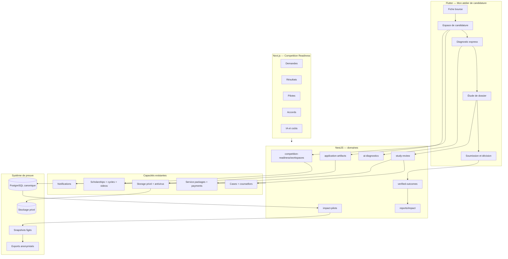

# KPB Education — architecture complète d’implémentation `kpb-competition-readiness`

Statut : plan d’exécution de référence, prêt à être confié à Codex/Fable  
Version : 1.0  
Date : 16 juillet 2026  
Marché initial : Afrique francophone  
Surfaces : Flutter mobile, API NestJS/Prisma/PostgreSQL, admin Next.js  
Nom étudiant recommandé : **Mon atelier de candidature**  
Nom interne du programme : **Scholarship Success Lab / Competition Readiness**

---

## 0. Décision exécutive

Le projet ne doit pas créer une quatrième plateforme ni remplacer les parcours
existants. Il doit ajouter une couche de préparation, de preuve et de pilotage
autour des briques déjà présentes : bourses, profil, matching, alertes, vidéos,
dossiers, documents, conseillers, services et paiements.

La tranche gagnante est le parcours suivant :

```mermaid
flowchart LR
    A["Bourse compatible"] --> B["Préparer ma candidature"]
    B --> C["Checklist et documents"]
    C --> D["Un diagnostic IA express"]
    D --> E["Demande gratuite d’étude du dossier"]
    E --> F["Tri par un conseiller KPB"]
    F -->|"échange utile"| G["Créneau proposé"]
    F -->|"autonomie suffisante"| H["Actions gratuites"]
    G --> I["Accompagnement payant proposé après étude"]
    H --> J["Candidature soumise"]
    I --> J
    J --> K["Décision envoyée par l’établissement"]
    K --> L["Preuve vérifiée par KPB"]
    L --> M["Impact publiable et dossier de concours"]
```



La première livraison est considérée réussie si elle permet de démontrer, sans
chiffre fabriqué :

1. qu’un étudiant pertinent a commencé et progressé dans une candidature ;
2. qu’il a reçu au maximum un conseil IA ciblé, borné et mesurable ;
3. qu’un conseiller a étudié la demande avant toute vente ;
4. qu’une soumission et une décision peuvent être déclarées puis vérifiées ;
5. que KPB peut produire des cohortes et KPI auditables pour un concours.

## 1. Décisions produit non négociables

| Sujet | Décision figée | Conséquence technique |
| --- | --- | --- |
| Marché | Afrique francophone d’abord | Français complet, anglais conservé ; segmentation pays et faible connectivité |
| Décision d’admission | L’établissement décide et envoie la décision | KPB ne crée jamais une admission ; KPB vérifie seulement une preuve fournie |
| Conseil KPB | Assistance et tri humain | Une demande d’étude précède l’accès aux créneaux et à une offre |
| Gratuit | Information, matching, checklist, suivi, un diagnostic express | Aucun paywall avant la première valeur utile |
| Payant | Accompagnement après étude du dossier | Pas d’achat impulsif présenté comme condition pour candidater |
| IA | Une seule amélioration prioritaire par candidature/cycle | Pas de chat illimité dans l’Atelier ; quota atomique et résultat mis en cache |
| Pédagogie | Positionnement EdTech sans changer le modèle | Micro-apprentissage actionnable et mesure de progression, pas un LMS séparé |
| Partenaires | Les partenaires existants sont réutilisés | Un affichage `isPartner` ou un logo ne prouve pas un accord signé |
| Impact | Seulement des résultats vérifiables | `Case.completed` ne vaut ni admission ni bourse obtenue |
| Mineurs | Protection renforcée | Consentement responsable légal et restrictions document/IA selon l’âge |

## 2. Objectifs et non-objectifs

### 2.1 Objectifs P0

- créer un espace de candidature par étudiant, bourse et cycle ;
- suivre les étapes et artefacts sans créer prématurément un dossier commercial ;
- offrir un diagnostic IA one-shot, structuré et plafonné ;
- permettre une demande gratuite d’étude, son tri et la proposition de créneaux ;
- convertir vers un `Case` et un service payant seulement après étude ;
- enregistrer séparément soumission, décision d’admission et financement ;
- vérifier les preuves et calculer des KPI auditables ;
- donner à l’admin un seul centre opérationnel de pilotage ;
- lancer par feature flags et cohorte pilote.

### 2.2 P1

- registre des accords partenaires et capacités de vérification ;
- gestion complète de cohortes pilotes et évaluations pré/post ;
- exports anonymisés pour dossiers de concours ;
- automatisations de relance et rappels de résultats ;
- tests utilisateurs et preuves de faible connectivité.

### 2.3 P2

- expériences contrôlées et comparaison de cohortes ;
- langues locales ou parcours vocal après recherche utilisateur ;
- intégrations partenaires de vérification, uniquement avec accord formel ;
- recommandations pédagogiques supplémentaires, payantes ou humaines, après
  validation du coût et de l’efficacité.

### 2.4 Hors périmètre

- prédire la probabilité d’admission ;
- auto-postuler au nom de l’étudiant ;
- modifier une décision d’établissement ;
- ouvrir un chat IA illimité ;
- mettre des passeports ou relevés de notes dans un prompt par défaut ;
- déclarer un partenariat signé depuis un simple `Institution.isPartner` ;
- reconstruire le catalogue de bourses ou le système de paiement ;
- publier des statistiques de petits groupes permettant une réidentification.

## 3. Vérité actuelle du dépôt et stratégie de réutilisation

| Capacité actuelle | Source | Décision |
| --- | --- | --- |
| Catalogue, critères, avantages, cycles | `Scholarship`, `ScholarshipCycle` | Réutiliser comme référentiel de l’Atelier |
| Étapes de candidature | `ScholarshipApplicationStep` | Utiliser comme modèles ; persister l’état étudiant séparément |
| Vidéos YouTube | `ScholarshipVideo` | Réutiliser, lecture à la demande sans autoplay |
| Alertes et notifications | `ScholarshipAlertSubscription`, `UserNotification` | Réutiliser pour les échéances et relances consenties |
| Profil, consentement IA, mineurs | `UserProfile` | Réutiliser les consentements ; renforcer les politiques par fonctionnalité |
| Matching explicable | `Match`, `MatchExplanation` | Afficher l’adéquation, jamais comme probabilité d’acceptation |
| Dossiers et documents commerciaux | `Case`, `CaseDocument` | Conserver pour l’accompagnement ; créer des artefacts gratuits en amont |
| Conseillers | `Counsellor` et `Case.counsellorId` | Réutiliser pour affectation et conversion |
| Rendez-vous | `Appointment` | Étendre ; ne plus laisser l’Atelier créer un créneau arbitraire directement |
| Services et paiement | `ServicePackage`, `ServicePurchase`, `PaymentIntent` | Déclencher seulement après tri humain |
| Partenaires publics | `Partner`, `Institution.isPartner` | Conserver l’affichage ; ajouter un registre privé des accords |
| IA | `LlmService` sur Groq | Étendre en fournisseur agnostique, JSON borné et usage mesuré |
| Quota Coach | mémoire processus, 5/semaine | Ne pas réutiliser tel quel ; quota Atelier persistant et atomique |
| Impact public | `ImpactService` | Corriger la sémantique des admissions |
| Reporting | `ReportsService` | Ajouter les outcomes vérifiés et cohortes |
| Feature config | `GET /config/app` | Étendre par drapeaux runtime, avec défauts fail-closed |
| Analytics | contrat Dart + GA4 | Étendre les constantes ; PostgreSQL reste la source des outcomes |

### 3.1 Règles d’intégration

1. Les migrations sont additives et compatibles avec les anciennes versions.
2. Une seule équipe/agent possède `schema.prisma` et les contrats partagés à la fois.
3. Aucun backfill ne convertit automatiquement un `Case.completed` en admission.
4. Aucun backfill ne convertit automatiquement `isPartner=true` en accord signé.
5. Les nouveaux endpoints sont versionnés par contrat, pas par duplication de l’API.
6. Le mobile et l’admin tolèrent les champs absents pendant le déploiement progressif.
7. Les feature flags backend sont désactivés par défaut en production jusqu’au pilote.

## 4. Architecture cible



### 4.1 Contextes bornés

| Contexte | Responsabilité | Ne doit pas faire |
| --- | --- | --- |
| Workspace | progression d’une candidature | déclarer l’admission |
| Artifacts | fichiers/version/scan/ownership | remplacer les documents d’un `Case` payé |
| AI Diagnostic | une amélioration structurée | conseil juridique, prédiction, chat |
| Study Review | tri gratuit et passage humain | encaisser avant analyse |
| Outcomes | soumission/décision/preuve | inférer un résultat depuis le statut du dossier |
| Partnerships | preuve d’accord et capacités | transformer un logo en contrat |
| Pilots | cohortes, consentements, mesures | utiliser GA4 comme registre d’admission |
| Reporting | agrégats et exports | exposer PII ou petits groupes |

## 5. Modèle de données Prisma cible

Les noms ci-dessous sont contractuels. Les enums sont en anglais pour rester
cohérents avec le schéma ; les libellés sont traduits côté client.

### 5.1 Enums

```prisma
enum ScholarshipWorkspaceStatus {
  started
  preparing
  ready_for_review
  review_requested
  submitted
  decision_received
  archived
}

enum WorkspaceStepStatus {
  not_started
  in_progress
  completed
  skipped
}

enum ApplicationArtifactKind {
  cv
  motivation_letter
  essay
  recommendation_letter
  transcript
  diploma
  language_test
  passport
  portfolio
  other
}

enum ArtifactProcessingStatus {
  pending_upload
  uploaded
  scanning
  clean
  rejected
  extraction_failed
}

enum AiDiagnosticStatus {
  pending
  running
  succeeded
  deterministic_fallback
  failed
  blocked
}

enum StudyReviewStatus {
  draft
  submitted
  triaged
  more_information_needed
  call_offered
  scheduled
  converted_to_case
  autonomy_recommended
  declined
  closed
}

enum EvidenceVerificationStatus {
  self_reported
  pending
  verified
  needs_information
  rejected
}

enum AdmissionDecision {
  admitted
  rejected
  waitlisted
  deferred
  withdrawn
}

enum FundingDecision {
  full
  partial
  none
  pending
  not_applicable
}

enum PartnershipAgreementStatus {
  prospect
  letter_of_intent
  signed
  active
  expired
  terminated
}

enum PilotStatus {
  draft
  recruiting
  active
  analysis
  completed
  archived
}
```

### 5.2 Espace de candidature

```prisma
model ScholarshipWorkspace {
  id                  String                     @id @default(cuid())
  userId              String
  scholarshipId       String
  scholarshipCycleId  String
  status              ScholarshipWorkspaceStatus @default(started)
  readinessPercent    Int                        @default(0)
  startedAt           DateTime                   @default(now())
  lastActivityAt      DateTime                   @default(now())
  submittedAt         DateTime?
  decisionReceivedAt  DateTime?
  archivedAt          DateTime?
  createdAt           DateTime                   @default(now())
  updatedAt           DateTime                   @updatedAt

  user                UserProfile                @relation(fields: [userId], references: [id], onDelete: Cascade)
  scholarship         Scholarship                @relation(fields: [scholarshipId], references: [id], onDelete: Restrict)
  scholarshipCycle    ScholarshipCycle           @relation(fields: [scholarshipCycleId], references: [id], onDelete: Restrict)
  steps               ScholarshipWorkspaceStep[]
  artifacts           ApplicationArtifact[]
  diagnostics         AiDiagnostic[]
  reviewRequests      StudyReviewRequest[]
  submissions         ApplicationSubmission[]
  decisions           ApplicationDecisionRecord[]
  cohortMemberships   ImpactCohortMembership[]

  @@unique([userId, scholarshipId, scholarshipCycleId])
  @@index([userId, status, lastActivityAt])
  @@index([scholarshipCycleId, status])
}

model ScholarshipWorkspaceStep {
  id                 String                 @id @default(cuid())
  workspaceId        String
  applicationStepId  String
  status             WorkspaceStepStatus    @default(not_started)
  completedAt        DateTime?
  clientMutationId   String?                @unique
  createdAt          DateTime               @default(now())
  updatedAt          DateTime               @updatedAt

  workspace          ScholarshipWorkspace   @relation(fields: [workspaceId], references: [id], onDelete: Cascade)
  applicationStep    ScholarshipApplicationStep @relation(fields: [applicationStepId], references: [id], onDelete: Restrict)

  @@unique([workspaceId, applicationStepId])
  @@index([workspaceId, status])
}
```

#### Invariants

- `scholarshipCycleId` doit appartenir à `scholarshipId` ; validation service + transaction.
- Le workspace est créé par upsert ; deux doubles taps retournent le même ID.
- `readinessPercent` est déterministe, entier de 0 à 100, jamais une chance d’admission.
- Le calcul recommandé est pondéré par configuration : profil 15 %, critères
  compris 15 %, étapes 35 %, documents obligatoires 35 %.
- Une étape `skipped` exige un motif et n’augmente la progression que si elle
  est explicitement optionnelle.
- Le passage à `submitted` ne se fait qu’à partir d’une `ApplicationSubmission`.
- Le passage à `decision_received` ne se fait qu’à partir d’une décision déclarée.

### 5.3 Artefacts gratuits et versions immuables

```prisma
model ApplicationArtifact {
  id                 String                    @id @default(cuid())
  workspaceId        String
  kind               ApplicationArtifactKind
  title              String
  currentVersionId   String?
  createdAt          DateTime                  @default(now())
  updatedAt          DateTime                  @updatedAt

  workspace          ScholarshipWorkspace      @relation(fields: [workspaceId], references: [id], onDelete: Cascade)
  versions           ApplicationArtifactVersion[] @relation("ArtifactVersions")

  @@unique([workspaceId, kind, title])
  @@index([workspaceId, kind])
}

model ApplicationArtifactVersion {
  id                 String                    @id @default(cuid())
  artifactId         String
  versionNumber      Int
  storageKey         String                    @unique
  originalFileName   String
  mimeType           String
  sizeBytes          Int
  sha256             String
  processingStatus   ArtifactProcessingStatus  @default(pending_upload)
  extractedText      String?
  rejectionCode      String?
  uploadedAt         DateTime?
  createdAt          DateTime                  @default(now())

  artifact           ApplicationArtifact       @relation("ArtifactVersions", fields: [artifactId], references: [id], onDelete: Cascade)

  @@unique([artifactId, versionNumber])
  @@index([artifactId, createdAt])
  @@index([processingStatus])
}
```

`currentVersionId` est validé au niveau service car Prisma ne modélise pas
simplement une relation circulaire vers la collection. Le stockage conserve une
clé privée, jamais une URL publique permanente. Les URLs signées expirent en
quelques minutes et sont émises après contrôle d’ownership/RBAC.

Types acceptés en P0 : PDF, DOCX et image JPEG/PNG ; taille maximale configurable,
10 Mo par défaut. Une analyse antivirus et une validation du type réel sont
obligatoires avant lecture, téléchargement interne ou diagnostic IA.

### 5.4 Diagnostic IA et registre de coût

```prisma
model AiDiagnostic {
  id                    String              @id @default(cuid())
  workspaceId           String
  artifactVersionId     String?
  entitlementKey        String              @unique
  status                AiDiagnosticStatus  @default(pending)
  documentKind          ApplicationArtifactKind?
  strengthFr            String?
  strengthEn            String?
  priorityImprovementFr String?
  priorityImprovementEn String?
  rationaleFr           String?
  rationaleEn           String?
  nextActionFr          String?
  nextActionEn          String?
  criterionReferences   Json?
  provider              String?
  model                 String?
  promptVersion         String
  fallbackReason        String?
  startedAt             DateTime?
  completedAt           DateTime?
  createdAt             DateTime            @default(now())
  updatedAt             DateTime            @updatedAt

  workspace             ScholarshipWorkspace @relation(fields: [workspaceId], references: [id], onDelete: Cascade)
  artifactVersion       ApplicationArtifactVersion? @relation(fields: [artifactVersionId], references: [id], onDelete: SetNull)
  usage                 AiUsageLedger?

  @@index([workspaceId, createdAt])
  @@index([status, createdAt])
}

model AiUsageLedger {
  id                    String       @id @default(cuid())
  diagnosticId          String       @unique
  requestKey            String       @unique
  feature               String
  provider              String
  model                 String
  promptVersion         String
  inputTokens           Int?
  outputTokens          Int?
  totalTokens           Int?
  latencyMs             Int?
  estimatedCostMicrosUsd BigInt?
  providerRequestId     String?
  outcome               String
  errorCode             String?
  createdAt             DateTime     @default(now())

  diagnostic            AiDiagnostic @relation(fields: [diagnosticId], references: [id], onDelete: Cascade)

  @@index([feature, createdAt])
  @@index([provider, model, createdAt])
  @@index([outcome, createdAt])
}
```

Règles d’entitlement :

- la clé gratuite est `workspace:<workspaceId>:free-diagnostic:v1` ;
- l’unicité en base empêche deux appels facturés lors d’un double tap ;
- seul `succeeded` ou `deterministic_fallback` ferme le parcours gratuit ;
- un timeout technique autorise une reprise avec la même clé et le même
  enregistrement, dans une limite anti-abus ;
- une nouvelle version de prompt ne recrée pas automatiquement un droit gratuit ;
- un override administrateur crée une clé distincte, une raison et un audit ;
- le résultat existant est retourné sans nouvel appel fournisseur.

### 5.5 Étude de dossier et rendez-vous proposés

```prisma
model StudyReviewRequest {
  id                    String            @id @default(cuid())
  workspaceId           String
  userId                String
  requestNumber         Int
  status                StudyReviewStatus @default(draft)
  assignedCounsellorId  String?
  studentMessage        String?
  preferredContact      String?
  timezone              String            @default("Africa/Niamey")
  availability          Json?
  triageSummary         String?
  missingItems          Json?
  internalNotes         String?
  submittedAt           DateTime?
  triagedAt             DateTime?
  closedAt              DateTime?
  resultingCaseId       String?
  resultingPurchaseId   String?
  createdAt             DateTime          @default(now())
  updatedAt             DateTime          @updatedAt

  workspace             ScholarshipWorkspace @relation(fields: [workspaceId], references: [id], onDelete: Cascade)
  user                  UserProfile       @relation(fields: [userId], references: [id], onDelete: Cascade)
  assignedCounsellor    Counsellor?       @relation(fields: [assignedCounsellorId], references: [id], onDelete: SetNull)
  resultingCase         Case?             @relation(fields: [resultingCaseId], references: [id], onDelete: SetNull)
  resultingPurchase     ServicePurchase?  @relation(fields: [resultingPurchaseId], references: [id], onDelete: SetNull)
  slotOffers            StudyReviewSlotOffer[]

  @@unique([workspaceId, requestNumber])
  @@index([status, submittedAt])
  @@index([assignedCounsellorId, status])
  @@index([userId, createdAt])
}

model CounsellorAvailabilitySlot {
  id              String      @id @default(cuid())
  counsellorId    String
  startsAt        DateTime
  endsAt          DateTime
  timezone        String
  capacity        Int         @default(1)
  bookedCount     Int         @default(0)
  status          String      @default("available")
  createdAt       DateTime    @default(now())
  updatedAt       DateTime    @updatedAt

  counsellor      Counsellor  @relation(fields: [counsellorId], references: [id], onDelete: Cascade)
  offers          StudyReviewSlotOffer[]

  @@unique([counsellorId, startsAt, endsAt])
  @@index([counsellorId, status, startsAt])
}

model StudyReviewSlotOffer {
  id              String      @id @default(cuid())
  reviewRequestId String
  slotId          String
  offeredAt       DateTime    @default(now())
  expiresAt       DateTime
  selectedAt      DateTime?
  createdAt       DateTime    @default(now())

  reviewRequest   StudyReviewRequest @relation(fields: [reviewRequestId], references: [id], onDelete: Cascade)
  slot            CounsellorAvailabilitySlot @relation(fields: [slotId], references: [id], onDelete: Restrict)

  @@unique([reviewRequestId, slotId])
  @@index([slotId, expiresAt])
}
```

Champs additifs sur `Appointment` :

```prisma
model Appointment {
  // champs existants conservés
  counsellorId    String?
  reviewRequestId String?
  slotId          String?
  endsAt          DateTime?
  timezone        String?
  bookingKey      String? @unique
}
```

Le service réserve un slot dans une transaction avec contrôle
`bookedCount < capacity`. La création directe historique de rendez-vous reste
compatible pour les autres parcours, mais l’Atelier ne l’appelle jamais avant
`call_offered`. Une contrainte métier empêche un conseiller non affecté de lire
les documents ou notes internes de la demande.

### 5.6 Soumission et décisions vérifiées

```prisma
model ApplicationSubmission {
  id                    String                     @id @default(cuid())
  workspaceId           String
  submittedAt           DateTime
  submissionChannel     String?
  applicationRefHash    String?
  evidenceVersionId     String?
  verificationStatus    EvidenceVerificationStatus @default(self_reported)
  verificationNotes     String?
  verifiedAt            DateTime?
  verifiedById          String?
  createdAt             DateTime                   @default(now())
  updatedAt             DateTime                   @updatedAt

  workspace             ScholarshipWorkspace       @relation(fields: [workspaceId], references: [id], onDelete: Cascade)
  evidenceVersion       ApplicationArtifactVersion? @relation(fields: [evidenceVersionId], references: [id], onDelete: SetNull)

  @@index([workspaceId, submittedAt])
  @@index([verificationStatus, createdAt])
}

model ApplicationDecisionRecord {
  id                    String                     @id @default(cuid())
  workspaceId           String
  supersedesId          String?
  isCurrent             Boolean                    @default(true)
  issuedByName          String
  admissionDecision     AdmissionDecision
  fundingDecision       FundingDecision            @default(pending)
  fundingAmountMinor    BigInt?
  fundingCurrency       String?
  issuedAt              DateTime?
  receivedAt            DateTime
  evidenceVersionId     String?
  verificationStatus    EvidenceVerificationStatus @default(self_reported)
  verificationNotes     String?
  verifiedAt            DateTime?
  verifiedById          String?
  consentForAggregate   Boolean                    @default(false)
  consentForTestimonial Boolean                    @default(false)
  createdAt             DateTime                   @default(now())
  updatedAt             DateTime                   @updatedAt

  workspace             ScholarshipWorkspace       @relation(fields: [workspaceId], references: [id], onDelete: Cascade)
  supersedes            ApplicationDecisionRecord? @relation("DecisionHistory", fields: [supersedesId], references: [id], onDelete: SetNull)
  revisions             ApplicationDecisionRecord[] @relation("DecisionHistory")
  evidenceVersion       ApplicationArtifactVersion? @relation(fields: [evidenceVersionId], references: [id], onDelete: SetNull)

  @@index([workspaceId, isCurrent])
  @@index([verificationStatus, createdAt])
  @@index([admissionDecision, fundingDecision])
}

model OutcomeVerificationEvent {
  id              String      @id @default(cuid())
  entityType      String
  entityId        String
  fromStatus      String
  toStatus        String
  actorAdminId    String
  reasonCode      String?
  notes           String?
  createdAt       DateTime    @default(now())

  @@index([entityType, entityId, createdAt])
  @@index([actorAdminId, createdAt])
}
```

Une décision `waitlisted` peut être remplacée par `admitted` sans détruire
l’historique : le service met l’ancienne ligne à `isCurrent=false` et crée une
révision dans la même transaction. L’établissement reste `issuedByName` ; KPB
est seulement l’acteur de vérification. L’accord de publication d’un témoignage
est distinct de l’accord d’inclusion dans des agrégats.

### 5.7 Accords partenaires

Le modèle `Partner` actuel reste le répertoire public. La preuve contractuelle
vit dans un modèle privé séparé.

```prisma
model PartnerAgreement {
  id                       String                     @id @default(cuid())
  partnerId                String
  institutionId            String?
  status                   PartnershipAgreementStatus @default(prospect)
  agreementType            String
  purposeCodes             String[]                   @default([])
  countryCodes             String[]                   @default([])
  canRecruitPilot          Boolean                    @default(false)
  canVerifySubmission      Boolean                    @default(false)
  canVerifyDecision        Boolean                    @default(false)
  canShareAggregateData    Boolean                    @default(false)
  agreementStorageKey      String?
  signedAt                 DateTime?
  startsAt                 DateTime?
  endsAt                   DateTime?
  ownerAdminId             String?
  lastVerifiedAt           DateTime?
  createdAt                DateTime                   @default(now())
  updatedAt                DateTime                   @updatedAt

  partner                  Partner                    @relation(fields: [partnerId], references: [id], onDelete: Restrict)
  institution              Institution?               @relation(fields: [institutionId], references: [id], onDelete: SetNull)
  evidence                 PartnerAgreementEvidence[]

  @@index([partnerId, status])
  @@index([institutionId])
  @@index([status, endsAt])
}

model PartnerAgreementEvidence {
  id                 String           @id @default(cuid())
  agreementId        String
  kind               String
  storageKey         String?
  externalUrl        String?
  note               String?
  verifiedById       String?
  verifiedAt         DateTime?
  createdAt          DateTime         @default(now())

  agreement          PartnerAgreement @relation(fields: [agreementId], references: [id], onDelete: Cascade)

  @@index([agreementId, kind])
}
```

Les logos et la liste publique ne doivent afficher « partenaire officiel » que
si une règle explicite le permet. Le reporting concours compte séparément :
partenaires affichés, lettres d’intention, accords signés, accords actifs et
partenaires capables de vérifier des résultats.

### 5.8 Pilotes, cohortes et snapshots

```prisma
model ImpactPilot {
  id                 String       @id @default(cuid())
  code               String       @unique
  name               String
  hypothesis         String
  countryCodes       String[]     @default([])
  targetPopulation   Json
  primaryMetrics     Json
  guardrailMetrics   Json
  status             PilotStatus  @default(draft)
  recruitmentStartsAt DateTime?
  startsAt           DateTime?
  endsAt             DateTime?
  analysisLockedAt   DateTime?
  protocolVersion    String
  ownerAdminId       String
  createdAt          DateTime     @default(now())
  updatedAt          DateTime     @updatedAt

  cohorts            ImpactCohort[]
  snapshots          ImpactSnapshot[]
}

model ImpactCohort {
  id                 String       @id @default(cuid())
  pilotId            String
  code               String
  label              String
  cohortType         String
  inclusionRules     Json
  exclusionRules     Json
  createdAt          DateTime     @default(now())
  updatedAt          DateTime     @updatedAt

  pilot              ImpactPilot @relation(fields: [pilotId], references: [id], onDelete: Cascade)
  memberships        ImpactCohortMembership[]

  @@unique([pilotId, code])
}

model ImpactCohortMembership {
  id                 String       @id @default(cuid())
  cohortId           String
  userId             String
  workspaceId        String?
  consentedAt        DateTime
  enrolledAt         DateTime     @default(now())
  exitedAt           DateTime?
  exitReason         String?

  cohort             ImpactCohort @relation(fields: [cohortId], references: [id], onDelete: Cascade)
  user               UserProfile @relation(fields: [userId], references: [id], onDelete: Cascade)
  workspace          ScholarshipWorkspace? @relation(fields: [workspaceId], references: [id], onDelete: SetNull)

  @@unique([cohortId, userId, workspaceId])
  @@index([userId])
}

model PilotAssessment {
  id                 String       @id @default(cuid())
  membershipId       String
  assessmentType     String
  instrumentVersion  String
  answers            Json
  score              Decimal?
  administeredAt     DateTime     @default(now())

  @@index([membershipId, assessmentType, administeredAt])
}

model ImpactSnapshot {
  id                 String       @id @default(cuid())
  pilotId            String
  snapshotVersion    Int
  periodStart        DateTime
  periodEnd          DateTime
  metricDefinitions  Json
  metrics            Json
  sourceWatermark    DateTime
  generatedByVersion String
  isPublicSafe       Boolean      @default(false)
  generatedAt        DateTime     @default(now())

  pilot              ImpactPilot @relation(fields: [pilotId], references: [id], onDelete: Restrict)

  @@unique([pilotId, snapshotVersion])
  @@index([pilotId, periodEnd])
}
```

Un snapshot est immuable. Une correction produit une version suivante et un
journal des écarts. Les réponses d’évaluation sont séparées des événements
analytics et soumises à un consentement spécifique au pilote.

### 5.9 Relations ajoutées aux modèles existants

La migration ajoute les collections inverses nécessaires à `UserProfile`,
`Scholarship`, `ScholarshipCycle`, `ScholarshipApplicationStep`, `Counsellor`,
`Case`, `ServicePurchase`, `Partner` et `Institution`. Aucun champ existant ne
change de signification. Les types monétaires sont des entiers en unité mineure
et les dates sont stockées en UTC.

