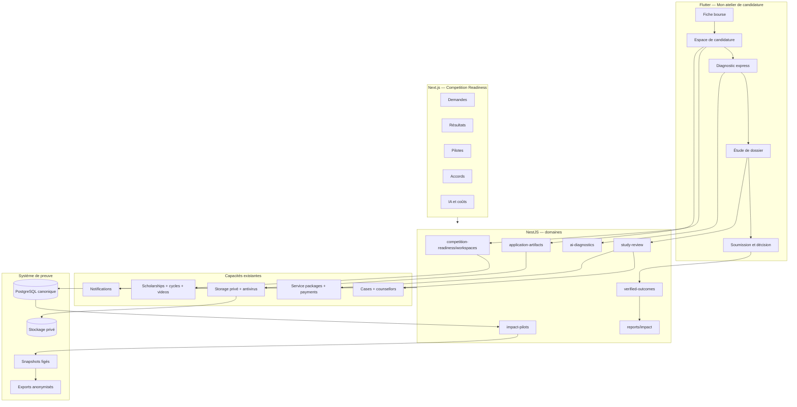
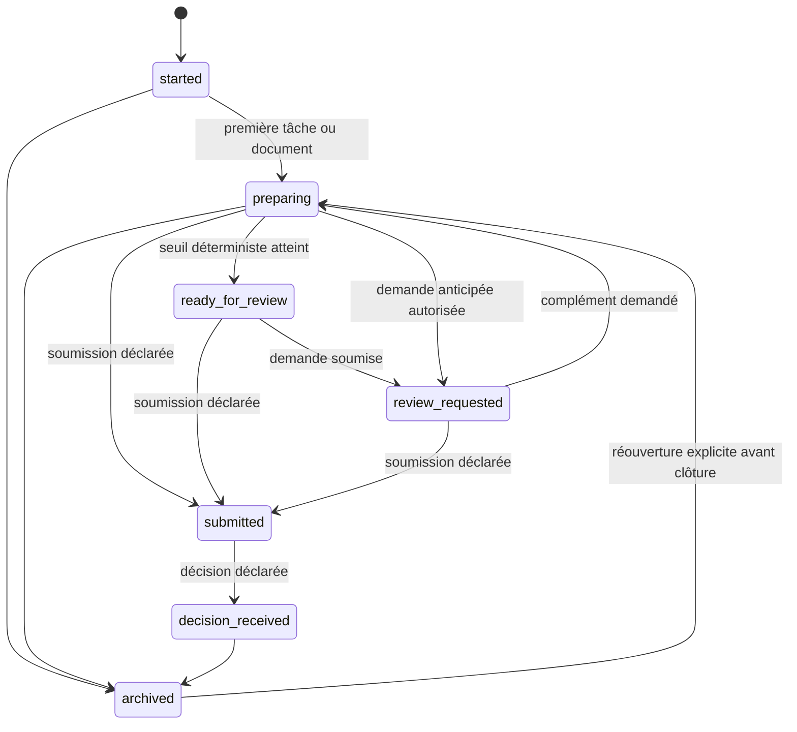
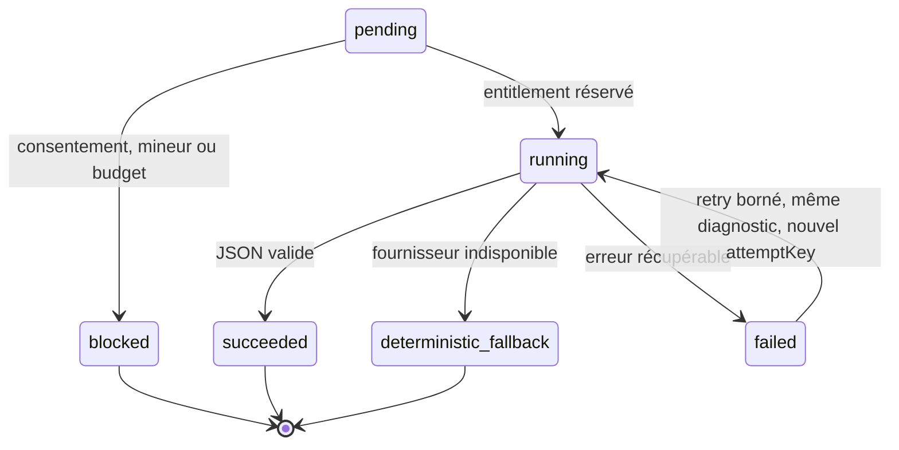
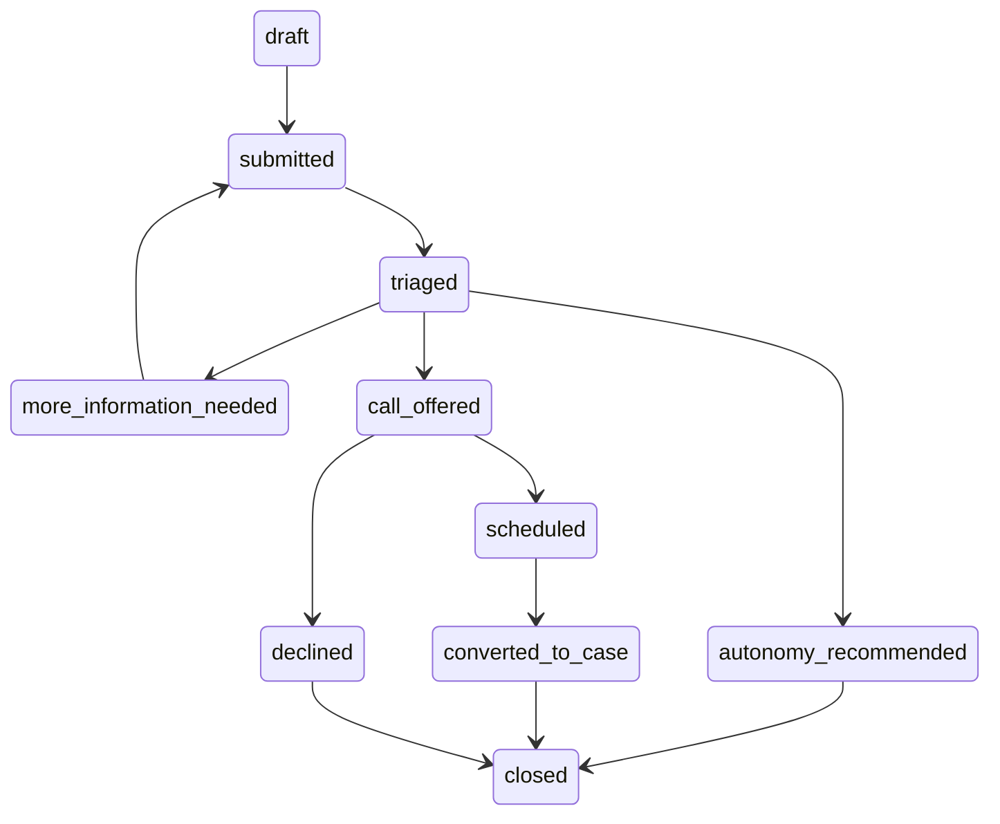
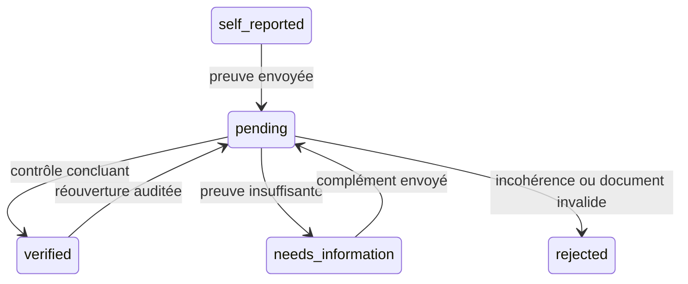
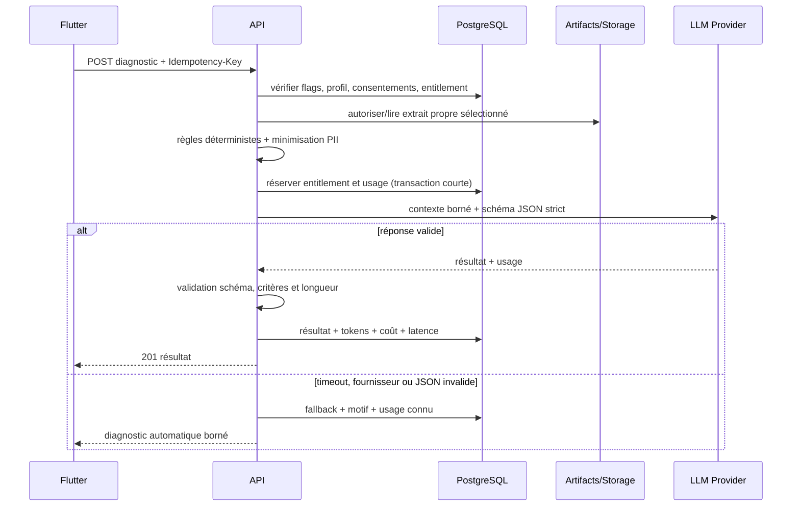
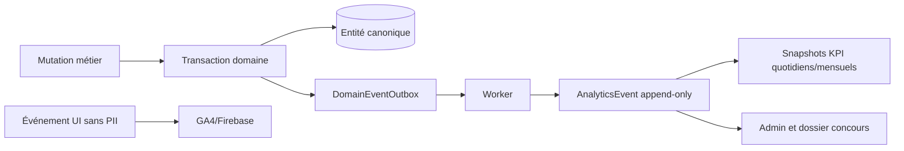

# KPB Education — architecture complète d’implémentation `kpb-competition-readiness`

Statut : plan d’exécution de référence, prêt à être confié à Codex/Fable  
Version : 1.0  
Date : 16 juillet 2026  
Marché initial : Afrique francophone  
Surfaces : Flutter mobile, API NestJS/Prisma/PostgreSQL, admin Next.js  
Nom étudiant recommandé : **Mon atelier de candidature**  
Nom interne du programme : **Scholarship Success Lab / Competition Readiness**

---

## 0. Décision exécutive

Le projet ne doit pas créer une quatrième plateforme ni remplacer les parcours
existants. Il doit ajouter une couche de préparation, de preuve et de pilotage
autour des briques déjà présentes : bourses, profil, matching, alertes, vidéos,
dossiers, documents, conseillers, services et paiements.

La tranche gagnante est le parcours suivant :

```mermaid
flowchart LR
    A["Bourse compatible"] --> B["Préparer ma candidature"]
    B --> C["Checklist et documents"]
    C --> D["Un diagnostic IA express"]
    D --> E["Demande gratuite d’étude du dossier"]
    E --> F["Tri par un conseiller KPB"]
    F -->|"échange utile"| G["Créneau proposé"]
    F -->|"autonomie suffisante"| H["Actions gratuites"]
    G --> I["Accompagnement payant proposé après étude"]
    H --> J["Candidature soumise"]
    I --> J
    J --> K["Décision envoyée par l’établissement"]
    K --> L["Preuve vérifiée par KPB"]
    L --> M["Impact publiable et dossier de concours"]
```



La première livraison est considérée réussie si elle permet de démontrer, sans
chiffre fabriqué :

1. qu’un étudiant pertinent a commencé et progressé dans une candidature ;
2. qu’il a reçu au maximum un conseil IA ciblé, borné et mesurable ;
3. qu’un conseiller a étudié la demande avant toute vente ;
4. qu’une soumission et une décision peuvent être déclarées puis vérifiées ;
5. que KPB peut produire des cohortes et KPI auditables pour un concours.

## 1. Décisions produit non négociables

| Sujet | Décision figée | Conséquence technique |
| --- | --- | --- |
| Marché | Afrique francophone d’abord | Français complet, anglais conservé ; segmentation pays et faible connectivité |
| Décision d’admission | L’établissement décide et envoie la décision | KPB ne crée jamais une admission ; KPB vérifie seulement une preuve fournie |
| Conseil KPB | Assistance et tri humain | Une demande d’étude précède l’accès aux créneaux et à une offre |
| Gratuit | Information, matching, checklist, suivi, un diagnostic express | Aucun paywall avant la première valeur utile |
| Payant | Accompagnement après étude du dossier | Pas d’achat impulsif présenté comme condition pour candidater |
| IA | Une seule amélioration prioritaire par candidature/cycle | Pas de chat illimité dans l’Atelier ; quota atomique et résultat mis en cache |
| Pédagogie | Positionnement EdTech sans changer le modèle | Micro-apprentissage actionnable et mesure de progression, pas un LMS séparé |
| Partenaires | Les partenaires existants sont réutilisés | Un affichage `isPartner` ou un logo ne prouve pas un accord signé |
| Impact | Seulement des résultats vérifiables | `Case.completed` ne vaut ni admission ni bourse obtenue |
| Mineurs | Protection renforcée | Consentement responsable légal et restrictions document/IA selon l’âge |

## 2. Objectifs et non-objectifs

### 2.1 Objectifs P0

- créer un espace de candidature par étudiant, bourse et cycle ;
- suivre les étapes et artefacts sans créer prématurément un dossier commercial ;
- offrir un diagnostic IA one-shot, structuré et plafonné ;
- permettre une demande gratuite d’étude, son tri et la proposition de créneaux ;
- convertir vers un `Case` et un service payant seulement après étude ;
- enregistrer séparément soumission, décision d’admission et financement ;
- vérifier les preuves et calculer des KPI auditables ;
- donner à l’admin un seul centre opérationnel de pilotage ;
- lancer par feature flags sur une alpha interne/allowlistée.

### 2.2 P1

- registre des accords partenaires et capacités de vérification ;
- gestion complète de cohortes pilotes et évaluations pré/post ;
- exports anonymisés pour dossiers de concours ;
- automatisations de relance et rappels de résultats ;
- tests utilisateurs et preuves de faible connectivité.

### 2.3 P2

- expériences contrôlées et comparaison de cohortes ;
- langues locales ou parcours vocal après recherche utilisateur ;
- intégrations partenaires de vérification, uniquement avec accord formel ;
- recommandations pédagogiques supplémentaires, payantes ou humaines, après
  validation du coût et de l’efficacité.

### 2.4 Hors périmètre

- prédire la probabilité d’admission ;
- auto-postuler au nom de l’étudiant ;
- modifier une décision d’établissement ;
- ouvrir un chat IA illimité ;
- mettre des passeports ou relevés de notes dans un prompt par défaut ;
- déclarer un partenariat signé depuis un simple `Institution.isPartner` ;
- reconstruire le catalogue de bourses ou le système de paiement ;
- publier des statistiques de petits groupes permettant une réidentification.

## 3. Vérité actuelle du dépôt et stratégie de réutilisation

| Capacité actuelle | Source | Décision |
| --- | --- | --- |
| Catalogue, critères, avantages, cycles | `Scholarship`, `ScholarshipCycle` | Réutiliser comme référentiel de l’Atelier |
| Étapes de candidature | `ScholarshipApplicationStep` | Utiliser comme modèles ; persister l’état étudiant séparément |
| Vidéos YouTube | `ScholarshipVideo` | Réutiliser, lecture à la demande sans autoplay |
| Alertes et notifications | `ScholarshipAlertSubscription`, `UserNotification` | Réutiliser pour les échéances et relances consenties |
| Profil, consentement IA, mineurs | `UserProfile` | Réutiliser les consentements ; renforcer les politiques par fonctionnalité |
| Matching explicable | `Match`, `MatchExplanation` | Afficher l’adéquation, jamais comme probabilité d’acceptation |
| Dossiers et documents commerciaux | `Case`, `CaseDocument` | Conserver pour l’accompagnement ; créer des artefacts gratuits en amont |
| Conseillers | `Counsellor` et `Case.counsellorId` | Réutiliser pour affectation et conversion |
| Rendez-vous | `Appointment` | Étendre ; ne plus laisser l’Atelier créer un créneau arbitraire directement |
| Services et paiement | `ServicePackage`, `ServicePurchase`, `PaymentIntent` | Déclencher seulement après tri humain |
| Partenaires publics | `Partner`, `Institution.isPartner` | Conserver l’affichage ; ajouter un registre privé des accords |
| IA | `LlmService` sur Groq | Étendre en fournisseur agnostique, JSON borné et usage mesuré |
| Quota Coach | mémoire processus, 5/semaine | Ne pas réutiliser tel quel ; quota Atelier persistant et atomique |
| Impact public | `ImpactService` | Corriger la sémantique des admissions |
| Reporting | `ReportsService` | Ajouter les outcomes vérifiés et cohortes |
| Feature config | `GET /config/app` | Étendre par drapeaux runtime, avec défauts fail-closed |
| Analytics | contrat Dart + GA4 | Étendre les constantes ; PostgreSQL reste la source des outcomes |

Le validateur local de catalogue documenté le 16 juillet 2026 compte 25
opportunités uniques, dont 3 couvrant le secondaire, 12 le Bachelor et 19 le
Master (les niveaux se chevauchent). Ce volume satisfait le point de départ ;
il ne remplace ni la double revue éditoriale ni la vérification des sources et
dates avant pilote.

### 3.1 Règles d’intégration

1. Les migrations sont additives et compatibles avec les anciennes versions.
2. Une seule équipe/agent possède `schema.prisma` et les contrats partagés à la fois.
3. Aucun backfill ne convertit automatiquement un `Case.completed` en admission.
4. Aucun backfill ne convertit automatiquement `isPartner=true` en accord signé.
5. Les nouveaux endpoints sont versionnés par contrat, pas par duplication de l’API.
6. Le mobile et l’admin tolèrent les champs absents pendant le déploiement progressif.
7. Les feature flags backend sont désactivés par défaut en production jusqu’au pilote.

## 4. Architecture cible



### 4.1 Contextes bornés

| Contexte | Responsabilité | Ne doit pas faire |
| --- | --- | --- |
| Workspace | progression d’une candidature | déclarer l’admission |
| Artifacts | fichiers/version/scan/ownership | remplacer les documents d’un `Case` payé |
| AI Diagnostic | une amélioration structurée | conseil juridique, prédiction, chat |
| Study Review | tri gratuit et passage humain | encaisser avant analyse |
| Outcomes | soumission/décision/preuve | inférer un résultat depuis le statut du dossier |
| Partnerships | preuve d’accord et capacités | transformer un logo en contrat |
| Pilots | cohortes, consentements, mesures | utiliser GA4 comme registre d’admission |
| Reporting | agrégats et exports | exposer PII ou petits groupes |

## 5. Modèle de données Prisma cible

Les noms ci-dessous sont contractuels. Les enums sont en anglais pour rester
cohérents avec le schéma ; les libellés sont traduits côté client.

### 5.1 Enums

```prisma
enum ScholarshipWorkspaceStatus {
  started
  preparing
  ready_for_review
  review_requested
  submitted
  decision_received
  archived
}

enum WorkspaceStepStatus {
  not_started
  in_progress
  completed
  not_applicable
}

enum WorkspaceStepCategory {
  profile_eligibility
  documents
  form_and_essays
  review_and_submission
}

enum ApplicationArtifactKind {
  cv
  motivation_letter
  essay
  recommendation_letter
  transcript
  diploma
  language_test
  passport
  portfolio
  other
}

enum ArtifactProcessingStatus {
  pending_upload
  uploaded
  scanning
  clean
  rejected
  extraction_failed
  deleted
}

enum AiDiagnosticStatus {
  pending
  running
  succeeded
  deterministic_fallback
  failed
  blocked
}

enum StudyReviewStatus {
  draft
  submitted
  triaged
  more_information_needed
  call_offered
  scheduled
  converted_to_case
  autonomy_recommended
  declined
  closed
}

enum AvailabilitySlotStatus {
  available
  blocked
  exhausted
  cancelled
}

enum SlotOfferStatus {
  offered
  selected
  expired
  withdrawn
}

enum EvidenceVerificationStatus {
  self_reported
  pending
  verified
  needs_information
  rejected
}

enum AdmissionDecision {
  admitted
  rejected
  waitlisted
  deferred
  withdrawn
}

enum FundingDecision {
  full
  partial
  none
  pending
  not_applicable
}

enum PartnershipAgreementStatus {
  draft
  prospect
  pending_signature
  signed
  active
  expired
  terminated
}

enum PartnershipAgreementType {
  letter_of_intent
  memorandum_of_understanding
  pilot
  data_sharing
  referral
  sponsorship
  other
}

enum OutcomeEvidenceKind {
  submission_confirmation
  admission_decision
  rejection_decision
  waitlist_decision
  funding_award
  funding_rejection
  enrollment_confirmation
  other
}

enum PilotStatus {
  draft
  recruiting
  active
  analysis
  completed
  archived
}
```

### 5.2 Espace de candidature

```prisma
model ScholarshipWorkspace {
  id                  String                     @id @default(cuid())
  userId              String
  scholarshipId       String
  scholarshipCycleId  String
  status              ScholarshipWorkspaceStatus @default(started)
  version             Int                        @default(1)
  readinessPercent    Int                        @default(0)
  startedAt           DateTime                   @default(now())
  lastActivityAt      DateTime                   @default(now())
  submittedAt         DateTime?
  decisionReceivedAt  DateTime?
  archivedAt          DateTime?
  createdAt           DateTime                   @default(now())
  updatedAt           DateTime                   @updatedAt

  user                UserProfile                @relation(fields: [userId], references: [id], onDelete: Cascade)
  scholarship         Scholarship                @relation(fields: [scholarshipId], references: [id], onDelete: Restrict)
  scholarshipCycle    ScholarshipCycle           @relation(fields: [scholarshipCycleId], references: [id], onDelete: Restrict)
  steps               ScholarshipWorkspaceStep[]
  artifacts           ApplicationArtifact[]
  diagnostics         AiDiagnostic[]
  reviewRequests      StudyReviewRequest[]
  submissions         ApplicationSubmission[]
  decisions           ApplicationDecisionRecord[]
  fundingDecisions    FundingDecisionRecord[]
  outcomeEvidence     OutcomeEvidenceAsset[]
  cohortMemberships   ImpactCohortMembership[]

  @@unique([userId, scholarshipId, scholarshipCycleId])
  @@index([userId, status, lastActivityAt])
  @@index([scholarshipCycleId, status])
}

model ScholarshipWorkspaceStep {
  id                 String                 @id @default(cuid())
  workspaceId        String
  sourceStepId       String?
  code               String
  titleFr            String
  titleEn            String
  category           WorkspaceStepCategory
  weight             Int
  isRequired         Boolean                @default(true)
  templateVersion    String
  status             WorkspaceStepStatus    @default(not_started)
  notApplicableReason String?
  completedAt        DateTime?
  createdAt          DateTime               @default(now())
  updatedAt          DateTime               @updatedAt

  workspace          ScholarshipWorkspace   @relation(fields: [workspaceId], references: [id], onDelete: Cascade)
  sourceStep         ScholarshipApplicationStep? @relation(fields: [sourceStepId], references: [id], onDelete: SetNull)

  @@unique([workspaceId, code])
  @@index([workspaceId, status])
}

model IdempotencyRecord {
  id                 String       @id @default(cuid())
  actorType          String
  actorId            String
  operation          String
  idempotencyKey     String
  payloadHash        String
  status             String       @default("in_progress")
  resourceType       String?
  resourceId         String?
  resultingVersion   Int?
  responseCode       Int?
  responseSnapshot   Json?
  createdAt          DateTime     @default(now())
  completedAt        DateTime?
  expiresAt          DateTime

  @@unique([actorType, actorId, operation, idempotencyKey])
  @@index([resourceType, resourceId, createdAt])
  @@index([status, expiresAt])
}
```

#### Invariants

- `scholarshipCycleId` doit appartenir à `scholarshipId` ; validation service + transaction.
- Le CTA Atelier n’est activé que si un cycle `forecast|open` existe. La
  migration crée un cycle forecast pour les fiches legacy exploitables ; sinon
  l’admin doit préparer le cycle avant ouverture du CTA.
- Le workspace est créé par upsert ; deux doubles taps retournent le même ID.
- `readinessPercent` est déterministe, entier de 0 à 100, jamais une chance d’admission.
- Le calcul recommandé est pondéré par configuration : profil et éligibilité
  20 %, documents 40 %, formulaire/essais 25 %, relecture/soumission 15 %.
- Les titres, catégorie, poids et caractère obligatoire sont copiés dans le
  workspace à sa création ; une modification éditoriale ultérieure ne réécrit
  jamais l’historique étudiant.
- Les étapes du catalogue et les tâches génériques utilisent un `code` stable et
  un `templateVersion`; `sourceStepId` est nul pour une tâche générique.
- Une étape `not_applicable` exige un motif ; elle sort du dénominateur seulement
  si la règle versionnée l’autorise.
- Le passage à `submitted` ne se fait qu’à partir d’une `ApplicationSubmission`.
- Le passage à `decision_received` ne se fait qu’à partir d’une décision déclarée.
- Les mutations offline sont rejouées dans l’ordre. Un reçu persistant retourne
  le même résultat pour un retry ancien ; après `409`, le client recharge,
  rebase les mutations encore pertinentes et compacte les changements
  successifs d’une même étape avant renvoi.

### 5.3 Artefacts gratuits et versions immuables

```prisma
model ApplicationArtifact {
  id                 String                    @id @default(cuid())
  workspaceId        String
  kind               ApplicationArtifactKind
  title              String
  currentVersionId   String?                   @unique
  createdAt          DateTime                  @default(now())
  updatedAt          DateTime                  @updatedAt

  workspace          ScholarshipWorkspace      @relation(fields: [workspaceId], references: [id], onDelete: Cascade)
  versions           ApplicationArtifactVersion[] @relation("ArtifactVersions")
  currentVersion     ApplicationArtifactVersion? @relation("CurrentArtifactVersion", fields: [currentVersionId], references: [id], onDelete: SetNull)

  @@unique([workspaceId, kind, title])
  @@index([workspaceId, kind])
}

model ApplicationArtifactVersion {
  id                 String                    @id @default(cuid())
  artifactId         String
  versionNumber      Int
  storageKey         String                    @unique
  originalFileName   String
  mimeType           String
  sizeBytes          Int
  sha256             String
  processingStatus   ArtifactProcessingStatus  @default(pending_upload)
  extractedText      String?
  rejectionCode      String?
  uploadedAt         DateTime?
  deletedAt          DateTime?
  createdAt          DateTime                  @default(now())

  artifact           ApplicationArtifact       @relation("ArtifactVersions", fields: [artifactId], references: [id], onDelete: Cascade)
  currentForArtifact ApplicationArtifact?       @relation("CurrentArtifactVersion")
  diagnostics        AiDiagnostic[]
  studyReviewShares  StudyReviewArtifactShare[]

  @@unique([artifactId, versionNumber])
  @@index([artifactId, createdAt])
  @@index([processingStatus])
}
```

Le service vérifie en plus que `currentVersionId` appartient au même artefact ;
la FK seule ne peut pas exprimer cette contrainte croisée. Le stockage conserve
une clé privée, jamais une URL publique permanente. Les URLs signées expirent
en quelques minutes et sont émises après contrôle d’ownership/RBAC.

Types acceptés en P0 : PDF et image JPEG/PNG ; taille maximale configurable,
10 Mo par défaut. DOCX arrive en P1 après ajout d’une validation OOXML réelle,
des extensions/keys autorisées et des tests antivirus. Une analyse antivirus et
une validation du type réel sont obligatoires avant lecture, téléchargement
interne ou diagnostic IA.

Avec un stockage objet, l’URL PUT vise un préfixe/bucket de quarantaine :
`complete` vérifie l’objet par HEAD/hash puis un worker le scanne et le promeut
vers la zone privée `clean`. Avec le driver local actuel, le client utilise un
multipart authentifié vers le backend ; aucune fausse URL présignée n’est
émulée. La suppression logique écrit `deletedAt`, puis une outbox supprime
physiquement l’objet après les contrôles de rétention.

### 5.4 Diagnostic IA et registre de coût

```prisma
model AiDiagnostic {
  id                    String              @id @default(cuid())
  workspaceId           String
  artifactVersionId     String?
  entitlementKey        String              @unique
  status                AiDiagnosticStatus  @default(pending)
  documentKind          ApplicationArtifactKind?
  generatedLanguage     String?
  strength              String?
  priorityImprovement   String?
  rationale             String?
  nextAction            String?
  criterionReferences   Json?
  inputFingerprint      String?
  workspaceVersion      Int?
  criteriaVersion       String?
  artifactSha256        String?
  provider              String?
  model                 String?
  promptVersion         String
  fallbackReason        String?
  startedAt             DateTime?
  completedAt           DateTime?
  createdAt             DateTime            @default(now())
  updatedAt             DateTime            @updatedAt

  workspace             ScholarshipWorkspace @relation(fields: [workspaceId], references: [id], onDelete: Cascade)
  artifactVersion       ApplicationArtifactVersion? @relation(fields: [artifactVersionId], references: [id], onDelete: SetNull)
  usageAttempts         AiUsageAttempt[]

  @@index([workspaceId, createdAt])
  @@index([status, createdAt])
}

model AiUsageAttempt {
  id                    String       @id @default(cuid())
  diagnosticId          String?
  actorKey              String?
  attemptKey            String       @unique
  attemptNumber         Int
  feature               String
  provider              String
  model                 String
  promptVersion         String
  priceVersion          String?
  usageSource           String?
  inputTokens           Int?
  cachedInputTokens     Int?
  outputTokens          Int?
  totalTokens           Int?
  latencyMs             Int?
  estimatedCostMicrosUsd BigInt?
  providerRequestId     String?
  outcome               String
  errorCode             String?
  lockedBy              String?
  leaseExpiresAt        DateTime?
  startedAt             DateTime?
  completedAt           DateTime?
  nextAttemptAt         DateTime?
  createdAt             DateTime     @default(now())

  diagnostic            AiDiagnostic? @relation(fields: [diagnosticId], references: [id], onDelete: SetNull)

  @@unique([diagnosticId, attemptNumber])
  @@index([feature, createdAt])
  @@index([provider, model, createdAt])
  @@index([outcome, createdAt])
  @@index([outcome, nextAttemptAt])
}

model AiQuotaBucket {
  id              String      @id @default(cuid())
  userId          String
  feature         String
  periodKey       String
  quotaLimit      Int
  used            Int         @default(0)
  resetsAt        DateTime
  version         Int         @default(1)
  createdAt       DateTime    @default(now())
  updatedAt       DateTime    @updatedAt

  user            UserProfile @relation(fields: [userId], references: [id], onDelete: Cascade)

  @@unique([userId, feature, periodKey])
  @@index([feature, resetsAt])
}

model AiBudgetPeriod {
  id                  String      @id @default(cuid())
  feature             String
  periodKey           String
  budgetMicrosUsd     BigInt
  reservedMicrosUsd   BigInt      @default(0)
  spentMicrosUsd      BigInt      @default(0)
  version             Int         @default(1)
  startsAt            DateTime
  endsAt              DateTime
  createdAt           DateTime    @default(now())
  updatedAt           DateTime    @updatedAt

  transactions        AiBudgetTransaction[]

  @@unique([feature, periodKey])
  @@index([feature, endsAt])
}

model AiBudgetTransaction {
  id                    String         @id @default(cuid())
  budgetPeriodId        String
  diagnosticId          String?
  dedupeKey             String         @unique
  reason                String
  reservedDeltaMicrosUsd BigInt         @default(0)
  spentDeltaMicrosUsd   BigInt          @default(0)
  createdAt             DateTime       @default(now())

  budgetPeriod          AiBudgetPeriod @relation(fields: [budgetPeriodId], references: [id], onDelete: Restrict)

  @@index([budgetPeriodId, createdAt])
  @@index([diagnosticId])
}

model AiModelPrice {
  id                       String   @id @default(cuid())
  priceVersion             String   @unique
  provider                 String
  model                    String
  inputMicrosUsdPerM       BigInt
  cachedInputMicrosUsdPerM BigInt?
  outputMicrosUsdPerM      BigInt
  effectiveAt              DateTime
  retiredAt                DateTime?
  sourceUrl                String?
  createdAt                DateTime @default(now())

  @@index([provider, model, effectiveAt])
}

model AiInvoiceReconciliation {
  id                    String   @id @default(cuid())
  provider              String
  periodKey             String
  calculatedMicrosUsd   BigInt
  invoicedMicrosUsd     BigInt
  varianceBps           Int
  invoiceReference      String?
  reconciledByAdminId   String?
  reconciledAt          DateTime?
  createdAt             DateTime @default(now())

  @@unique([provider, periodKey])
}

model RuntimeFeatureFlag {
  key               String   @id
  version           Int      @default(1)
  enabled           Boolean  @default(false)
  rolloutPercent    Int      @default(0)
  rolloutEpoch      Int      @default(1)
  countryCodes      String[] @default([])
  languageCodes     String[] @default([])
  cohortIds         String[] @default([])
  minimumAppVersion String?
  configSchemaVersion Int    @default(1)
  config            Json?
  updatedByAdminId  String?
  createdAt         DateTime @default(now())
  updatedAt         DateTime @updatedAt
  subjects          RuntimeFeatureFlagSubject[]
}

model RuntimeFeatureFlagSubject {
  id                 String             @id @default(cuid())
  flagKey            String
  userId             String
  enabled            Boolean            @default(true)
  expiresAt          DateTime?
  createdAt          DateTime           @default(now())

  flag               RuntimeFeatureFlag @relation(fields: [flagKey], references: [key], onDelete: Cascade)

  @@unique([flagKey, userId])
  @@index([userId, expiresAt])
}
```

Règles d’entitlement :

- la clé gratuite est `workspace:<workspaceId>:free-diagnostic:v1` ;
- l’unicité en base empêche deux appels facturés lors d’un double tap ;
- seul `succeeded` ou `deterministic_fallback` ferme le parcours gratuit ;
- un timeout technique autorise une reprise avec la même clé et le même
  enregistrement, dans une limite anti-abus ;
- une nouvelle version de prompt ne recrée pas automatiquement un droit gratuit ;
- un override administrateur crée une clé distincte, une raison et un audit ;
- le résultat existant est retourné sans nouvel appel fournisseur.

La consommation du quota utilise un `UPDATE ... WHERE used < quotaLimit`
atomique. Le budget réserve un coût maximal avant l’appel puis convertit la
réservation en coût réel par transactions dédupliquées. Un job rembourse les
réservations orphelines. Un flag runtime ne peut jamais contourner le master
switch d’environnement : l’accès effectif est `envMaster && runtimeFlag`.
Lors d’une suppression de compte, les résultats et documents disparaissent ;
les tentatives IA nécessaires au rapprochement financier sont détachées,
pseudonymisées et conservées uniquement pendant la durée comptable définie.

### 5.5 Étude de dossier et rendez-vous proposés

```prisma
model StudyReviewRequest {
  id                    String            @id @default(cuid())
  workspaceId           String
  requestNumber         Int
  version               Int               @default(1)
  status                StudyReviewStatus @default(draft)
  assignedCounsellorId  String?
  studentMessage        String?
  preferredContact      String?
  timezone              String            @default("UTC")
  availability          Json?
  triageSummary         String?
  missingItems          Json?
  submittedAt           DateTime?
  triagedAt             DateTime?
  closedAt              DateTime?
  resultingCaseId       String?           @unique
  resultingPurchaseId   String?           @unique
  createdAt             DateTime          @default(now())
  updatedAt             DateTime          @updatedAt

  workspace             ScholarshipWorkspace @relation(fields: [workspaceId], references: [id], onDelete: Cascade)
  assignedCounsellor    Counsellor?       @relation(fields: [assignedCounsellorId], references: [id], onDelete: SetNull)
  resultingCase         Case?             @relation(fields: [resultingCaseId], references: [id], onDelete: SetNull)
  resultingPurchase     ServicePurchase?  @relation(fields: [resultingPurchaseId], references: [id], onDelete: SetNull)
  slotOffers            StudyReviewSlotOffer[]
  artifactShares        StudyReviewArtifactShare[]
  internalNotes         StudyReviewInternalNote[]
  appointments          Appointment[]

  @@unique([workspaceId, requestNumber])
  @@index([status, submittedAt])
  @@index([assignedCounsellorId, status])
}

model StudyReviewArtifactShare {
  id                 String                     @id @default(cuid())
  reviewRequestId    String
  artifactVersionId  String
  consentReceiptId   String
  grantedByUserId    String
  grantedAt          DateTime                   @default(now())
  revokedAt          DateTime?

  reviewRequest      StudyReviewRequest         @relation(fields: [reviewRequestId], references: [id], onDelete: Cascade)
  artifactVersion    ApplicationArtifactVersion @relation(fields: [artifactVersionId], references: [id], onDelete: Restrict)
  consentReceipt     ConsentReceipt             @relation(fields: [consentReceiptId], references: [id], onDelete: Restrict)

  @@unique([reviewRequestId, artifactVersionId])
  @@index([artifactVersionId, revokedAt])
}

model StudyReviewInternalNote {
  id                 String             @id @default(cuid())
  reviewRequestId    String
  authorAdminId      String
  body               String
  createdAt          DateTime           @default(now())

  reviewRequest      StudyReviewRequest @relation(fields: [reviewRequestId], references: [id], onDelete: Cascade)

  @@index([reviewRequestId, createdAt])
}

model CounsellorAvailabilitySlot {
  id              String      @id @default(cuid())
  counsellorId    String
  startsAt        DateTime
  endsAt          DateTime
  timezone        String
  capacity        Int         @default(1)
  bookedCount     Int         @default(0)
  status          AvailabilitySlotStatus @default(available)
  createdAt       DateTime    @default(now())
  updatedAt       DateTime    @updatedAt

  counsellor      Counsellor  @relation(fields: [counsellorId], references: [id], onDelete: Cascade)
  offers          StudyReviewSlotOffer[]
  appointments    Appointment[]

  @@unique([counsellorId, startsAt, endsAt])
  @@index([counsellorId, status, startsAt])
}

model StudyReviewSlotOffer {
  id              String      @id @default(cuid())
  reviewRequestId String
  slotId          String
  offeredAt       DateTime    @default(now())
  expiresAt       DateTime
  status          SlotOfferStatus @default(offered)
  selectedAt      DateTime?
  createdAt       DateTime    @default(now())

  reviewRequest   StudyReviewRequest @relation(fields: [reviewRequestId], references: [id], onDelete: Cascade)
  slot            CounsellorAvailabilitySlot @relation(fields: [slotId], references: [id], onDelete: Restrict)
  appointment     Appointment?

  @@unique([reviewRequestId, slotId])
  @@index([slotId, expiresAt])
}
```

Champs additifs sur `Appointment` :

```prisma
model Appointment {
  // champs existants conservés
  counsellorId    String?
  reviewRequestId String?
  slotId          String?
  slotOfferId     String? @unique
  endsAt          DateTime?
  timezone        String?
  bookingKey      String? @unique
  counsellor      Counsellor? @relation(fields: [counsellorId], references: [id], onDelete: SetNull)
  reviewRequest   StudyReviewRequest? @relation(fields: [reviewRequestId], references: [id], onDelete: SetNull)
  slot            CounsellorAvailabilitySlot? @relation(fields: [slotId], references: [id], onDelete: SetNull)
  slotOffer       StudyReviewSlotOffer? @relation(fields: [slotOfferId], references: [id], onDelete: SetNull)
}

model Counsellor {
  // champs existants conservés
  adminUserId     String? @unique
  adminUser       AdminUser? @relation(fields: [adminUserId], references: [id], onDelete: SetNull)
  appointments    Appointment[]
}
```

Le service réserve un slot dans une transaction avec contrôle
`bookedCount < capacity`. Une lecture de document exige simultanément : partage
actif, version `clean`, même workspace et conseiller authentifié relié via
`Counsellor.adminUserId`. La création directe historique de rendez-vous reste
compatible pour les autres parcours, mais l’Atelier ne l’appelle jamais avant
`call_offered`. Une contrainte métier empêche un conseiller non affecté de lire
les documents ou notes internes de la demande.

La migration SQL ajoute les CHECK `capacity > 0` et
`0 <= bookedCount <= capacity`, une exclusion des créneaux actifs qui se
chevauchent pour un même conseiller, ainsi qu’un index partiel garantissant un
seul rendez-vous actif par `reviewRequestId`. Une replanification verrouille la
demande, annule l’ancien rendez-vous, décrémente l’ancien slot puis réserve le
nouveau dans une transaction ; l’offre sélectionnée est liée par `slotOfferId`.
`selectedAt` n’est écrit qu’après réservation réussie sous CAS de
`StudyReviewRequest.version`; un échec laisse l’offre sélectionnable ou expirée,
jamais à moitié consommée.

La création d’une demande exige `Idempotency-Key`, verrouille le workspace et
attribue `requestNumber` dans la transaction. La migration ajoute aussi :

```sql
CREATE UNIQUE INDEX one_open_review_request_per_workspace
ON "StudyReviewRequest" ("workspaceId") WHERE "status" <> 'closed';
```

Une transition terminale écrit `closed` dans la même transaction avant qu’une
nouvelle demande soit autorisée ; deux requêtes concurrentes ne peuvent donc pas
contourner `REVIEW_REQUEST_ALREADY_OPEN`.

### 5.6 Soumission et décisions vérifiées

```prisma
model OutcomeEvidenceAsset {
  id                    String                    @id @default(cuid())
  workspaceId           String
  ownerUserId           String
  kind                  OutcomeEvidenceKind
  storageKey            String                    @unique
  originalFileName      String
  mimeType              String
  sizeBytes             Int
  sha256                String
  processingStatus      ArtifactProcessingStatus @default(pending_upload)
  retentionClass        String
  deletedAt             DateTime?
  createdAt             DateTime                  @default(now())

  workspace             ScholarshipWorkspace      @relation(fields: [workspaceId], references: [id], onDelete: Cascade)
  owner                 UserProfile               @relation(fields: [ownerUserId], references: [id], onDelete: Cascade)
  submissions           ApplicationSubmission[]
  admissionDecisions    ApplicationDecisionRecord[]
  fundingDecisions      FundingDecisionRecord[]

  @@index([workspaceId, kind])
  @@index([ownerUserId, createdAt])
  @@index([processingStatus])
}

model ApplicationSubmission {
  id                    String                     @id @default(cuid())
  workspaceId           String
  version               Int                        @default(1)
  submittedAt           DateTime
  submissionChannel     String?
  applicationRefHash    String?
  evidenceId            String?
  verificationStatus    EvidenceVerificationStatus @default(self_reported)
  verificationNotes     String?
  verifiedAt            DateTime?
  verifiedById          String?
  createdAt             DateTime                   @default(now())
  updatedAt             DateTime                   @updatedAt

  workspace             ScholarshipWorkspace       @relation(fields: [workspaceId], references: [id], onDelete: Cascade)
  evidence              OutcomeEvidenceAsset?       @relation(fields: [evidenceId], references: [id], onDelete: Restrict)

  @@index([workspaceId, submittedAt])
  @@index([verificationStatus, createdAt])
}

model ApplicationDecisionRecord {
  id                    String                     @id @default(cuid())
  workspaceId           String
  supersedesId          String?                    @unique
  version               Int                        @default(1)
  isCurrent             Boolean                    @default(true)
  issuedByName          String
  admissionDecision     AdmissionDecision
  issuedAt              DateTime?
  receivedAt            DateTime
  evidenceId            String?
  verificationStatus    EvidenceVerificationStatus @default(self_reported)
  verificationNotes     String?
  verifiedAt            DateTime?
  verifiedById          String?
  createdAt             DateTime                   @default(now())
  updatedAt             DateTime                   @updatedAt

  workspace             ScholarshipWorkspace       @relation(fields: [workspaceId], references: [id], onDelete: Cascade)
  supersedes            ApplicationDecisionRecord? @relation("DecisionHistory", fields: [supersedesId], references: [id], onDelete: SetNull)
  revisions             ApplicationDecisionRecord[] @relation("DecisionHistory")
  evidence              OutcomeEvidenceAsset?       @relation(fields: [evidenceId], references: [id], onDelete: Restrict)
  fundingDecisions      FundingDecisionRecord[]

  @@index([workspaceId, isCurrent])
  @@index([verificationStatus, createdAt])
  @@index([admissionDecision, verificationStatus])
}

model FundingDecisionRecord {
  id                    String                     @id @default(cuid())
  workspaceId           String
  admissionDecisionId   String?
  supersedesId          String?                    @unique
  version               Int                        @default(1)
  isCurrent             Boolean                    @default(true)
  issuedByName          String
  fundingDecision       FundingDecision
  fundingAmountMinor    BigInt?
  fundingCurrency       String?
  issuedAt              DateTime?
  receivedAt            DateTime
  evidenceId            String?
  verificationStatus    EvidenceVerificationStatus @default(self_reported)
  verificationNotes     String?
  verifiedAt            DateTime?
  verifiedById          String?
  createdAt             DateTime                   @default(now())
  updatedAt             DateTime                   @updatedAt

  workspace             ScholarshipWorkspace       @relation(fields: [workspaceId], references: [id], onDelete: Cascade)
  admissionDecision     ApplicationDecisionRecord? @relation(fields: [admissionDecisionId], references: [id], onDelete: SetNull)
  supersedes            FundingDecisionRecord?     @relation("FundingDecisionHistory", fields: [supersedesId], references: [id], onDelete: SetNull)
  revisions             FundingDecisionRecord[]    @relation("FundingDecisionHistory")
  evidence              OutcomeEvidenceAsset?      @relation(fields: [evidenceId], references: [id], onDelete: Restrict)

  @@index([workspaceId, isCurrent])
  @@index([fundingDecision, verificationStatus])
}

model OutcomeVerificationEvent {
  id              String      @id @default(cuid())
  entityType      String
  entityId        String
  fromStatus      String
  toStatus        String
  actorAdminId    String
  reasonCode      String?
  notes           String?
  createdAt       DateTime    @default(now())

  @@index([entityType, entityId, createdAt])
  @@index([actorAdminId, createdAt])
}
```

Une décision `waitlisted` peut être remplacée par `admitted` sans détruire
l’historique : le service verrouille le workspace, met l’ancienne ligne à
`isCurrent=false` et crée la révision dans la même transaction. Admission et
financement ont leurs propres preuves, statuts et vérificateurs.

Prisma ne sait pas exprimer les index partiels ; la migration SQL ajoute :

```sql
CREATE UNIQUE INDEX one_current_admission_per_workspace
ON "ApplicationDecisionRecord" ("workspaceId") WHERE "isCurrent" = true;

CREATE UNIQUE INDEX one_current_funding_per_workspace
ON "FundingDecisionRecord" ("workspaceId") WHERE "isCurrent" = true;
```

Une preuve liée à un outcome n’est plus supprimable : elle est tombstonée selon
la politique de rétention, et les FK utilisent `RESTRICT`. L’établissement reste
`issuedByName` ; KPB est seulement l’acteur de vérification. Les droits
`aggregate_impact` et `public_testimonial` viennent uniquement de reçus de
consentement valides, versionnés et non révoqués.
Le service impose `OutcomeEvidenceAsset.ownerUserId = workspace.userId` dans la
transaction et interdit toujours ces preuves au pipeline IA.

### 5.7 Accords partenaires

Le modèle `Partner` actuel reste le répertoire public. La preuve contractuelle
vit dans un modèle privé séparé.

```prisma
model PartnerAgreement {
  id                       String                     @id @default(cuid())
  agreementKey             String
  revisionNumber           Int
  supersedesId             String?                    @unique
  isCurrent                Boolean                    @default(true)
  lockVersion              Int                        @default(1)
  partnerId                String
  institutionId            String?
  status                   PartnershipAgreementStatus @default(draft)
  agreementType            PartnershipAgreementType
  purposeCodes             String[]                   @default([])
  countryCodes             String[]                   @default([])
  canRecruitPilot          Boolean                    @default(false)
  canVerifySubmission      Boolean                    @default(false)
  canVerifyDecision        Boolean                    @default(false)
  canShareAggregateData    Boolean                    @default(false)
  canPubliclyNamePartner   Boolean                    @default(false)
  canUsePartnerLogo        Boolean                    @default(false)
  dataProtectionScope      Json?
  safeguardingScope       Json?
  agreementStorageKey      String?
  signedAt                 DateTime?
  startsAt                 DateTime?
  endsAt                   DateTime?
  ownerAdminId             String?
  lastVerifiedAt           DateTime?
  createdAt                DateTime                   @default(now())
  updatedAt                DateTime                   @updatedAt

  partner                  Partner                    @relation(fields: [partnerId], references: [id], onDelete: Restrict)
  institution              Institution?               @relation(fields: [institutionId], references: [id], onDelete: SetNull)
  supersedes               PartnerAgreement?          @relation("AgreementHistory", fields: [supersedesId], references: [id], onDelete: SetNull)
  revisions                PartnerAgreement[]         @relation("AgreementHistory")
  evidence                 PartnerAgreementEvidence[]
  pilotLinks               ImpactPilotPartnerAgreement[]

  @@unique([agreementKey, revisionNumber])
  @@index([partnerId, status])
  @@index([institutionId])
  @@index([status, endsAt])
}

model PartnerAgreementEvidence {
  id                 String           @id @default(cuid())
  agreementId        String
  kind               String
  storageKey         String?
  externalUrl        String?
  note               String?
  verifiedById       String?
  verifiedAt         DateTime?
  createdAt          DateTime         @default(now())

  agreement          PartnerAgreement @relation(fields: [agreementId], references: [id], onDelete: Cascade)

  @@index([agreementId, kind])
}
```

Une modification matérielle crée une révision immuable et ferme `isCurrent` dans
une transaction ; la migration ajoute un index partiel unique sur
`agreementKey WHERE isCurrent=true`. Les capacités ne sont effectives que si la
révision courante est `active`, dans ses dates, et si `purposeCodes` couvre la
finalité. Les logos et la liste publique ne doivent afficher « partenaire
officiel » que si `canPubliclyNamePartner` et, pour le logo,
`canUsePartnerLogo` le permettent. Le reporting concours compte séparément :
partenaires affichés, lettres d’intention, accords signés, accords actifs et
partenaires capables de vérifier des résultats.

### 5.8 Pilotes, cohortes et snapshots

```prisma
model ImpactPilot {
  id                 String       @id @default(cuid())
  code               String       @unique
  version            Int          @default(1)
  name               String
  hypothesis         String
  countryCodes       String[]     @default([])
  targetPopulation   Json
  primaryMetrics     Json
  guardrailMetrics   Json
  status             PilotStatus  @default(draft)
  recruitmentStartsAt DateTime?
  startsAt           DateTime?
  endsAt             DateTime?
  analysisLockedAt   DateTime?
  protocolVersion    String
  ownerAdminId       String
  createdAt          DateTime     @default(now())
  updatedAt          DateTime     @updatedAt

  cohorts            ImpactCohort[]
  snapshots          ImpactSnapshot[]
  partnerAgreements  ImpactPilotPartnerAgreement[]
}

model ImpactPilotPartnerAgreement {
  id                 String           @id @default(cuid())
  pilotId            String
  agreementId        String
  roleCodes          String[]         @default([])
  countryCodes       String[]         @default([])
  startsAt           DateTime?
  endsAt             DateTime?
  createdAt          DateTime         @default(now())

  pilot              ImpactPilot      @relation(fields: [pilotId], references: [id], onDelete: Cascade)
  agreement          PartnerAgreement @relation(fields: [agreementId], references: [id], onDelete: Restrict)

  @@unique([pilotId, agreementId])
}

model ImpactCohort {
  id                 String       @id @default(cuid())
  pilotId            String
  code               String
  version            Int          @default(1)
  label              String
  cohortType         String
  inclusionRules     Json
  exclusionRules     Json
  createdAt          DateTime     @default(now())
  updatedAt          DateTime     @updatedAt

  pilot              ImpactPilot @relation(fields: [pilotId], references: [id], onDelete: Cascade)
  memberships        ImpactCohortMembership[]

  @@unique([pilotId, code])
}

model ImpactCohortMembership {
  id                 String       @id @default(cuid())
  cohortId           String
  userId             String
  workspaceId        String?
  consentReceiptId   String
  status             String       @default("enrolled")
  enrolledAt         DateTime     @default(now())
  withdrawnAt        DateTime?
  exitReason         String?
  countryCodeLocked  String
  studyLevelLocked   String?
  genderCodeLocked   String?
  deviceClassLocked  String?
  connectivityLocked String?
  profileRubricVersion String
  matchingAlgorithmVersion String?
  baselineSnapshot   Json

  cohort             ImpactCohort @relation(fields: [cohortId], references: [id], onDelete: Cascade)
  user               UserProfile @relation(fields: [userId], references: [id], onDelete: Cascade)
  workspace          ScholarshipWorkspace? @relation(fields: [workspaceId], references: [id], onDelete: SetNull)
  consentReceipt     ConsentReceipt @relation(fields: [consentReceiptId], references: [id], onDelete: Restrict)
  assessments        PilotAssessment[]
  experimentAssignment ExperimentAssignment?

  @@unique([cohortId, userId])
  @@index([userId])
}

model ExperimentAssignment {
  id                 String       @id @default(cuid())
  membershipId       String       @unique
  experimentKey      String
  experimentVersion  String
  armCode            String
  assignmentSeedHash String
  assignedAt         DateTime     @default(now())

  membership         ImpactCohortMembership @relation(fields: [membershipId], references: [id], onDelete: Cascade)

  @@index([experimentKey, experimentVersion, armCode])
}

model PilotAssessment {
  id                 String       @id @default(cuid())
  membershipId       String
  assessmentType     String
  instrumentVersion  String
  answers            Json
  score              Decimal?
  administeredAt     DateTime     @default(now())

  membership         ImpactCohortMembership @relation(fields: [membershipId], references: [id], onDelete: Cascade)

  @@index([membershipId, assessmentType, administeredAt])
}

model ImpactSnapshot {
  id                 String       @id @default(cuid())
  pilotId            String
  snapshotVersion    Int
  periodStart        DateTime
  periodEnd          DateTime
  metricDefinitions  Json
  metrics            Json
  sourceWatermark    DateTime
  generatedByVersion String
  isPublicSafe       Boolean      @default(false)
  generatedAt        DateTime     @default(now())

  pilot              ImpactPilot @relation(fields: [pilotId], references: [id], onDelete: Restrict)

  @@unique([pilotId, snapshotVersion])
  @@index([pilotId, periodEnd])
}
```

Un snapshot est immuable. Une correction produit une version suivante et un
journal des écarts. Les réponses d’évaluation sont séparées des événements
analytics et soumises à un consentement spécifique au pilote.

### 5.9 Scopes administrateur et audit de sécurité

```prisma
model AdminScopeGrant {
  id               String    @id @default(cuid())
  adminUserId      String
  capability       String
  countryCodes     String[]  @default([])
  cohortIds        String[]  @default([])
  resourceScope    Json?
  grantedByAdminId String
  startsAt         DateTime  @default(now())
  expiresAt        DateTime?
  revokedAt        DateTime?
  createdAt        DateTime  @default(now())

  adminUser        AdminUser @relation(fields: [adminUserId], references: [id], onDelete: Cascade)

  @@index([adminUserId, capability, revokedAt])
  @@index([expiresAt])
}

model AdminAuditEvent {
  id               String   @id @default(cuid())
  actorAdminId     String?
  action           String
  purposeCode      String?
  entityType       String
  entityId         String
  requestId        String
  correlationId    String?
  reasonCode       String?
  result           String
  changes          Json?
  occurredAt       DateTime @default(now())

  @@index([entityType, entityId, occurredAt])
  @@index([actorAdminId, occurredAt])
  @@index([action, occurredAt])
}
```

`RolesGuard` autorise un rôle général ; `DomainAccessPolicyService` exige ensuite
la capacité, le scope pays/cohorte, l’affectation et la finalité. Téléchargement
de preuve, export, vérification, budget, flag, accord et cohorte créent tous un
`AdminAuditEvent` append-only sans contenu du document ni PII libre.

### 5.10 Relations ajoutées aux modèles existants

La migration ajoute explicitement :

- `UserProfile.workspaces`, `outcomeEvidence`, `consentReceipts`,
  `aiQuotaBuckets`, `cohortMemberships` ;
- `Scholarship.workspaces` et `ScholarshipCycle.workspaces` ;
- `ScholarshipApplicationStep.workspaceStepSnapshots` ;
- `Counsellor.reviewRequests`, `availabilitySlots`, `appointments` et le lien
  unique `adminUserId` ;
- `AdminUser.counsellorProfile` et `scopeGrants` ;
- `Case.studyReviewRequest` et `ServicePurchase.studyReviewRequest` ;
- `Partner.agreements` et `Institution.partnerAgreements`.

Aucun champ existant ne change de signification. Les types monétaires sont des
entiers en unité mineure et les dates sont stockées en UTC. Les relations sont
nommées lorsque deux chemins relient les mêmes modèles, puis vérifiées par
`prisma format`/`validate` dans CR-001 avant que les clients ne démarrent.

## 6. Machines à états et invariants transactionnels

### 6.1 Workspace



Le statut résume les événements ; il n’en est pas la preuve. Le service dérive
les transitions dans une transaction et incrémente `version`. Un client doit
envoyer `expectedVersion` pour les mutations non append-only. Une version
obsolète renvoie `409 VERSION_CONFLICT` avec le snapshot serveur.

### 6.2 Diagnostic



Le verrou d’entitlement et le registre d’usage sont écrits avant l’appel. Le
réseau n’est jamais appelé à l’intérieur d’une transaction longue. Le pattern
est : réserver atomiquement, appeler, valider, finaliser ; un job réconcilie les
enregistrements `running` expirés.

### 6.3 Demande d’étude



Seuls `counselor`, `admin` et `super_admin` peuvent trier. Une offre commerciale
peut être préparée après `triaged`, mais elle ne devient achetable qu’après une
décision humaine documentée. `commercial` voit les métadonnées nécessaires à
la conversion, pas les preuves privées sauf autorisation dédiée.

### 6.4 Vérification des résultats



Une vérification demande : un fichier propre, un émetteur identifiable, une
cohérence bourse/cycle/étudiant et un acteur autorisé distinct du bénéficiaire.
Le refus ne supprime ni la déclaration ni l’audit.

## 7. Architecture backend NestJS

### 7.1 Arborescence

```text
backend/src/modules/competition-readiness/
  competition-readiness.module.ts
  common/
    competition-readiness.errors.ts
    ownership.policy.ts
    idempotency.service.ts
    feature-access.service.ts
  workspaces/
    workspaces.controller.ts
    workspaces.service.ts
    workspace-progress.service.ts
    dto/
  artifacts/
    application-artifacts.controller.ts
    application-artifacts.service.ts
    artifact-policy.service.ts
    dto/
  diagnostics/
    ai-diagnostics.controller.ts
    ai-diagnostics.service.ts
    diagnostic-prompt.builder.ts
    diagnostic-schema.ts
    ai-budget.service.ts
    ai-usage.service.ts
    diagnostic-reconcile.job.ts
    dto/
  study-review/
    study-review.controller.ts
    study-review.service.ts
    availability.service.ts
    appointment-booking.service.ts
    dto/
  outcomes/
    outcomes.controller.ts
    outcomes.service.ts
    outcome-verification.service.ts
    dto/
  pilots/
    impact-pilots.service.ts
    impact-snapshot.service.ts
  admin/
    admin-competition-readiness.controller.ts
    admin-review-queue.service.ts
    admin-outcomes.service.ts
    admin-partnerships.service.ts
    admin-pilots.service.ts
    admin-ai-operations.service.ts
  analytics/
    readiness-events.service.ts
    readiness-report.service.ts
```

Adaptations hors module :

```text
backend/src/modules/ai/llm.service.ts
backend/src/modules/config/app-config.controller.ts
backend/src/modules/impact/impact.service.ts
backend/src/modules/reports/reports.service.ts
backend/src/modules/appointments/appointments.service.ts
backend/src/modules/storage/storage.service.ts
backend/src/app.module.ts
backend/.env.example
backend/prisma/schema.prisma
backend/prisma/migrations/...
```

### 7.2 Frontières de service

- `WorkspacesService` possède création, ownership, transitions et snapshot.
- `WorkspaceProgressService` est une fonction pure testable ; aucun LLM.
- `ApplicationArtifactsService` orchestre stockage, antivirus et versions.
- `AiDiagnosticsService` ne télécharge jamais une URL arbitraire ; il reçoit un
  artefact autorisé ou un extrait nettoyé par le service d’artefacts.
- `StudyReviewService` possède le tri, mais délègue les créneaux à
  `AppointmentBookingService`.
- l’owner d’une `StudyReviewRequest` est toujours dérivé de
  `request.workspace.userId`; aucun `userId` du body ou du modèle ne peut diverger.
- `OutcomesService` accepte les déclarations ; `OutcomeVerificationService`
  possède le changement de statut admin et l’audit.
- `ImpactSnapshotService` lit les tables canoniques, jamais GA4 pour les outcomes.
- `LlmService` reste compatible avec le Coach ; les nouvelles options sont
  additionnelles (`temperature`, `maxTokens`, `responseSchema`, `feature`,
  `attemptKey`) et le retour inclut usage/latence/fallback.

### 7.3 Transaction et idempotence

| Action | Clé | Garantie |
| --- | --- | --- |
| Créer workspace | unique utilisateur+bourse+cycle | upsert, même réponse |
| Modifier étape | `clientMutationId` | exactement un effet logique |
| Initier upload | `Idempotency-Key` | pas de version fichier fantôme |
| Diagnostic | `entitlementKey` + `attemptKey` | un entitlement logique ; aucune tentative dupliquée et tous les retries comptés |
| Demande d’étude | `Idempotency-Key` + index partiel workspace ouvert | pas de double file conseiller |
| Offrir slots | request+slot | pas de doublon |
| Réserver | `bookingKey` | capacité atomique |
| Déclarer soumission | `Idempotency-Key` | append unique |
| Déclarer décision | `Idempotency-Key` | historique déterministe |
| Vérifier | statut attendu + audit | pas de validation perdue |

Les clés sont limitées à l’utilisateur authentifié. Un attaquant ne peut pas
sonder une clé appartenant à un autre utilisateur. Les réponses idempotentes
doivent garder le même code fonctionnel et le même identifiant de ressource.

## 8. Contrats API étudiants

Préfixe de controller retenu : `/competition-readiness`, donc URL externe
`/api/competition-readiness/...` avec le `app.setGlobalPrefix('api')` actuel.
Authentification étudiant obligatoire, sauf `/api/config/app`. Les listes
utilisent pagination curseur.

### 8.1 Accès et workspaces

| Méthode et route | Entrée essentielle | Sortie | Notes |
| --- | --- | --- | --- |
| `GET /competition-readiness/access` | aucune | flags effectifs, motifs de blocage, limites | calcul pays/version/cohorte/utilisateur |
| `GET /competition-readiness/workspaces?status=&cursor=&limit=` | filtres | résumés + `nextCursor` | limite 20, max 50 |
| `POST /competition-readiness/workspaces` | `scholarshipId`, `cycleId` | snapshot 201/200 | upsert idempotent |
| `GET /competition-readiness/workspaces/:id` | ETag optionnel | snapshot complet | ownership strict, 304 possible |
| `PATCH /competition-readiness/workspaces/:id` | `expectedVersion`, archive/réouvrir | snapshot | pas de statut arbitraire |
| `PUT /competition-readiness/workspaces/:id/steps/:stepId` | statut, `clientMutationId`, version | snapshot progression | valide l’appartenance de l’étape |

Résumé de liste :

```json
{
  "id": "ws_123",
  "status": "preparing",
  "version": 7,
  "readinessPercent": 45,
  "scholarship": {
    "id": "sch_123",
    "name": "Chevening",
    "countryName": "Royaume-Uni"
  },
  "cycle": {
    "id": "cycle_2027",
    "status": "forecast",
    "dateConfidence": "estimated",
    "closesAt": null,
    "estimatedCloseAt": "2027-11-05T23:59:00.000Z"
  },
  "nextAction": {
    "code": "upload_cv",
    "label": "Ajouter ton CV"
  },
  "lastActivityAt": "2026-07-16T12:00:00.000Z"
}
```

### 8.2 Artefacts

| Méthode et route | Entrée | Sortie | Contrôle |
| --- | --- | --- | --- |
| `GET /.../workspaces/:id/artifacts` | aucune | artefacts/versions sans `storageKey` | ownership |
| `POST /.../workspaces/:id/artifacts/upload-intents` | kind, nom, MIME, taille, SHA | URL signée courte + version | whitelist, quota, idempotence |
| `POST /.../artifact-versions/:id/complete` | ETag/size/hash | statut `scanning` | vérifie objet et propriétaire |
| `GET /.../artifact-versions/:id/download` | aucune | 302/URL signée ou stream | auth à chaque accès |
| `DELETE /.../artifact-versions/:id` | raison | 204/tombstone | interdit si preuve en vérification |

La réponse ne renvoie jamais le chemin interne. L’upload incomplet expire et un
job nettoie l’objet orphelin. Une version `rejected` expose un code localisable,
pas une trace antivirus.

### 8.3 Diagnostic

| Méthode et route | Entrée | Sortie |
| --- | --- | --- |
| `GET /.../workspaces/:id/diagnostic` | aucune | résultat existant, droit restant, stale flag |
| `POST /.../workspaces/:id/diagnostic` | artefact autorisé ou extrait, consent version, idempotency key | `201`, `200 cached`, `202 running` ou blocage stable |

Sortie réussie contractuelle :

```json
{
  "id": "diag_123",
  "status": "succeeded",
  "strength": "Ton expérience associative est concrète et quantifiée.",
  "priorityImprovement": "Relie cette expérience au critère de leadership de la bourse.",
  "rationale": "Le critère officiel demande un impact démontrable ; ce lien n’est pas encore explicite.",
  "nextAction": "Réécris le deuxième paragraphe en ajoutant le problème, ton action et le résultat.",
  "criterionReferences": [
    {"criterionId": "leadership", "sourceUrl": "https://official.example"}
  ],
  "generatedAt": "2026-07-16T12:00:00.000Z",
  "isFallback": false,
  "canRequestAnotherFreeDiagnostic": false
}
```

Le contrat contient exactement une amélioration prioritaire. Il ne renvoie ni
score de chance, ni classement psychologique, ni texte prétendant remplacer le
conseiller.

### 8.4 Étude et planning

| Méthode et route | Action |
| --- | --- |
| `POST /.../workspaces/:id/review-requests` | soumettre besoins, message, consentement de partage et disponibilité |
| `GET /.../review-requests/:id` | lire état, complément demandé et prochaines actions |
| `PATCH /.../review-requests/:id` | compléter une demande autorisée |
| `GET /.../review-requests/:id/slot-offers` | lire seulement les créneaux offerts et non expirés |
| `POST /.../review-requests/:id/appointments` | sélectionner `slotOfferId`, `bookingKey` |
| `PATCH /appointments/:id` | annuler/replanifier selon politique |

Le payload de demande contient une liste explicite d’artefacts partagés. La
simple présence d’un document dans l’Atelier ne donne pas accès au conseiller.

### 8.5 Soumission et décision

| Méthode et route | Action |
| --- | --- |
| `POST /.../workspaces/:id/submissions` | déclarer date/canal/référence hashée/preuve |
| `GET /.../workspaces/:id/submissions` | historique et statut de vérification |
| `POST /.../workspaces/:id/outcome-evidence/upload-intents` | initier une preuve classée, en quarantaine |
| `POST /.../outcome-evidence/:id/complete` | vérifier objet/hash puis lancer le scan |
| `POST /.../workspaces/:id/admission-decisions` | déclarer/réviser la décision d’admission |
| `POST /.../workspaces/:id/funding-decisions` | déclarer/réviser le financement séparément |
| `GET /.../workspaces/:id/decisions` | admission + financement courants et historiques |
| `POST /.../outcomes/:type/:id/evidence` | joindre un complément propre |
| `POST /.../workspaces/:id/consents` | gérer consentement agrégat/témoignage séparément |

### 8.6 Contrats API admin

Les routes effectives commencent par `/api/admin/competition-readiness` et
réutilisent `AdminAuthGuard` + `RolesGuard` + politiques de domaine.

| Méthode et route | Action | Rôles principaux |
| --- | --- | --- |
| `GET /admin/competition-readiness/review-requests` | file paginée, filtres/SLA | counselor, commercial métadonnées, admin |
| `GET /admin/competition-readiness/review-requests/:id` | projection selon capacité | counselor assigné, admin |
| `PATCH /admin/competition-readiness/review-requests/:id/triage` | statut, affectation, complément, version | counselor, admin |
| `POST /admin/competition-readiness/review-requests/:id/slot-offers` | offrir une liste de slots | counselor assigné, admin |
| `POST /admin/competition-readiness/review-requests/:id/convert-to-case` | créer/lier Case puis offre éventuelle | counselor + commercial/admin |
| `GET /admin/competition-readiness/outcomes` | file soumissions/décisions | moderator, admin |
| `GET /admin/competition-readiness/outcomes/:type/:id` | détail + preuve courte | moderator autorisé, admin |
| `PATCH /admin/competition-readiness/outcomes/:type/:id/verification` | verified/needs-info/rejected + version | moderator, admin |
| `GET /admin/competition-readiness/evidence/:versionId/file` | stream/URL très courte | capacité preuve + audit |
| `GET /admin/competition-readiness/ai/usage` | coûts, cache, erreurs, budget | admin, super_admin |
| `PATCH /admin/competition-readiness/ai/budget` | prochaine période/seuils | super_admin |
| `PATCH /admin/competition-readiness/flags/:key` | désactivation/rollout borné | super_admin |
| `GET/POST/PATCH /admin/competition-readiness/partner-agreements` | accords et preuves | commercial, admin |
| `GET/POST/PATCH /admin/competition-readiness/pilots` | pilotes/cohortes | admin, super_admin |
| `POST /admin/competition-readiness/pilots/:id/snapshots` | figer un snapshot | admin, super_admin |
| `GET /admin/competition-readiness/reports` | KPI méthodologiques | rôles autorisés, projections |

Toutes les mutations envoient `expectedVersion` ou `If-Match`, un motif pour
les actions sensibles et un `Idempotency-Key` pour les créations. Les exports
exigent une finalité, un TTL et un audit ; aucune route ne renvoie directement
`storageKey`.

## 9. Codes d’erreur stables

```text
FEATURE_DISABLED
PROFILE_INCOMPLETE
WORKSPACE_NOT_FOUND
WORKSPACE_CYCLE_MISMATCH
VERSION_CONFLICT
AI_CONSENT_REQUIRED
GUARDIAN_CONSENT_REQUIRED
DIAGNOSTIC_ALREADY_AVAILABLE
AI_BUDGET_EXHAUSTED
AI_TEMPORARILY_UNAVAILABLE
ARTIFACT_KIND_NOT_ALLOWED
ARTIFACT_TOO_LARGE
EVIDENCE_SCAN_PENDING
EVIDENCE_REJECTED
REVIEW_REQUEST_ALREADY_OPEN
REVIEW_REQUEST_NOT_TRIAGED
NO_SLOT_OFFERED
SLOT_OFFER_EXPIRED
SLOT_TAKEN
OUTCOME_EVIDENCE_REQUIRED
OUTCOME_ALREADY_SUPERSEDED
FORBIDDEN_SCOPE
RATE_LIMITED
```

Chaque erreur a `code`, `message` localisable côté client, `requestId` et
éventuellement `details` sans PII. Le mobile branche sa logique sur `code`,
jamais sur le texte français.

## 10. Diagnostic IA à coût plafonné

### 10.1 Promesse fonctionnelle

Le diagnostic gratuit n’est pas un conseiller virtuel complet. Il répond une
seule fois à : **« Quelle est l’amélioration prioritaire que je peux faire
maintenant sur cette candidature ? »**

Il retourne :

- un point fort ;
- une amélioration prioritaire ;
- une justification reliée à un critère vérifié de la bourse ;
- une prochaine action concrète ;
- une invitation non agressive à demander l’étude gratuite du dossier.

Il ne retourne pas : probabilité d’admission, garantie, texte intégral prêt à
copier, liste interminable de faiblesses, diagnostic psychologique, avis
juridique/financier ou donnée de deadline non présente dans le contexte vérifié.

### 10.2 Pipeline



### 10.3 Contrôles avant appel

1. feature flag et kill switch ouverts ;
2. profil authentifié et workspace possédé ;
3. consentement IA explicite toujours disponible en base ; échec base = refus ;
4. pour un mineur déclaré, consentement responsable légal valide ;
5. droit gratuit non consommé et pas de requête `running` équivalente ;
6. budget global/journalier/utilisateur disponible ;
7. bourse approuvée, source officielle et critères suffisamment frais ;
8. artefact en statut `clean` et type autorisé ;
9. longueur, langue et injection nettoyées ;
10. `entitlementKey` et la première `attemptKey` réservées atomiquement.

### 10.4 Données autorisées

| Donnée | P0 | Traitement |
| --- | --- | --- |
| Pays, niveau, langue | oui | catégories, pas d’identité |
| Critères et étapes de la bourse | oui | seulement contenu KPB vérifié |
| État de la checklist | oui | booléens et métadonnées |
| CV | oui sur sélection explicite | texte extrait, PII masquée |
| Lettre de motivation/essay | oui sur sélection explicite | texte borné, PII masquée |
| Lettre de recommandation | non par défaut | humain uniquement |
| Passeport, diplôme, relevé, test | non | jamais envoyé au LLM en P0 |
| Nom, email, téléphone, contact tuteur | non | suppression avant prompt |
| Conversation Coach | non | contextes totalement séparés |

Un PDF scanné sans texte n’est pas OCRisé en P0 : l’app demande de coller un
extrait ou de passer par l’étude humaine. L’extrait est plafonné à 8 000
caractères ; la sortie à environ 220 tokens.

La sortie est monolingue (`generatedLanguage=fr|en`) afin que les 220 tokens ne
paient pas deux traductions. `inputFingerprint` est le SHA-256 canonique de la
version du prompt, langue, version workspace, version des critères/rubrique et
hash de l’artefact. `stale=true` est calculé sans LLM dès qu’un de ces composants
matériels diffère ; « stale » n’accorde pas automatiquement un second diagnostic
gratuit.

### 10.5 Paramètres et contrat fournisseur

Le fournisseur applicatif reste Groq au départ, pour ne pas introduire une
migration produit non demandée. `LlmService.completeJson` devient une méthode
compatible `completeStructured` :

```ts
type StructuredCompletionRequest<T> = {
  feature: 'success_lab_diagnostic';
  attemptKey: string;
  system: string;
  user: string;
  responseSchema: JsonSchema;
  fallback: T;
  temperature: 0.1;
  maxTokens: 220;
  promptVersion: string;
};

type StructuredCompletionResult<T> = {
  data: T;
  provider: string;
  model: string;
  providerRequestId?: string;
  inputTokens?: number;
  outputTokens?: number;
  latencyMs: number;
  outcome: 'success' | 'fallback' | 'refused' | 'error';
  fallbackReason?: string;
};
```

Le parseur ne doit pas extraire arbitrairement le premier bloc `{...}` puis lui
faire confiance. Il valide le JSON contre le schéma, les longueurs, les champs
obligatoires et les références de critères. Un résultat invalide déclenche le
fallback, pas un affichage partiel.

### 10.6 Budget et circuit breaker

| Seuil | Action |
| ---: | --- |
| 70 % du budget mensuel | alerte admin et projection de fin de mois |
| 85 % | contexte raccourci/modèle économique configuré, sans réduire la sûreté |
| 100 % | aucun nouvel appel ; fallback déterministe |
| taux erreur 5 min > 20 % | circuit ouvert 10 minutes |
| p95 latence > seuil | alerte, sans lancer d’appels concurrents spéculatifs |

Limites initiales configurables : un diagnostic réussi par workspace/cycle,
trois tentatives techniques par 24 h, cap journalier global, cap pilote et
budget mensuel. Chaque tentative fournisseur a sa propre ligne, y compris retry
ou erreur ; le total du diagnostic est leur somme réconciliée. La table
tarifaire versionnée distingue tokens entrée/cache/sortie et les factures sont
rapprochées par période. Aucun prompt ni contenu de document brut n’est stocké
dans `AiUsageAttempt`.

Gates coût provisoires du pilote, à recalibrer après 14 jours : p95 ≤ 25 FCFA
par diagnostic, ≤ 500 FCFA par utilisateur IA actif/mois, écart calcul/facture
≤ 5 %, aucune dépense au-delà du budget et fallback fournisseur < 10 %. Le coût
canonique reste en micros USD ; toute conversion XOF cite la date et la source
du taux de change.

### 10.7 Variables d’environnement

```dotenv
KPB_COMPETITION_READINESS_ENABLED=false
KPB_SUCCESS_LAB_ENABLED=false
KPB_AI_DIAGNOSTIC_ENABLED=false
KPB_AI_DIAGNOSTIC_KILL_SWITCH=true
KPB_AI_DIAGNOSTIC_MODEL=
KPB_AI_DIAGNOSTIC_PROMPT_VERSION=success-lab-v1
KPB_AI_DIAGNOSTIC_MAX_INPUT_CHARS=8000
KPB_AI_DIAGNOSTIC_MAX_OUTPUT_TOKENS=220
KPB_AI_DIAGNOSTIC_DAILY_CALL_CAP=100
KPB_AI_DIAGNOSTIC_MONTHLY_BUDGET_MICROS_USD=0
KPB_AI_DIAGNOSTIC_PRICE_VERSION=
KPB_SUCCESS_LAB_PILOT_COUNTRIES=NE,SN,CI
KPB_SUCCESS_LAB_ROLLOUT_PERCENT=0
KPB_FEATURE_ROLLOUT_SECRET=
KPB_OUTCOME_EVIDENCE_ENABLED=false
KPB_IMPACT_PUBLIC_STATS_ENABLED=false
```

`KPB_AI_DIAGNOSTIC_KILL_SWITCH=true` ferme l’IA. Une valeur manquante de budget
vaut zéro en production. Les secrets restent dans le gestionnaire de secrets,
jamais dans les flags retournés au mobile.

### 10.8 Évaluation IA avant pilote

P0 comporte un jeu synthétique/anonymisé d’au moins 60 cas ciblés sur le
diagnostic one-shot. Le programme complet peut monter à 360 cas : faits sur les
bourses, procédures, mineurs/consentement, injections et demandes hors périmètre.

L’unité de notation est le claim atomique, pas la réponse entière. La grille
versionnée classe les faits critiques (deadline, nationalité/niveau, financement,
lien officiel), l’exactitude, l’entailment de la citation, sa fraîcheur, le
refus et l’escalade. Chaque taux publie numérateur, dénominateur et intervalle
d’incertitude.

Seuils de promotion :

- zéro erreur critique **observée sur N**, sans présenter cela comme preuve de
  risque nul ;
- exactitude factuelle et références valides ≥ 95 % au niveau claim ;
- 100 % des faits critiques reliés à une source officielle assez fraîche selon
  la politique de la bourse ;
- rappel/précision de refus approprié ≥ 90 % ;
- escalade correcte vers l’humain ≥ 95 % ;
- écart entre segments évalué seulement dans le jeu élargi équilibré, avec au
  moins 30 cas pertinents par segment ;
- validation aveugle par deux lecteurs, troisième arbitre et accord inter-juges
  cible κ ≥ 0,70.

Les 60 cas P0 sont un gate de régression/sûreté, pas une base suffisante pour une
claim d’équité à cinq points. Le jeu de 360 cas sert au modèle card avant
extension du pilote.

Toute modification de prompt, modèle, règles ou schéma crée une nouvelle
version d’évaluation. Le déploiement garde la dernière version verte prête au
rollback.

## 11. Architecture Flutter

### 11.1 Navigation

Il n’y a pas de sixième onglet. Les entrées sont :

1. CTA principal **« Préparer ma candidature »** dans la fiche bourse ;
2. carte **« Reprendre mon atelier »** sur l’accueil si un workspace actif existe ;
3. section **« Ateliers de candidature »** en tête de Dossiers ;
4. deep links des notifications ;
5. accès à l’historique depuis la section Dossiers.

Le bouton vers le formulaire officiel reste visible dans « Comment postuler »,
mais il ne remplace pas le CTA de préparation.

Routes :

```text
/success-lab
/success-lab/new?scholarshipId=:scholarshipId&cycleId=:cycleId
/success-lab/:workspaceId
/success-lab/:workspaceId/diagnostic
/success-lab/:workspaceId/study-request
/success-lab/:workspaceId/schedule
/success-lab/:workspaceId/submission
/success-lab/:workspaceId/outcome
```

Les IDs sont normalisés avant navigation. Un deep link protégé conserve sa
destination après authentification. Des conflits ont existé sur les fichiers de
navigation pendant la préparation de ce plan ; le contrôle final ne montre plus
de statut `UU`. CR-000 doit néanmoins vérifier la provenance des résolutions et
capturer une baseline avant toute nouvelle modification de ces fichiers partagés.

### 11.2 Arborescence

```text
lib/app/features/success_lab/
  success_lab_list_screen.dart
  success_lab_workspace_screen.dart
  success_lab_diagnostic_screen.dart
  success_lab_study_request_screen.dart
  success_lab_schedule_screen.dart
  success_lab_submission_screen.dart
  success_lab_outcome_screen.dart
  widgets/
    success_lab_progress_card.dart
    success_lab_next_action_card.dart
    success_lab_step_tile.dart
    artifact_upload_tile.dart
    diagnostic_result_card.dart
    review_status_card.dart
    outcome_status_card.dart

lib/app/core/models/success_lab.dart
lib/app/core/models/app_models.dart              # export/part du nouveau modèle
lib/app/core/data/success_lab_api_codec.dart
lib/app/core/repositories/success_lab_repository.dart
lib/app/core/controllers/success_lab_list_controller.dart
lib/app/core/controllers/success_lab_controller.dart
lib/app/core/services/success_lab_cache_service.dart
lib/app/core/services/success_lab_outbox.dart
```

Fichiers existants adaptés :

```text
lib/app/core/config/app_routes.dart
lib/app/core/repositories/app_api_client.dart
lib/app/core/observability/analytics_event_contract.dart
lib/app/core/services/analytics_service.dart
lib/app/core/translations/app_translations.dart
lib/app/features/scholarships/scholarship_detail_screen.dart
lib/app/features/cases/cases_screen.dart
lib/app/features/home/home_screen.dart
lib/main.dart
lib/app/core/services/auth_service.dart          # purge logout/suppression
```

La logique n’est pas ajoutée au contrôleur global. Le codec est l’unique
frontière JSON ; le repository orchestre API/cache/outbox ; un controller par
workspace porte les mutations locales.

### 11.3 Écrans et états

#### Liste

- actifs, soumis, en attente de décision, archivés ;
- bourse, confiance de date, deadline, progression et prochaine action ;
- cache immédiat puis synchronisation silencieuse ;
- état vide vers la découverte des bourses.

#### Workspace

- contexte et fraîcheur de la bourse ;
- progression de préparation, clairement non prédictive ;
- éligibilité/profil, documents, formulaire/essais, relecture/soumission ;
- vidéos déjà attachées à la bourse, chargées seulement sur action ;
- diagnostic express ;
- carte d’étude gratuite ;
- soumission et résultat institutionnel.

#### Diagnostic

- écran de consentement si nécessaire ;
- sélection d’un CV/lettre/essay propre ou saisie d’un extrait ;
- chargement annulable côté UI, appel idempotent côté serveur ;
- résultat borné et invitation à l’étude ;
- badge explicite pour un fallback automatique.

#### Étude

- besoins : éligibilité, CV, lettre, stratégie, formulaire, entretien ;
- message facultatif ;
- sélection explicite des documents partagés ;
- disponibilité et canal ;
- statut et compléments ;
- créneaux seulement après offre.

#### Soumission/décision

- formulaires distincts ;
- preuve privée avec progression d’upload/scan ;
- admission et financement séparés ;
- consentements agrégat et témoignage désactivés par défaut ;
- aucun écran de célébration avant confirmation de l’enregistrement ;
- la vérification KPB est affichée séparément de la décision institutionnelle.

Enums UI :

```text
LabLoadPhase:
initial | loading | cached | syncing | ready | empty |
offline | forbidden | featureDisabled | error

DiagnosticPhase:
notStarted | eligible | generating | completed |
fallback | consentRequired | budgetBlocked | failed

UploadPhase:
idle | selecting | compressing | uploading |
scanning | completed | retryableFailure | rejected

MutationPhase:
idle | queuedOffline | sending | success | conflict | failed
```

Chaque action possède son état ; un upload ne bloque pas toute la page.

### 11.4 Offline, synchronisation et faible connectivité

Boîtes Hive versionnées :

```text
kpb.success_lab.cache.v1
kpb.success_lab.outbox.v1
```

Le cache contient snapshot, `schemaVersion`, `etag`, `syncedAt` et `userId`. Il
est purgé par le chemin central de déconnexion/suppression de compte, pas
seulement initialisé dans `main.dart`. L’outbox contient
`clientMutationId`, action, payload minimal, `baseVersion`, tentative et date.

Actions différables : statut de tâche et archivage.
Actions obligatoirement en ligne : upload, diagnostic, preuve, réservation,
paiement et consentement. Aucun fichier sensible ne reste dans l’outbox.

Politique de conflit :

- tâches : recharger puis fusionner par événement/idempotency key ;
- append-only : conserver les deux événements valides ;
- vérification, paiement, créneau : serveur autoritaire ;
- `409 VERSION_CONFLICT` : snapshot serveur + action de reprise visible.

Mode data-lite : aucune vidéo en autoplay, miniatures réduites, pagination,
compression d’image, pas de téléchargement automatique des preuves et affichage
de la fraîcheur du cache.

### 11.5 Accessibilité et localisation

- français et anglais livrés ensemble, avec test de parité des clés ;
- taille de texte jusqu’à 200 % sans coupure de CTA ;
- cibles tactiles ≥ 48 px ;
- progression expliquée par texte, jamais couleur seule ;
- annonces lecteur d’écran après sauvegarde/upload/diagnostic ;
- contraste WCAG AA, focus visible et mode sombre ;
- dates localisées, fuseau explicite sur les rendez-vous ;
- sous-titres et transcription disponibles pour les vidéos KPB ;
- formulation simple pour les lycéens et consentement adapté aux mineurs.

## 12. Architecture admin Next.js

### 12.1 Un hub, pas une navigation éclatée

Créer `admin/app/competition-readiness/page.tsx` avec des tabs routables :

```text
/competition-readiness?tab=requests
/competition-readiness?tab=outcomes
/competition-readiness?tab=pilots
/competition-readiness?tab=partners
/competition-readiness?tab=ai
/competition-readiness?tab=reports
```

Les sélections sont encodées dans les query params du hub afin d’ouvrir un
drawer sans remplacer la page ni perdre les filtres :

```text
/competition-readiness?tab=requests&selectedRequestId=:id
/competition-readiness?tab=outcomes&selectedOutcomeType=:type&selectedOutcomeId=:id
/competition-readiness?tab=pilots&selectedPilotId=:id
/competition-readiness?tab=partners&selectedAgreementId=:id
```

Le menu `DashboardShell` ajoute une seule entrée « Préparation concours ». Les
liens sont filtrés par capacité côté UI, tandis que les guards backend restent
l’autorité.

### 12.2 Arborescence

```text
admin/app/competition-readiness/
  page.tsx
  loading.tsx
  error.tsx

admin/components/competition-readiness/
  readiness-tabs.tsx
  review-request-queue.tsx
  review-request-drawer.tsx
  outcome-verification-queue.tsx
  secure-evidence-viewer.tsx
  pilot-cohort-panel.tsx
  partner-agreement-panel.tsx
  ai-cost-panel.tsx
  readiness-report-panel.tsx

admin/lib/competition-readiness-api.ts
admin/lib/admin-capabilities.ts
admin/hooks/use-admin-resource.ts
```

`loading.tsx` couvre la navigation serveur ; les fetchs déclenchés dans les
composants clients conservent leurs propres skeleton/error/retry. Si une URL
propre sans query params devient nécessaire en P2, utiliser des routes
interceptées/parallèles Next.js, pas des pages profondes ordinaires supposées se
comporter comme des drawers.

Le client HTTP ajoute trois fonctions explicites : JSON, blob sécurisé et
multipart. Il ne force pas `Content-Type: application/json` sur un upload.

### 12.3 Tabs et actions

| Tab | Information | Actions autorisées |
| --- | --- | --- |
| Demandes | SLA, bourse, progression, besoin, conseiller | affecter, demander complément, recommander autonomie, offrir appel, convertir en Case |
| Résultats | preuve, établissement émetteur, admission, financement | vérifier, demander complément, rejeter, réouvrir |
| Pilotes | recrutement, consentements, cohortes, J0/J30/J90 | créer, inclure, fermer, figer snapshot |
| Partenaires | accord, dates, capacité et droits | créer version, vérifier preuve, expirer |
| IA | appels, cache, erreurs, tokens, coût, budget | kill switch, seuils, export métrique ; prompt réservé super-admin |
| Rapports | KPI, couverture preuve, segments, méthodologie | snapshot, export anonymisé, claim-to-evidence |

La vérification n’est jamais optimiste. Le panneau attend la réponse serveur et
affiche l’audit. Le visualiseur de preuve utilise une URL très courte ou un
stream authentifié ; il interdit l’indexation, la mise en cache et le partage de
lien.

### 12.4 RBAC

| Capacité | counselor | commercial | content_manager | moderator | admin | super_admin |
| --- | :---: | :---: | :---: | :---: | :---: | :---: |
| Demandes assignées | oui | métadonnées | non | non | oui | oui |
| Documents partagés | assigné seulement | non | non | non | oui | oui |
| Offre de créneau | oui | non | non | non | oui | oui |
| Conversion/offre commerciale | avis | oui après tri | non | non | oui | oui |
| Vérification de soumission/décision | non si dossier lié | non | non | oui | oui | oui |
| Contenu bourse/étapes/vidéos | lecture | lecture | oui | lecture | oui | oui |
| Accords signés | non | oui | non | non | oui | oui |
| Cohortes pilotes | assignées | recrutement | non | lecture agrégée | oui | oui |
| Coûts IA | agrégés | non | non | qualité agrégée | oui | oui |
| Modifier budget/prompt/flag | non | non | non | non | limité | oui |
| Export nominatif | non | non | non | non | sur autorisation | oui + audit |

Les scopes langue, pays, cohorte et affectation sont appliqués côté service.
Une personne ne valide pas son propre travail ni une décision associée à un
dossier qu’elle accompagne, sauf procédure de double contrôle auditée.

### 12.5 États d’interface

- skeleton initial, état vide contextualisé, erreur avec retry, 403 explicite ;
- pagination curseur et filtres reflétés dans l’URL ;
- mutation limitée à la ligne/drawer concerné ;
- rafraîchissement 30 secondes uniquement si l’onglet est visible ;
- bannière lorsque les données sont anciennes ou le backend dégradé ;
- confirmation forte pour rejet, révocation, export et modification de budget ;
- navigation clavier, focus restauré après fermeture de drawer, contraste AA.

## 13. Événements, analytics et source de vérité

### 13.1 Principe

PostgreSQL est la source des événements métier et des résultats. GA4/Firebase
mesure la navigation et les interactions, mais ne peut pas prouver une
soumission, une admission, un consentement ou un coût.

`POST /api/analytics/events/batch` accepte uniquement une allowlist d’événements
de découverte avec `eventId`, version, heure client bornée et propriétés
typées ; le serveur ajoute l’acteur pseudonyme, l’heure reçue et déduplique.
Soumission, décision, consentement, achat et coût ne sont jamais acceptés depuis
ce collecteur : ils proviennent exclusivement de mutations métier.



Modèles complémentaires :

```prisma
model DomainEventOutbox {
  id              String   @id @default(cuid())
  eventId         String   @unique
  eventName       String
  schemaVersion   Int
  aggregateType   String
  aggregateId     String
  payload         Json
  occurredAt      DateTime
  status          String   @default("pending")
  attemptCount    Int      @default(0)
  nextAttemptAt   DateTime @default(now())
  lockedAt        DateTime?
  lockedBy        String?
  leaseExpiresAt  DateTime?
  lastErrorCode   String?
  processedAt     DateTime?
  deadLetteredAt  DateTime?
  createdAt       DateTime @default(now())

  @@index([status, nextAttemptAt])
  @@index([aggregateType, aggregateId, occurredAt])
}

model AnalyticsEvent {
  id                String   @id @default(cuid())
  eventId           String   @unique
  idempotencyKey    String   @unique
  eventName         String
  schemaVersion     Int
  occurredAt        DateTime
  receivedAt        DateTime @default(now())
  source            String
  actorKey          String?
  actorKeyVersion   String?
  pilotId           String?
  cohortId          String?
  countryCodeLocked String?
  scholarshipId     String?
  cycleId           String?
  workspaceId       String?
  properties        Json
  traceId           String?
  isTest            Boolean  @default(false)

  @@index([eventName, occurredAt])
  @@index([pilotId, cohortId, occurredAt])
  @@index([workspaceId, occurredAt])
}

model MetricDefinition {
  id                 String   @id @default(cuid())
  metricKey          String
  version            Int
  nameFr             String
  definition         String
  grain              String
  numeratorDefinition String
  denominatorDefinition String
  numeratorQueryPath String?
  denominatorQueryPath String?
  numeratorSqlHash   String?
  denominatorSqlHash String?
  definitionCommitSha String
  exclusions         Json
  dimensions         String[] @default([])
  sourceWatermarkField String
  lateArrivalHours   Int      @default(72)
  correctionPolicy   String
  ownerAdminId       String
  effectiveAt        DateTime
  retiredAt          DateTime?

  @@unique([metricKey, version])
}
```

`payload` est une allowlist technique. Aucun événement ne contient nom, email,
téléphone, texte libre, contenu de document ou clé de stockage. `actorKey` est
un pseudonyme HMAC rotatable, pas le user ID exporté.

### 13.2 Événements minimaux

| Domaine | Événements serveur/canoniques |
| --- | --- |
| Découverte | `scholarship_viewed`, `scholarship_saved`, `scholarship_alert_subscribed`, `scholarship_alert_opened` |
| Workspace | `scholarship_workspace_started`, `workspace_step_completed`, `workspace_ready_for_review` |
| Artefacts | `application_artifact_uploaded`, `artifact_scan_completed` |
| IA | `ai_diagnostic_requested`, `ai_diagnostic_completed`, `ai_diagnostic_cache_hit`, `ai_diagnostic_blocked`, `ai_diagnostic_fallback` |
| Étude | `study_review_requested`, `study_review_triaged`, `appointment_offered`, `appointment_scheduled` |
| Soumission | `application_submission_reported`, `application_submission_verified` |
| Décision | `application_decision_reported`, `application_decision_verified`, `funding_decision_verified` |
| Vente | `service_offer_presented`, `service_purchase_created`, `service_purchase_paid` |
| Pilote | `pilot_enrolled`, `pilot_consent_withdrawn`, `pilot_assessment_completed` |
| Partenaire | `partner_agreement_stage_changed`, `partner_commitment_signed` |
| Qualité | `scholarship_verified`, `scholarship_corrected`, `cycle_activated` |

Le mobile peut émettre les événements de vue/clic correspondants avec les
constantes de `analytics_event_contract.dart`. `scholarship_viewed` passe par un
endpoint batch validé/idempotent ; sauvegarde et alerte sont émises par leurs
mutations serveur. Pour tout événement utilisateur dédupliqué, `actorKey` et sa
version HMAC sont obligatoires. Les événements critiques sont toujours produits
côté serveur à la suite d’un commit métier. Le worker claim les lignes avec
`FOR UPDATE SKIP LOCKED`, un lease expirant et une dead-letter inspectable.

### 13.2.1 Notifications transactionnelles

`UserNotification` et une outbox durable sont réutilisés. Le commit métier crée
la notification in-app et l’outbox dans la même transaction ; le worker appelle
OneSignal avec retries et dead-letter.

| Déclencheur | Canaux | Dedupe key | Deep link |
| --- | --- | --- | --- |
| diagnostic terminé après réponse différée | in-app + push opt-in | `diag-ready:<diagnosticId>:<userId>` | `/success-lab/:workspaceId/diagnostic` |
| complément demandé | in-app + push | `review-info:<requestId>:<version>` | `/success-lab/:workspaceId/study-request` |
| créneaux offerts | in-app + push | `review-slots:<requestId>:<offerBatch>` | `/success-lab/:workspaceId/schedule` |
| rendez-vous confirmé | in-app + push | `appointment-confirmed:<appointmentId>` | écran rendez-vous |
| rappel 24 h / 1 h | push + in-app | `appointment-reminder:<id>:24h|1h` | écran rendez-vous |
| preuve à compléter | in-app + push | `evidence-needs-info:<entity>:<id>:<version>` | soumission/outcome |
| soumission vérifiée | in-app + push | `submission-verified:<submissionId>` | `/success-lab/:workspaceId/submission` |
| décision vérifiée | in-app + push générique | `decision-verified:<decisionId>` | `/success-lab/:workspaceId/outcome` |
| échéance bourse | règles existantes | clé cycle+palier+user | fiche/workspace |

Le lockscreen n’affiche jamais « admis/refusé » ni une donnée financière : le
push dit seulement qu’une mise à jour privée est disponible après ouverture.
Les campagnes promotionnelles, dont une promotion éventuelle du guide, restent
séparées des notifications transactionnelles et exigent préférence marketing,
cap de fréquence et politique store/canal autorisée.

### 13.3 KPI contractuels

#### KPI 1 — candidatures vérifiées pour 100 chercheurs actifs

```text
100 × candidatures distinctes avec soumission vérifiée pendant la fenêtre
      / utilisateurs distincts ayant consulté, sauvegardé, activé une alerte
        ou commencé un workspace pour une bourse pertinente pendant la fenêtre
```

Fenêtre mensuelle. Une impression seule ne suffit pas. Dédupliquer par
utilisateur, bourse et cycle. Afficher numérateur, dénominateur et couverture de
preuve. Cette intensité peut dépasser 100 si un étudiant soumet plusieurs
candidatures ; publier donc aussi le **taux de chercheurs avec au moins une
soumission vérifiée**, borné à 100 %.

Définitions versionnées :

- « bourse pertinente » = résultat `eligible|probably_eligible` du ruleset de
  critères/matching enregistré, ou workspace créé explicitement par l’étudiant ;
- « chercheur actif » = acteur ayant un `scholarship_viewed` canonique et au
  moins une action forte (`saved|alert_subscribed|workspace_started`) dans la fenêtre ;
- une simple impression de liste et un événement GA4 ne qualifient personne.

#### KPI 2 — taux de décision positive vérifiée

```text
décisions d’admission `admitted` vérifiées
/ décisions d’admission connues et vérifiées
```

Le financement a son KPI distinct (`full|partial`). Publier également la
couverture : décisions connues / candidatures arrivées à maturité.

#### KPI 3 — progression de préparation à J30

```text
nouveaux chercheurs ayant profil >= 80 %, choisi une bourse pertinente
et terminé au moins une étape ou un document avant J30
/ tous les nouveaux chercheurs de bourse de la cohorte
```

Analyse en intention de traiter : les abandons restent au dénominateur.

Pour le pilote, l’ancre est `ImpactCohortMembership.enrolledAt`. Hors pilote,
`scholarshipSeekerAt` est figé au premier événement serveur où
`wantsScholarship=true` ou à la première action forte. « Profil ≥80 % » utilise
la rubrique `profile_readiness_v1` : champs obligatoires versionnés, poids,
valeurs valides et dénominateur publiés dans `MetricDefinition`. J30 signifie
`[anchor, anchor + 30 jours)` en UTC.

Une candidature est « arrivée à maturité » à la date de décision attendue du
cycle ou de l’établissement, plus une grâce versionnée de 30 jours. Maturité et
décision connue sont deux états distincts.

#### Indicateurs moteurs

- temps jusqu’au premier match qualifié ;
- alerte activée, alerte ouverte, étape commencée ;
- progression médiane J7/J30 ;
- délai de première réponse et taux de demandes triées dans le SLA ;
- slot offert → rendez-vous confirmé ;
- étude gratuite → offre → achat, sans confondre achat et impact ;
- rétention de préparation J30/J90.

#### Garde-fous

- taux de fiche active périmée ou incorrecte ;
- couverture des preuves de soumission/décision ;
- fait IA non soutenu et référence invalide ;
- coût IA par diagnostic et utilisateur actif ;
- écart de progression entre segments consentis ;
- crash-free, sync, upload et livraison notification ;
- incidents de confidentialité/mineurs.

### 13.4 Correction d’ImpactService

Le JSON public est étendu sans casser les clients :

```text
admissionsSecured = COUNT décision courante
  WHERE admissionDecision = admitted
    AND verificationStatus = verified
    AND consent aggregate_impact valide si la statistique vient d’un pilote consentant

verifiedApplicationsSubmitted = COUNT soumission verified
scholarshipsSecured = COUNT FundingDecisionRecord courant full|partial verified
knownDecisions = COUNT décision admission verified
methodologyVersion = verified_outcomes_v1
evidenceAsOf = dernier watermark inclus
```

`completedCases` reste éventuellement un KPI opérationnel admin nommé
`completedOperationalCases`. Il n’alimente plus `admissionsSecured` et ne sert
jamais de fallback public.

### 13.5 Confidentialité statistique

- UTC pour les fenêtres ; événements tardifs acceptés 72 h ;
- snapshot mensuel figé à J+7 ; toute correction crée une nouvelle version ;
- comptes de test exclus ; pays/niveau/cohorte figés à l’inclusion ;
- segments publics masqués si `n < 20` ; agrégats internes restreints si `n < 5` ;
- intervalles d’incertitude et taille d’échantillon affichés ;
- aucun export nominatif dans un dossier de concours.

La « complétude des événements critiques » se calcule par réconciliation : pour
chaque ligne métier éligible dans la fenêtre, exactement un `eventId` attendu
doit exister dans l’outbox puis dans `AnalyticsEvent`. Le contrôle publie
`expected`, `present`, `missing`, `duplicates`, backlog non traité et âge du
plus ancien message ; le ratio est `present_unique / expected`.

## 14. Pilote Afrique francophone

### 14.1 Objectif

Le pilote ne sert pas seulement à montrer que l’app fonctionne. Il teste si
l’Atelier améliore une progression observable et s’il peut collecter des
résultats fiables sans surcharger étudiants, conseillers ou budget IA.

Pays proposés, sous réserve d’un partenaire réellement opérationnel : Niger,
Sénégal, Côte d’Ivoire.

### 14.2 Cohortes

```text
C0 enrolled       inscription + consentement pilote valide
C1 activated_7d   profil complété + premier match/atelier en 7 jours
C2 prepared_30d   critère de progression J30 atteint
C3 submitted      soumission déclarée puis preuve demandée
C4 matured        date de décision attendue + grâce atteinte
C5 decision_known décision institutionnelle connue et vérifiée
C6 retained_90d   activité de préparation à J90
```

### 14.3 Protocole initial

- pilote de faisabilité : 300 participants consentants, cible 100/pays ;
- mix indicatif : 20 % lycéens, 40 % Bachelor, 40 % Master ;
- quotas de suivi pour genre déclaré, appareil et qualité de connexion, avec consentement ;
- mesures J0, J7, J30, J90, puis résultats à 6–12 mois ;
- accès différé de 30 jours possible seulement dans un protocole de recherche
  approuvé, avec allocation stratifiée, analyse en intention de traiter,
  attrition et contamination préspécifiées, sans retirer l’information
  essentielle à personne ;
- entretiens qualitatifs étudiants, tuteurs et partenaires ;
- hypothèses, exclusions et analyse préenregistrées avant recrutement.

Les 300 participants établissent une faisabilité, pas une causalité. La taille
d’un essai causal dépend de l’effet minimal, du taux de base, de l’allocation,
de l’attrition et des clusters ; elle doit être recalculée et signée par un
statisticien avant recrutement. Sans ce protocole, KPB rapporte uniquement des
associations et des intervalles d’incertitude.

### 14.4 Partenaires nécessaires

- au moins trois lettres d’intention signées pour le pipeline, idéalement une par pays ;
- avant recrutement, au moins un accord opérationnel `active` par pays, couvrant
  explicitement recrutement, données, protection des mineurs et responsabilités ;
- un canal actif de recrutement par pays au minimum ;
- rôle exact : recrutement, sensibilisation, safeguarding, vérification ou suivi ;
- clause d’absence de promesse d’admission ;
- finalité et transfert des données ;
- droit d’usage du logo, durée et résiliation ;
- processus de signalement pour les mineurs.

`letter_of_intent` est un `agreementType`; le cycle de vie est séparé :
`draft|pending_signature|signed|active|expired|terminated`. Le pitch n’emploie
« partenariat actif » que si une révision courante, datée, autorisée et une
activité opérationnelle peuvent être montrées.

### 14.5 Go/no-go du pilote

Go si : consentements testés, zéro erreur critique sur les bourses pilotes,
outcomes séparés, IA fail-closed, droits documents vérifiés, dashboards QA et
support opérationnel formé, et accord opérationnel actif dans chaque pays de
recrutement. No-go si un seul de ces contrôles est faux. À J90, le gate exige le
fonctionnement du suivi et des soumissions vérifiées ; admissions et financements
restent un suivi longitudinal à 6–12 mois.

## 15. Data room concours

```text
00_manifest/
01_methodology_and_preregistered_plan/
02_product_and_technical_validation/
03_data_dictionary_metric_registry_cohorts/
04_frozen_deidentified_extracts/
05_evidence_hashes_and_redacted_artifacts/
06_ai_model_cards_eval_runs_incidents/
07_partnerships_and_signed_lois/
08_governance_consent_dpia_minors/
09_costs_invoices_unit_economics/
10_claim_to_evidence_matrix_and_pitch/
```

Chaque affirmation du dossier possède : `claimId`, texte, `metricKey/version`,
cohorte, fenêtre, snapshot, preuves, propriétaire, caveat, droit de partage,
hash SHA-256 et date. Une affirmation sans preuve reste « non démontrée » et
n’entre pas dans le pitch.

## 16. Sécurité, confidentialité et mineurs

### 16.1 Modèle de menace minimal

| Menace | Contrôle obligatoire |
| --- | --- |
| IDOR sur workspace/document/rendez-vous | policy ownership à chaque route et requêtes filtrées par acteur |
| Conseiller lisant un dossier non assigné | `assignedCounsellorId` vérifié côté DB, pas seulement UI |
| URL de preuve partagée | stockage privé, URL signée courte, no-store, audit du téléchargement |
| MIME forgé/malware | magic bytes, taille, antivirus avant disponibilité |
| Double appel IA/coût | clé unique, réservation atomique, réconciliation |
| Prompt injection dans document | contenu non fiable isolé, instructions système, schéma et références validés |
| Faux résultat | statut self-reported, preuve et vérification séparés |
| Faux partenariat | accord actif + preuve + droit public requis |
| Réidentification statistique | suppression petites cellules et export anonymisé |
| Consentement introuvable | fail-closed pour IA/pilote/preuve sensible |
| Suppression incomplète | inventaire central des données + outbox de suppression objet |

### 16.2 Consentements versionnés

Les timestamps existants restent des caches de compatibilité. Un reçu versionné
devient la preuve :

```prisma
enum ConsentPurpose {
  product_analytics
  ai_third_party
  advisor_document_share
  outcome_evidence
  pilot_research
  aggregate_impact
  public_testimonial
  guardian_authorization
  marketing
}

model ConsentReceipt {
  id               String         @id @default(cuid())
  userId           String
  purpose          ConsentPurpose
  noticeId         String
  languageCode     String
  channel          String
  grantedAt        DateTime
  revokedAt        DateTime?
  guardianAuthorizationId String?
  ipHash            String?
  userAgentClass    String?
  createdAt         DateTime       @default(now())

  user             UserProfile    @relation(fields: [userId], references: [id], onDelete: Cascade)
  notice           ConsentNotice  @relation(fields: [noticeId], references: [id], onDelete: Restrict)
  guardianAuthorization GuardianAuthorization? @relation(fields: [guardianAuthorizationId], references: [id], onDelete: Restrict)
  studyReviewShares StudyReviewArtifactShare[]
  cohortMemberships ImpactCohortMembership[]

  @@index([userId, purpose, grantedAt])
  @@index([purpose, revokedAt])
}

model ConsentNotice {
  id               String         @id @default(cuid())
  purpose          ConsentPurpose
  version          String
  languageCode     String
  contentHash      String
  contentStorageKey String?
  effectiveAt      DateTime
  retiredAt        DateTime?
  createdAt        DateTime       @default(now())
  receipts         ConsentReceipt[]

  @@unique([purpose, version, languageCode])
}

model GuardianAuthorization {
  id               String      @id @default(cuid())
  minorUserId      String
  guardianUserId   String?
  relationshipCode String
  verificationMethod String
  evidenceStorageKey String?
  status           String      @default("pending")
  verifiedAt       DateTime?
  expiresAt        DateTime?
  revokedAt        DateTime?
  createdAt        DateTime    @default(now())
  updatedAt        DateTime    @updatedAt
  receipts         ConsentReceipt[]

  @@index([minorUserId, status])
  @@index([guardianUserId, status])
}
```

L’assentiment du mineur et l’autorisation du responsable légal sont séparés
lorsque requis. Une date de naissance inconnue ne donne pas automatiquement
accès au pilote ou à l’IA. Le retrait arrête les traitements futurs et lance le
workflow de conservation/suppression approprié.
La migration ajoute un index partiel empêchant deux reçus actifs pour un même
`userId + purpose`; accorder une nouvelle notice révoque l’ancienne dans la même
transaction. Une autorisation tuteur n’est valide que si le lien, la méthode et
la durée répondent à la politique pays/version.

### 16.3 Préconditions de sécurité déjà visibles dans le dépôt

Avant d’ouvrir P0 à des utilisateurs réels :

1. vérifier que `Appointment.caseId` appartient bien à l’étudiant lors d’une création ;
2. fermer les lectures par ID qui ne filtrent pas le propriétaire, notamment les résultats d’orientation ;
3. charger `accountType` depuis la DB pour les décisions sensibles, sans faire
   confiance à un rôle générique issu du token ;
4. ajouter `Idempotency-Key`, `If-Match` et `X-Request-Id` aux en-têtes CORS autorisés ;
5. déprécier les URL de preuve fournies directement par le client au profit d’un `outcomeEvidenceId` possédé et scanné ;
6. mettre à jour l’export et la suppression de compte, qui énumèrent les tables,
   pour couvrir workspace, artefacts, diagnostics, demandes, outcomes et consentements ;
7. vérifier que l’indisponibilité DB refuse l’IA au lieu de contourner le consentement ;
8. remplacer toute décision d’autorisation basée sur un nom de conseiller par un ID stable.

Ces correctifs sont dans le lot fondation ; ils ne doivent pas être repoussés à
la phase de concours.

Si ce PostgreSQL est exposé par une Data API Supabase, placer les nouvelles
tables sensibles dans un schéma privé ou révoquer explicitement les privilèges
`anon`/`authenticated`, puis ajouter une RLS propriétaire en défense en
profondeur. NestJS/Prisma reste l’unique porte métier ; la migration vérifie les
grants réels, pas seulement les guards applicatifs.

### 16.4 Conservation

Politique à valider juridiquement par pays, avec valeurs techniques initiales :

- upload abandonné : suppression après 24 h ;
- artefact non relié : 30 jours ;
- preuve outcome privée : durée du suivi + fenêtre de contestation définie ;
- données pilote identifiantes : durée du protocole, puis anonymisation/suppression ;
- usage IA : métadonnées financières/audit sans contenu brut ;
- audit sécurité : durée distincte, payload allowlisté et sans PII ;
- retrait de témoignage : dépublication immédiate, conservation de l’audit minimal.

La conformité locale, le rôle responsable/sous-traitant et les transferts
internationaux demandent une validation juridique ; ce document ne les présume
pas.

## 17. Migrations, backfill et rollback

### 17.1 Prérequis zéro

Le contrôle final du 16 juillet 2026 ne montre plus de conflit `UU`; le worktree
reste toutefois actif en parallèle (document, fichiers de thème et `tmp/`). Des
conflits étaient présents plus tôt dans la session. Aucun agent ne commence une
migration ou un changement de route avant :

- identification de la branche/source attendue ;
- vérification que les résolutions précédentes ont conservé les changements utilisateur ;
- `git diff --check` ;
- baseline des trois surfaces enregistrée.

Un échec déjà présent est documenté comme baseline et distingué d’une
régression. Les conflits ne sont jamais « résolus » par reset destructif.

### 17.2 Séquence additive

| Migration | Contenu | Gate |
| --- | --- | --- |
| `competition_01_foundations` | consentements, outbox, analytics/audit, flags nécessaires | Prisma generate + migration DB vide/peuplée |
| `competition_02_workspace_artifacts` | workspace, steps, artefacts/versions, indexes | ownership + upload/scan |
| `competition_03_ai_diagnostic_ledger` | diagnostic, usage, budget/quota | concurrence + kill switch |
| `competition_04_review_booking` | review request, slots/offres, extensions Appointment | collisions + RBAC |
| `competition_05_verified_outcomes` | submissions, decisions, audit | fixtures impact et non-inférence Case |
| `competition_06_partnership_pilot` | accords, cohortes, assessments, snapshots | confidentialité + cycle de vie |
| `competition_07_reporting` | indexes/vues/snapshots/backfill contrôlé | EXPLAIN + comparaison chiffres |

Après chaque migration :

```text
npx prisma format
npx prisma validate
npx prisma generate
npx prisma migrate status
npx prisma migrate deploy                 # DB vierge éphémère
npx prisma migrate deploy                 # clone peuplé anonymisé
npx prisma migrate diff --exit-code ...   # drift attendu = zéro
npm run lint
npm test -- --runInBand
npm run build
```

Les migrations SQL manuelles sont inventoriées et testées : index uniques
partiels pour décisions/consentements/rendez-vous, CHECK de capacité, exclusion
de chevauchement de slots et éventuelles révocations/RLS. Un test de backfill
compare les comptes avant/après et le rollback logique est la désactivation des
flags, jamais une suppression précipitée des nouvelles tables.

### 17.3 Backfill autorisé

- créer zéro workspace automatiquement ; l’étudiant déclenche le parcours ;
- créer un cycle `forecast` versionné pour chaque bourse active dont les données
  legacy permettent une estimation défendable ; sinon marquer la fiche
  `workspace_unavailable` jusqu’à préparation éditoriale ;
- associer éventuellement une demande à un `Case` seulement lors de conversion ;
- transformer un alumni approuvé avec preuve en **candidat à revue manuelle**, pas en admission vérifiée ;
- conserver `aiConsentedAt` comme indice, mais demander/écrire un reçu versionné
  avant le diagnostic ;
- marquer les données historiques de reporting `legacy_unverified` si elles
  doivent rester visibles en interne ;
- ne jamais backfiller `Case.completed → admitted` ;
- ne jamais backfiller `Institution.isPartner → agreement.active`.

### 17.4 Déploiement expand/activate

1. déployer les tables et code de lecture tolérant les valeurs absentes ;
2. laisser tous les flags désactivés ;
3. exécuter validations/backfills sans claims publics ;
4. activer admin interne ;
5. activer employés/testeurs ;
6. activer cohorte pilote par allowlist ;
7. augmenter un pourcentage stable si les gates sont verts.

Le rollback applicatif désactive les flags et revient à la version précédente ;
les nouvelles tables restent en place. Aucune migration de suppression n’est
faite pendant P0/P1.

## 18. Feature flags et configuration runtime

`GET /config/app` est étendu uniquement avec des flags publics non sensibles.
`GET /competition-readiness/access`, authentifié, calcule l’accès final selon
pays, langue, version, cohorte, consentement et rollout stable.

| Flag | Défaut prod | Ciblage |
| --- | :---: | --- |
| `competitionReadinessEnabled` | false | pays/version/cohorte |
| `successLabEnabled` | false | pays/version/cohorte |
| `aiDiagnosticEnabled` | false | allowlist/budget |
| `humanReviewEnabled` | false | capacité conseiller |
| `schedulingEnabled` | false | conseiller/pays |
| `outcomeEvidenceEnabled` | false | pilote |
| `pilotCohortsEnabled` | false | invitation |
| `paidServicesEnabled` | false | canal/store/pays |
| `publicVerifiedImpactEnabled` | false | seulement après audit |

Le bucket est
`HMAC(KPB_FEATURE_ROLLOUT_SECRET:v<rolloutEpoch>, flagKey:userId) % 100`, stable.
Changer l’epoch réattribue volontairement une cohorte et crée un audit. Aucun client ne
peut forcer un flag en modifiant localement le JSON : chaque mutation sensible
recalcule l’accès côté serveur.
Le service valide `rolloutPercent` entre 0 et 100, les codes langue/pays, les IDs
de cohorte et `config` contre le JSON Schema associé à
`configSchemaVersion`; une configuration invalide est refusée, pas ignorée.

## 19. Tests et qualité

### 19.1 Backend

- fonctions pures de progression et transitions ;
- ownership/IDOR sur chaque endpoint et chaque relation imbriquée ;
- matrice RBAC complète ;
- création et mutations idempotentes sous concurrence ;
- dernier quota et dernier slot réservés par requêtes concurrentes ;
- budget réservé, consommé, remboursé et réconcilié ;
- consentement adulte/mineur/révoqué/DB indisponible ;
- MIME forgé, fichier trop grand, antivirus, objet manquant ;
- timeout fournisseur, JSON invalide, circuit ouvert, fallback ;
- décisions waitlistées/révisées et admission/financement séparés ;
- fixtures KPI incluant refus, inconnus, preuves rejetées et cellules petites ;
- export/suppression de compte + suppression physique ;
- migrations sur base vierge et copie peuplée ;
- non-régression Scholarship, Case, Appointment, Impact, Reports.

### 19.2 Flutter

- codecs avec champs absents/inconnus et enums futures ;
- progression, tâches non applicables, date estimée/confirmée ;
- controller cache/refresh/outbox/409/retry ;
- deep link, auth puis retour à destination ;
- diagnostic consentement/mineur/fallback/budget ;
- upload lent/rejeté/reprise manuelle ;
- chaque état vide/loading/offline/forbidden/error ;
- widget/golden tests sur petits écrans et thème clair/sombre ;
- texte 200 %, sémantique et navigation clavier pertinente ;
- parité FR/EN ;
- test sur Android entrée de gamme et réseau limité.

### 19.3 Admin

- lint/build TypeScript ;
- tests unitaires de capacités/RBAC et sérialisation BigInt/Decimal ;
- Testing Library/MSW pour files, filtres, erreurs et blobs ;
- Playwright : tri → offre → rendez-vous ; preuve → vérification ; budget IA → blocage ;
- aucune action de vérification optimiste ;
- accessibilité clavier/axe et absence de données dans URLs/logs.

### 19.4 Commandes de gate

```text
# Flutter
flutter analyze
flutter test --dart-define=KPB_ENABLE_REMOTE_SYNC=false
flutter build apk --debug

# Backend
npm run lint
npm test -- --runInBand
npm run test:e2e
npm run build
npx prisma validate
npx prisma migrate status

# Admin
npm run lint
npm test -- --run
npm run test:playwright
npm run build
npm audit --omit=dev
```

Les commandes sont lancées dans leurs répertoires respectifs. Les tests E2E
utilisent un PostgreSQL réel éphémère, pas uniquement des mocks Prisma.
CR-001 crée les scripts/harness backend E2E et CR-014 ajoute Vitest, Testing
Library, MSW et Playwright à l’admin ; ces commandes deviennent ensuite des
gates CI obligatoires, pas des tests décrits sans exécution.

### 19.5 Performance et résilience

- liste workspace p95 API < 500 ms hors réseau mobile ;
- détail p95 < 800 ms, requêtes bornées et sans N+1 ;
- upload reprend manuellement après perte réseau et ne double pas la version ;
- diagnostic p95 cible < 20 s avec timeout/fallback ;
- admin queue paginée, jamais chargement de toutes les preuves ;
- index validés par `EXPLAIN (ANALYZE, BUFFERS)` sur volume simulé ;
- charge de concurrence sur slots, diagnostic et outbox ;
- cache Flutter affichable hors ligne en moins d’une seconde sur appareil cible.

## 20. Observabilité et SLO

| Service | SLI | Objectif pilote |
| --- | --- | ---: |
| API Atelier | requêtes 2xx/attendues hors erreurs client | ≥ 99,5 % |
| Sync workspace | mutations finalement appliquées | ≥ 98 % |
| Upload preuve | uploads propres finalisés | ≥ 98 % |
| Notification critique | acceptée par le fournisseur | ≥ 95 % |
| Notification appareil | accusé de réception si disponible | suivi séparé |
| Diagnostic contrôlé | succès valide ou fallback explicite | ≥ 99 % |
| Diagnostic fournisseur | réponse réelle valide | ≥ 90 % au pilote |
| Fallback diagnostic | part des demandes servies en fallback | < 10 % |
| Erreur sans résultat | ni succès ni fallback | < 1 % |
| Admin triage | demande traitée dans SLA défini | ≥ 90 % |
| Événements critiques | complétude/reconciliation | ≥ 98 % |

Logs structurés : `requestId`, `traceId`, route, code fonctionnel, latence,
acteur pseudonyme, ressource et résultat ; jamais texte/document/secret. Alertes :
backlog outbox, scan bloqué, diagnostics `running` expirés, budget 70/85/100 %,
erreurs de vérification, accords expirants et snapshots en retard.

Runbooks requis : fournisseur IA indisponible, stockage/antivirus indisponible,
notification en panne, suspicion de faux document, retrait de consentement,
incident mineur, fuite de lien, rollback de feature flag.

## 21. Stratégie de livraison et pilote

### 21.1 Phases produit

| Phase | Audience | Capacité | Gate de sortie |
| --- | --- | --- | --- |
| Dark | équipe technique | API/admin, données synthétiques | sécurité, migrations, tests verts |
| Interne | employés/conseillers | parcours complet sans public | tri/SLA et runbooks validés |
| Alpha | 20–30 étudiants allowlistés | workspace + diagnostic + étude | zéro incident critique, retours UX |
| Pilote 1 | ~100 étudiants/pays ou cohorte bornée | outcomes + suivi J30 | données ≥98 % complètes |
| Pilote complet | cible 300 | trois pays si partenaires prêts | suivi J30 ≥80 %, soumissions vérifiées et suivi outcome opérationnel |
| Expansion | pourcentage stable | montée graduelle | budget, fiabilité, équité et support verts |

### 21.2 Gates P0 logiciel alpha-ready

- les conflits du worktree sont résolus et la baseline est reproductible ;
- migrations testées vide + peuplée, sans colonne destructive ;
- un étudiant ne voit que ses workspaces et fichiers ;
- un conseiller ne voit que les documents explicitement partagés/assignés ;
- diagnostic : un droit atomique, budget, consentements, fallback et eval verte ;
- prise de rendez-vous impossible avant offre et sans capacité ;
- soumission et décision séparées, vérification auditée ;
- `admissionsSecured` ne lit plus `Case.completed` ;
- flags désactivés par défaut et rollback testé ;
- Flutter/backend/admin passent leurs gates ;
- support, suppression, incident mineur et panne IA ont un runbook.

### 21.3 Gates avant affirmation concours

- complétude événements critiques ≥ 98 %, doublons < 0,5 % ;
- 100 % des participants pilotes ont un reçu adapté ;
- 100 % des mineurs concernés ont le processus tuteur attendu ;
- toutes les bourses pilotes, puis les 25 fiches revendiquées dans le pitch, ont
  été doublement revues, sans erreur critique et avec fraîcheur documentée ;
- aucune admission/bourse gagnée revendiquée sans décision vérifiée ;
- couverture de preuve des soumissions revendiquées ≥ 90 % ;
- seuils d’évaluation IA franchis, coût réconcilié à ±5 %, budget respecté et
  plafonds pilote validés ;
- crash-free cible ≥ 99,5 %, sync ≥ 98 %, notification critique acceptée par le fournisseur ≥ 95 % ;
- suivi J30 ≥ 80 % sur le pilote annoncé ;
- partenariats nommés soutenus par une révision active autorisant la claim ;
- au moins un accord opérationnel actif par pays effectivement recruté ;
- zéro incident critique confidentialité/mineur non résolu ;
- chaque chiffre du pitch pointe vers un snapshot et une méthodologie.

## 22. Modèle GPT et effort recommandés pour l’implémentation

### 22.1 Réponse courte

**Configuration suffisante et recommandée : GPT-5.6 Sol avec effort Extra High,
en demandant explicitement l’utilisation de sous-agents.**

Cette configuration donne au root la profondeur nécessaire sans payer Ultra à
chaque tour. Utiliser **Ultra** seulement si l’on veut une délégation automatique
« one-click » pour le cadrage ou l’audit final ; ce projet n’a pas besoin d’Ultra
pour chaque ticket. Garder la vitesse **Standard** ; Fast augmente la consommation
de crédits et n’améliore pas la qualité intrinsèque.

La recommandation suit la documentation Codex actuelle : GPT-5.6 pour les
tâches ambiguës, multi-étapes et validées ; Terra pour les scans/travaux bornés ;
les sous-agents pour des lots indépendants, avec prudence sur les écritures
concurrentes. Voir [Codex — Subagents](https://learn.chatgpt.com/docs/agent-configuration/subagents)
et [Codex — Models](https://learn.chatgpt.com/docs/models).
Ces noms/capacités ont été vérifiés dans la documentation officielle le 16
juillet 2026 et doivent être revérifiés au lancement, car l’offre de modèles est
temporelle.

### 22.2 Répartition exacte

| Rôle | Modèle | Effort | Usage |
| --- | --- | --- | --- |
| Root/orchestrateur | GPT-5.6 Sol dans l’UI ; `gpt-5.6` en config | Extra High / `xhigh` | décisions, contrats, dépendances, intégration |
| Propriétaire schéma/backend critique | GPT-5.6 Sol | High puis XHigh en revue | Prisma, migrations, RBAC, concurrence, outcomes |
| Builder mobile | GPT-5.6 Terra | High | écrans, repository, offline, widgets/tests |
| Builder admin/data | GPT-5.6 Terra | High | hub admin, queues, analytics, rapports |
| Explorateur/test-log | GPT-5.6 Terra | Medium | lecture, inventaire, logs, tests ciblés |
| Reviewer sécurité/final | GPT-5.6 Sol | XHigh ; Max seulement au gate final | cross-surface, menace, régression, DoD |

Si un seul choix est possible dans l’interface, choisir **GPT-5.6 Sol — Extra
High** et inclure dans le prompt : « utilise trois sous-agents directs en
parallèle, attends-les, puis intègre et vérifie ». Si la configuration affiche
seulement `High`, elle reste suffisante ; réserver Max/Ultra aux revues les plus
risquées.

### 22.3 Configuration Codex de projet proposée

```toml
# .codex/config.toml
[agents]
max_threads = 4
max_depth = 1
interrupt_message = true
```

Pourquoi quatre : l’environnement actuel offre quatre slots, donc un root et
trois workers. `max_depth=1` empêche un fan-out récursif coûteux et imprévisible.

Agents projet :

```toml
# .codex/agents/contracts_backend.toml
name = "contracts_backend"
description = "Owns Prisma, migrations, API contracts and critical backend invariants."
model = "gpt-5.6"
model_reasoning_effort = "xhigh"
developer_instructions = """
You are the only writer of schema.prisma, Prisma migrations and shared API contracts.
Use additive migrations. Preserve existing behavior. Test empty and populated databases.
Never infer admission from Case.completed or a signed partnership from isPartner.
Return exact changed files, commands, results and unresolved risks.
"""
```

```toml
# .codex/agents/mobile_builder.toml
name = "mobile_builder"
description = "Implements the Flutter Success Lab against frozen contracts."
model = "gpt-5.6-terra"
model_reasoning_effort = "high"
developer_instructions = """
Only edit Flutter feature, codec, repository and corresponding tests assigned to you.
Do not edit Prisma or API contracts. Preserve offline-first, i18n and accessibility.
Stop on contract ambiguity and report it to the root instead of inventing a field.
"""
```

```toml
# .codex/agents/admin_data_builder.toml
name = "admin_data_builder"
description = "Implements the admin hub, analytics and evidence reporting."
model = "gpt-5.6-terra"
model_reasoning_effort = "high"
developer_instructions = """
Only edit assigned admin/data modules and tests. Keep PostgreSQL as outcome truth.
Never expose evidence URLs or PII in analytics. Enforce UI capabilities but rely on API RBAC.
Do not edit Prisma or shared contracts without root reassignment.
"""
```

```toml
# .codex/agents/readiness_reviewer.toml
name = "readiness_reviewer"
description = "Read-only reviewer for correctness, security, tests and competition claims."
model = "gpt-5.6"
model_reasoning_effort = "xhigh"
sandbox_mode = "read-only"
developer_instructions = """
Review evidence-first. Prioritize IDOR, consent, minors, cost races, migration safety,
outcome semantics and missing tests. Do not modify files. Report findings by severity
with exact paths and verification steps.
"""
```

Ces fichiers sont proposés, pas créés par ce document. Ils doivent être ajoutés
seulement après résolution des conflits et accord sur le workflow Codex/Fable.

## 23. Orchestration multi-agents

### 23.1 Règles de coordination

1. Le root possède le plan, les décisions et l’acceptation finale.
2. Un agent nommé `contracts_backend` est le seul writer de Prisma/migrations/contrats.
3. Chaque worker reçoit une liste de fichiers autorisés et interdits.
4. Les audits/explorations sont parallèles ; les modifications de fichiers
   partagés sont séquentielles.
5. Chaque lot commence par un contrat gelé et finit par tests + diff résumé.
6. Le root relit le diff, exécute les gates et seulement ensuite ouvre le lot suivant.
7. Un agent ne résout jamais un conflit qui n’appartient pas explicitement à son lot.
8. Aucun agent ne commit/push/deploy sans demande explicite.

### 23.2 Matrice de propriété des fichiers

| Périmètre | Writer | Autres agents |
| --- | --- | --- |
| `backend/prisma/**` | contracts_backend | lecture seule |
| contrat DTO/OpenAPI/erreurs partagés | contracts_backend | propositions au root |
| `backend/src/modules/competition-readiness/**` | backend assigné par sous-domaine | pas deux writers sur le même module |
| `backend/src/app.module.ts`, `main.ts`, config | intégrateur/root | lecture seule |
| `lib/app/features/success_lab/**` | mobile_builder | lecture seule |
| codecs/models/repository Success Lab | mobile_builder | lecture seule |
| `app_routes.dart`, home, shell, cases | intégrateur mobile unique | autres agents lecture seule |
| `admin/app/competition-readiness/**` | admin_data_builder | lecture seule |
| `admin/components/competition-readiness/**` | admin_data_builder | lecture seule |
| analytics/KPI backend | data owner | reviewer lecture seule |
| docs/architecture et décisions | root | suggestions uniquement |
| tests d’un périmètre | même writer que le code | reviewer lecture seule |

### 23.3 Vagues d’exécution

```mermaid
gantt
    title KPB Competition Readiness — vagues techniques
    dateFormat  X
    axisFormat  %s
    section Fondation
    W0 Baseline et provenance      :w0, 0, 2
    W1 Contrats, schema, securite  :w1, after w0, 4
    section P0
    W2 Workspace artefacts UI      :w2, after w1, 7
    W3 Diagnostic IA borne         :w3, after w2, 5
    W4 Etude et rendez-vous        :w4, after w2, 6
    W5 Outcomes et impact          :w5, after w2, 6
    W5A Gate E2E P0                :w5a, after w5, 4
    section Preuve
    W6 Partenaires pilotes data    :w6, after w5a, 7
    W7 E2E audit rollout           :w7, after w6, 6
```



Les unités du diagramme sont des jours calendaires indicatifs de vague, pas la
somme des jours-agent.

#### Vague 0 — baseline

- Root : vérifier la provenance des résolutions déjà présentes et l’état réel du worktree.
- Worker 1 : backend baseline read-only.
- Worker 2 : Flutter baseline read-only.
- Worker 3 : admin/CI baseline read-only.
- Sortie : conflits résolus, commandes et échecs préexistants documentés.

#### Vague 1 — contrats et fondations

- contracts_backend : schéma/migrations 01–02, erreurs, DTO et fixtures JSON ;
- security worker : ownership, consentements, CORS, storage, delete/export ;
- test worker : DB harness, migrations vide/peuplée, matrice RBAC ;
- root : gèle `v1` avant tout écran.

#### Vague 2 — workspace et artefacts

- backend : services/endpoints/idempotence/progression ;
- mobile : modèles/codec/repository/cache puis écrans ;
- admin : hub/shell/états et mocks de contrat ;
- root : intégration des fichiers partagés, E2E workspace.

#### Vague 3 — diagnostic IA

- backend IA : entitlement, ledger, budget, prompt, fallback ;
- mobile : consentement/sélection/résultat ;
- eval/data : golden set, runner, seuils et dashboard ;
- root/reviewer : injection, coût concurrent et fail-closed.

#### Vague 4 — étude et rendez-vous

- backend : tri, partage explicite, slots/offres/réservation ;
- mobile : demande, complément, créneaux ;
- admin : queue, affectation, SLA, conversion Case/service ;
- root : vérifie qu’aucun paiement n’est proposé avant tri.

#### Vague 5 — outcomes et impact

- backend : soumissions, décisions, versions, preuves et audit ;
- mobile : formulaires et statuts ;
- admin/data : vérification, ImpactService, rapports ;
- reviewer : recherche toute inférence `completed = admission`.

#### Vague 5A — gate P0 indépendant

- E2E des trois surfaces, concurrence, privacy/export/delete et migrations ;
- audit sécurité, UX/accessibilité et claims P0 ;
- rehearsal flags/rollback et runbooks ;
- sortie : release candidate alpha interne, sans dépendre des accords/pilotes P1.

#### Vague 6 — accords, pilotes et data room

- backend : accords/cohortes/snapshots/outbox analytics ;
- admin : tabs partenaires/pilotes/rapports ;
- data : définitions KPI, snapshots et claim-to-evidence ;
- root : pilote synthétique de bout en bout.

#### Vague 7 — hardening

- trois reviewers parallèles : sécurité, UX/accessibilité, data/claims ;
- root : corrige/redistribue, exécute toutes les gates, teste rollback ;
- sortie : release candidate interne, pas publication automatique.

### 23.4 Prompt de lancement conseillé

```text
Implémente le projet décrit dans
docs/kpb-competition-readiness-implementation-architecture.md.

Utilise un root GPT-5.6 Sol en Extra High et trois sous-agents directs maximum.
Commence uniquement par la Vague 0. Le worktree peut contenir des changements
utilisateur et des conflits : ne supprime, reset, commit, push ou déploie rien.
Établis la baseline Flutter/backend/admin, attribue la propriété des fichiers,
puis arrête-toi au gate de la vague et rapporte les preuves.

Pour les vagues suivantes : un seul agent possède Prisma/migrations/contrats ;
les autres écrivent uniquement dans leurs dossiers assignés. Utilise des
migrations additives, garde les feature flags désactivés, exécute les tests du
lot et attends tous les sous-agents avant intégration. Ne considère jamais
Case.completed comme une admission, ni isPartner comme un accord signé.
```

À chaque nouvelle tâche, remplacer « Vague 0 » par la vague autorisée. Ne pas
demander « implémente tout » en un seul tour : les gates protègent les données et
réduisent les conflits.

## 24. Backlog exécutable

| ID | Ticket | Owner | Dépend | Effort agent |
| --- | --- | --- | --- | ---: |
| CR-000 | Vérifier les résolutions antérieures et capturer la baseline | root/integration | — | 1–2 j |
| CR-001 | Geler noms, enums, erreurs et JSON fixtures | contracts | CR-000 | 1–2 j |
| CR-002 | ConsentReceipt, audit et outbox foundation | contracts/backend | CR-001 | 2–3 j |
| CR-003 | Corriger ownership Appointment/Orientation et accountType | security | CR-000 | 2–3 j |
| CR-004 | Workspace + steps + progression | backend | CR-001/002 | 2–3 j |
| CR-005 | Artefacts/version/upload/scan privé | backend | CR-002 | 3–4 j |
| CR-006 | Flutter models/codec/repository/cache/outbox | mobile | CR-001 | 3–4 j |
| CR-007 | Flutter liste/workspace/navigation | mobile | CR-004/006 | 3–4 j |
| CR-008 | AI entitlement/ledger/budget/circuit | backend AI | CR-002 | 2–3 j |
| CR-009 | Prompt/schema/fallback one-shot | backend AI | CR-008 | 2–3 j |
| CR-010 | Eval P0 IA + seuils | data/reviewer | CR-009 | 2–3 j |
| CR-011 | Flutter diagnostic et consentement | mobile | CR-006/009 | 2–3 j |
| CR-012 | StudyReviewRequest et tri | backend | CR-004/005 | 2–3 j |
| CR-013 | Disponibilités/offres/réservation Appointment | backend | CR-012 | 3–4 j |
| CR-014 | Admin hub + queue demandes | admin | CR-001/012 | 3–4 j |
| CR-015 | Flutter étude/complément/créneau | mobile | CR-012/013 | 3–4 j |
| CR-016 | Conversion Case + offre service après tri | backend/admin | CR-012 | 2–3 j |
| CR-017 | Soumission et preuve | backend | CR-005 | 2–3 j |
| CR-018 | Décision versionnée admission/financement | backend | CR-017 | 2–3 j |
| CR-019 | Admin vérification et viewer sécurisé | admin | CR-017/018 | 3–4 j |
| CR-020 | Flutter soumission/décision | mobile | CR-017/018 | 2–3 j |
| CR-021 | Corriger ImpactService/Reports | backend/data | CR-018 | 2–3 j |
| CR-022 | Events/outbox/MetricDefinition | data/backend | CR-004/018 | 3–4 j |
| CR-023 | Accords partenaires | backend/admin | CR-002 | 3–4 j |
| CR-024 | Pilotes/cohortes/assessments | backend/admin | CR-022/023 | 4–6 j |
| CR-025 | Snapshots/report/data room export | data/admin | CR-021/024 | 3–4 j |
| CR-026 | i18n/a11y/faible réseau | mobile QA | CR-007/011/015/020 | 2–3 j |
| CR-027 | Privacy P0 export/delete/retention | security | CR-005/018 | 2–3 j |
| CR-028 | E2E P0 trois surfaces et concurrence | QA | CR-014–022, CR-026/027 | 4–6 j |
| CR-029 | Runbooks et rollback rehearsal P0 | integration | CR-028 | 2–3 j |
| CR-030 | Audit P0 claims/security/UX | reviewers | CR-029 | 2–3 j |
| CR-031 | Privacy + E2E partenaires/pilotes/data room | QA/security | CR-023–025 | 3–5 j |
| CR-032 | Audit final plateforme et rollout pilote | reviewers | CR-031 | 2–3 j |

## 25. Estimation réaliste

### 25.1 Logiciel P0 alpha-ready

| Workstream | Jours-agent |
| --- | ---: |
| Baseline, contrats et flags | 2–3 |
| Backend workspace, artefacts et outcomes | 8–11 |
| Flutter Atelier complet | 15–21 |
| Diagnostic IA, ledger et eval P0 | 4–6 |
| Étude, rendez-vous et conversion | 5–7 |
| Admin demandes/outcomes/IA | 6–9 |
| Analytics, ImpactService et KPI P0 | 4–6 |
| Sécurité, E2E, performance et release | 6–9 |
| **Total P0** | **50–72 jours-agent** |

Avec un root et trois workers, les dépendances empêchent de diviser simplement
par quatre. Compter **6 à 8 semaines calendaires** pour un P0 solide, si le
scope reste stable et la baseline est résolue rapidement.

### 25.2 Plateforme pilot-ready et preuve complète

Accords, pilotes/cohortes, analytics append-only complet, dashboards, eval IA
élargie et data room portent le total à environ **75–107 jours-agent**, soit
**9 à 12 semaines techniques** avec quatre slots et revues séquentielles.

### 25.3 Temps incompressible hors code

- double revue éditoriale des bourses et maintenance hebdomadaire ;
- vérification juridique/safeguarding et accords partenaires ;
- annotation de l’évaluation IA ;
- formation conseillers et support ;
- recrutement et suivi pilote J30/J90 ;
- décisions d’établissements souvent disponibles 6–12 mois plus tard.

Prévoir environ **90–130 jours-humains non techniques**, parallélisables en
partie. Les sous-agents accélèrent le logiciel ; ils ne remplacent ni les
partenaires, ni les étudiants, ni le temps nécessaire pour mesurer l’impact.

## 26. Definition of Done globale

Le P0 est « alpha-ready », pas seulement « codé », lorsque :

- chaque décision de ce document est traçable dans code/test/config ;
- tous les endpoints ont ownership, RBAC, DTO, erreur stable et idempotence ;
- chaque table sensible a stratégie d’export/suppression/conservation ;
- mobile fonctionne en cache et explique les actions nécessitant le réseau ;
- admin sait trier, offrir un créneau, vérifier et auditer ;
- diagnostic délivre exactement une priorité, respecte budget/consentement et
  passe l’eval ;
- aucun paiement n’est proposé avant étude ;
- décision institutionnelle et vérification KPB sont visuellement séparées ;
- impact public ne compte que des outcomes vérifiés ;
- les trois surfaces et migrations sont vertes ;
- flags/rollback/runbooks ont été testés ;
- aucune claim concours ne dépasse la preuve disponible.

Le statut réellement **pilot-ready** ajoute CR-023–025 et CR-031–032 : accords
opérationnels actifs, cohortes/consentements, protocole, snapshots, data room et
gate terrain. À J90, il exige des soumissions vérifiées et un mécanisme de suivi
fonctionnel ; admissions et financements restent longitudinaux à 6–12 mois.

## 27. Registre de risques et décisions à ne pas oublier

| Risque | Probabilité/impact | Mitigation | Owner |
| --- | --- | --- | --- |
| Résolutions antérieures ou changements utilisateur écrasés | élevé/élevé | Vague 0, provenance, ownership, pas de reset | root |
| Scope trop large | élevé/élevé | P0 figé, P1/P2 séparés | product/root |
| Double coût IA | moyen/élevé | entitlement + budget atomiques | backend AI |
| Conseil IA trompeur | moyen/élevé | une priorité, source, eval, humain | AI/product |
| Fuite de documents | moyen/critique | privé, scan, RBAC, audit | security |
| Faux chiffre d’impact | élevé/critique | outcomes vérifiés/snapshots | data |
| Rendez-vous non soutenables | élevé/moyen | tri avant slots, capacité | operations |
| Monétisation perçue comme pay-to-win | moyen/élevé | valeur gratuite, étude avant offre | product |
| Partenaire uniquement marketing | élevé/élevé | accord, activité, claim permission | partnerships |
| Mineur sans consentement | moyen/critique | reçu versionné et fail-closed | safeguarding |
| Réseau faible | élevé/moyen | cache, outbox, data-lite | mobile |
| Pilote insuffisant pour causalité | élevé/moyen | parler faisabilité/association | data/product |
| Décisions tardives | élevé/moyen | KPI avancés + suivi 6–12 mois | research |

## 28. Ordre de décision recommandé

1. Autoriser uniquement CR-000 : stabiliser le worktree.
2. Valider le P0 et les noms contractuels de ce document.
3. Autoriser CR-001–003 et geler le contrat v1.
4. Lancer les vagues 2–5 avec trois workers maximum.
5. Faire un alpha interne avant tout partenaire/pilote public.
6. N’ouvrir la vague 6 qu’après validation des KPI/outcomes P0.
7. Soumettre un concours seulement avec une claim-to-evidence matrix complète.

---

## Annexe A — réponse opérationnelle en une ligne

Pour lancer l’implémentation : **GPT-5.6 Sol, Extra High, Standard speed, un
root + trois sous-agents directs, `max_depth=1`, contrats/Prisma possédés par un
seul agent, exécution vague par vague à partir de CR-000.**

## Annexe B — documents de référence locaux

- `docs/kpb-competition-readiness-source-notes-2026.md` : preuves et faiblesses concours ;
- `docs/scholarships-exact-implementation-architecture.md` : catalogue, cycles,
  alertes, vidéos et garde-fous stores ;
- `docs/analytics-event-contract.md` : contrat analytics mobile existant ;
- `backend/prisma/schema.prisma` : source de vérité du modèle actuel.
