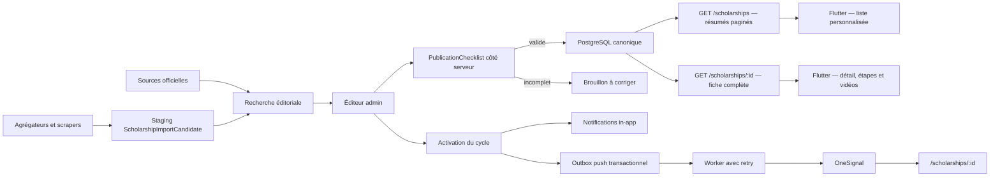

# Architecture exacte d'implémentation — Bourses, vidéos, alertes et guide

Statut : architecture cible validable avant implémentation  
Date : 16 juillet 2026  
Périmètre : Flutter mobile, API NestJS/Prisma, admin Next.js, collecte éditoriale,
YouTube, notifications et garde-fous stores.

## 1. Décisions d'architecture

Les décisions suivantes sont les contraintes de la livraison. Elles évitent de
reconstruire les briques qui fonctionnent déjà et ferment les principaux risques
de qualité.

1. **Une `Scholarship` représente une candidature réellement actionnable.** Une
   bourse dont les critères, la date ou le formulaire changent selon le pays ou
   l'université est déclinée en fiches distinctes. Exemples : « Fulbright —
   Niger » et « Fulbright — Côte d'Ivoire ». `programGroupKey` permet de les
   regrouper sans afficher une fiche vague ou une mauvaise deadline.
2. **PostgreSQL reste la source de vérité publique.** Les scrapers sont des
   outils de découverte. Ils ne publient pas et ne réécrivent jamais une fiche
   approuvée.
3. **La migration est additive.** Les champs actuels, les IDs, les routes et les
   tableaux bilingues restent lisibles pendant toute la transition.
4. **Les critères sont structurés pour le matching et rédigés pour l'étudiant.**
   Un texte libre seul ne permet pas de comparer correctement un âge, une
   nationalité, une note ou une expérience.
5. **La liste et la fiche détaillée deviennent deux contrats API distincts.** La
   liste reste légère et paginée ; les critères, avantages, étapes et vidéos sont
   chargés à l'ouverture de la fiche.
6. **La publication est bloquée par le backend si la fiche est incomplète.** Le
   contrôle ne dépend pas uniquement de l'interface admin.
7. **YouTube est stocké sous forme d'identifiant vidéo, jamais sous forme de
   HTML ou d'iframe fourni par l'admin.**
8. **L'ouverture d'une bourse et les notifications sont idempotentes.** Une
   panne OneSignal ne doit ni perdre le push ni provoquer de doublon.
9. **Le guide reste éditorial dans les builds stores.** Un achat Chariow ne peut
   être activé que dans un canal autorisé et avec un mécanisme fail-closed.

## 2. État réel du dépôt

| Capacité | État | Source actuelle |
| --- | --- | --- |
| Fiche avec description, avantages et critères | Présent | `Scholarship` et `live_scholarships_screen.dart` |
| Étapes « Comment postuler » | Présent | `ScholarshipApplicationStep` |
| Dates estimées et dates confirmées | Présent | `ScholarshipCycle` |
| Bouton « M'avertir » | Présent | `ScholarshipAlertSubscription` |
| Notifications in-app | Présent | `UserNotification` |
| Push OneSignal à l'ouverture | Présent, mais sans retry fiable | `ScholarshipLifecycleService` |
| Modération et activation admin | Présent | `admin/app/scholarships/page.tsx` |
| Vidéo attachée à une bourse | Absent | Nouvelle relation requise |
| Fiche profonde `/scholarships/:id` | Absente | Nouveau contrat et nouvel écran |
| Matching sur règles réelles | Insuffisant | Recherche textuelle sur le niveau |
| Catalogue demandé | Insuffisant | 11 fiches seedées, aucune vraie fiche lycée |
| Pagination mobile | Absente | Limite actuelle : 20 résultats |
| Éditeur admin complet | Absent | Le backend sait modifier les champs, l'UI non |
| Scraping sûr | Insuffisant | 2 sources enregistrées, écriture directe dans `Scholarship` |
| Guide store-safe | Présent | Page interne sans prix ni paiement externe |

Points à corriger avant l'enrichissement :

- `canada_future` et `france_excellence` sont des fiches incomplètes mais sont
  seedées actives et approuvées ;
- le seed réécrit le contenu des bourses existantes et peut écraser une
  correction faite dans l'admin ;
- un scrape marque actuellement une ligne comme vérifiée alors qu'un agrégateur
  n'est pas une vérification officielle ;
- un scraper en erreur peut retourner zéro ligne puis désactiver les anciennes
  lignes de sa source ;
- seuls `GreatYopScraper` et `MastereTnScraper` sont enregistrés ;
- la fiche mobile actuelle est une bottom sheet alimentée par l'objet de liste ;
- les notifications ouvrent `/scholarships` au lieu de la fiche concernée.

## 3. Architecture fonctionnelle cible



### États indépendants à ne pas confondre

- `moderationStatus` : qualité éditoriale (`pending`, `approved`, `rejected`) ;
- `isActive` : visibilité générale de la fiche ;
- `ScholarshipCycle.status` : état de la campagne de candidature (`forecast`,
  `open`, `closed`, `suspended`) ;
- `ScholarshipVideo.status` : publication de la vidéo ;
- `dateConfidence` : différence explicite entre estimation et confirmation.

Une fiche peut donc être approuvée et visible alors que son prochain cycle est
encore estimé. Elle ne peut pas être « ouverte » sans dates confirmées.

## 4. Modèle produit : une fiche = un parcours de candidature

Les programmes génériques doivent être éclatés lorsqu'ils n'ont pas une date et
un formulaire universels.

| Programme générique | Fiche actionnable |
| --- | --- |
| UWC | UWC — comité national du Niger |
| Fulbright Foreign Student | Fulbright — commission/ambassade du pays du candidat |
| Mastercard Foundation Scholars | Mastercard Foundation — université partenaire précise |
| Bourse d'ambassade | Pays de destination + ambassade/pays de résidence précis |

Le champ `programGroupKey` rapproche les variantes pour les statistiques, la
recherche et la déduplication. La date, l'URL de candidature et les critères
restent propres à chaque fiche.

## 5. Schéma Prisma cible

### 5.1 Champs ajoutés à `Scholarship`

```prisma
enum ScholarshipStudyLevel {
  secondary
  bachelor
  master
  doctorate
  postdoctorate
  exchange
  research
}

enum ScholarshipScheduleType {
  annual
  rolling
  one_off
}

model Scholarship {
  // Tous les champs actuels sont conservés.
  slug               String?                  @unique
  programGroupKey    String?
  providerNameFr     String                   @default("")
  providerNameEn     String                   @default("")
  summaryFr          String                   @default("")
  summaryEn          String                   @default("")
  eligibleLevels     ScholarshipStudyLevel[]  @default([])
  scheduleType       ScholarshipScheduleType  @default(annual)
  publishedAt        DateTime?

  criteria           ScholarshipEligibilityCriterion[]
  benefits           ScholarshipBenefit[]
  videos             ScholarshipVideo[]
  moderationEvents   ScholarshipModerationEvent[]
  importCandidates   ScholarshipImportCandidate[]

  @@index([programGroupKey])
}
```

Les champs existants suivants restent disponibles comme fallback :

- `levelEligibleFr` / `levelEligibleEn` ;
- `eligibilityFr` / `eligibilityEn` ;
- `advantagesFr` / `advantagesEn` ;
- `keyRequirementsFr` / `keyRequirementsEn`.

Pendant la transition, l'API lit les relations structurées lorsqu'elles sont
présentes, sinon les anciens tableaux. Aucun champ historique n'est supprimé
dans cette livraison.

### 5.2 Critères d'éligibilité

```prisma
enum ScholarshipCriterionType {
  nationality
  residence
  age
  study_level
  diploma
  academic_grade
  study_field
  language
  work_experience
  prior_admission
  financial_need
  leadership
  exclusion
  other
}

enum ScholarshipCriterionOperator {
  text
  equals
  included_in
  excluded_from
  minimum
  maximum
  between
  boolean
}

enum ScholarshipCriterionImpact {
  hard
  soft
  informational
}

model ScholarshipEligibilityCriterion {
  id             String                     @id @default(cuid())
  scholarshipId  String
  stableKey      String
  criterionType  ScholarshipCriterionType
  operator       ScholarshipCriterionOperator @default(text)
  impact         ScholarshipCriterionImpact @default(hard)
  value          Json?
  titleFr        String
  titleEn        String
  descriptionFr  String                     @default("")
  descriptionEn  String                     @default("")
  isMandatory    Boolean                    @default(true)
  displayOrder   Int
  sourceUrl      String?
  verifiedAt     DateTime?
  createdAt      DateTime                   @default(now())
  updatedAt      DateTime                   @updatedAt
  scholarship    Scholarship                @relation(fields: [scholarshipId], references: [id], onDelete: Cascade)

  @@unique([scholarshipId, stableKey])
  @@unique([scholarshipId, displayOrder])
  @@index([scholarshipId, criterionType])
}
```

`value` est validé selon `criterionType` et `operator`. Exemples valides :

```json
{"min": 14, "scale": 20}
{"minAge": 15, "maxAge": 18, "asOf": "cycle_close"}
{"countryCodes": ["NE", "SN", "BJ"]}
{"tests": [{"name": "IELTS", "minimum": 6.5}]}
{"minimumMonths": 24}
```

Le backend refuse une forme JSON incompatible avec le type. Les codes pays
utilisés dans les règles sont des codes ISO en majuscules et ne dépendent pas
des IDs historiques du catalogue.

### 5.3 Avantages

```prisma
enum ScholarshipBenefitType {
  tuition
  monthly_stipend
  housing
  travel
  visa
  insurance
  books
  installation
  research
  mentorship
  language_course
  other
}

model ScholarshipBenefit {
  id             String                 @id @default(cuid())
  scholarshipId  String
  stableKey      String
  benefitType    ScholarshipBenefitType
  titleFr        String
  titleEn        String
  descriptionFr  String                 @default("")
  descriptionEn  String                 @default("")
  amountMin      Int?
  amountMax      Int?
  currency       String?
  cadence        String?
  displayOrder   Int
  sourceUrl      String?
  verifiedAt     DateTime?
  createdAt      DateTime               @default(now())
  updatedAt      DateTime               @updatedAt
  scholarship    Scholarship            @relation(fields: [scholarshipId], references: [id], onDelete: Cascade)

  @@unique([scholarshipId, stableKey])
  @@unique([scholarshipId, displayOrder])
}
```

Les montants sont facultatifs et exprimés en unités principales de la devise.
Le texte officiel reste obligatoire afin de ne pas transformer une estimation
de montant en promesse.

### 5.4 Étapes « Comment postuler »

Le modèle actuel est conservé et étendu :

```prisma
model ScholarshipApplicationStep {
  // Champs actuels conservés.
  actionUrl           String?
  actionLabelFr       String?
  actionLabelEn       String?
  requiredDocumentsFr String[] @default([])
  requiredDocumentsEn String[] @default([])
}
```

Chaque suppression ou modification doit filtrer sur **`stepId` et
`scholarshipId`**, pas seulement sur `stepId`.

### 5.5 Vidéos YouTube

```prisma
enum ScholarshipVideoKind {
  overview
  eligibility
  application
  testimony
  tips
}

model ScholarshipVideo {
  id                 String               @id @default(cuid())
  scholarshipId      String
  youtubeVideoId     String
  kind               ScholarshipVideoKind @default(overview)
  titleFr            String
  titleEn            String
  descriptionFr      String               @default("")
  descriptionEn      String               @default("")
  thumbnailUrl       String?
  durationSeconds    Int?
  languageCode       String               @default("fr")
  academicYear       String?
  youtubePublishedAt DateTime?
  status             PublicationStatus    @default(draft)
  isFeatured         Boolean              @default(false)
  displayOrder       Int                  @default(0)
  createdAt          DateTime             @default(now())
  updatedAt          DateTime             @updatedAt
  scholarship        Scholarship          @relation(fields: [scholarshipId], references: [id], onDelete: Cascade)

  @@unique([scholarshipId, youtubeVideoId])
  @@index([scholarshipId, status, displayOrder])
}
```

Le backend construit les URLs suivantes ; elles ne sont pas stockées :

- lecture : `https://www.youtube.com/watch?v={youtubeVideoId}` ;
- partage : `https://youtu.be/{youtubeVideoId}` ;
- miniature de secours : `https://i.ytimg.com/vi/{youtubeVideoId}/hqdefault.jpg`.

### 5.6 Cycles et prévisions

Le modèle `ScholarshipCycle` existe déjà. Ajouter :

```prisma
applicationUrl       String?
forecastBasisCycleId String?
revision             Int @default(0)
```

Règles :

- une prévision provient du dernier cycle confirmé ;
- `forecastBasisCycleId` rend cette origine vérifiable ;
- une prévision n'envoie aucune notification ;
- seul un admin peut confirmer et ouvrir le cycle ;
- le cycle public courant est : le cycle `open`, sinon le prochain `forecast`
  par date, jamais simplement le dernier `updatedAt` ;
- un cron horaire ferme les cycles `open` dont `closesAt` est passé ;
- une bourse `rolling` affiche « candidatures continues » et ne reçoit pas de
  fausse estimation annuelle.

### 5.7 Profil nécessaire au matching

Les champs actuels réutilisés sont `targetLevel`, `fieldIds`, `birthDate`,
`gradeRange`, `countryOfResidence`, `targetCountryIds` et `languageLevel`.
Ajouter de manière optionnelle à `UserProfile` :

```prisma
nationalityCountryCode String?
countryOfResidenceCode String?
gradeAverageOn20       Float?
workExperienceMonths   Int?
languageTestScores     Json?
```

`gradeRange` reste le fallback historique. Aucun champ manquant ne rend un
étudiant inéligible : il produit le statut `possibly_eligible` et une demande
de compléter le profil.

### 5.8 Audit de modération

```prisma
model ScholarshipModerationEvent {
  id            String                 @id @default(cuid())
  scholarshipId String
  fromStatus    ScholarshipModeration?
  toStatus      ScholarshipModeration
  reason        String?
  actorId       String
  actorName     String
  snapshot      Json?
  createdAt     DateTime               @default(now())
  scholarship   Scholarship            @relation(fields: [scholarshipId], references: [id], onDelete: Cascade)

  @@index([scholarshipId, createdAt])
}
```

Le rejet exige un motif. L'approbation stocke l'identité de l'opérateur et un
snapshot de la checklist de publication.

## 6. Matching fiable et explicable

Créer `ScholarshipEligibilityService`. Il charge le profil authentifié avec
`req.studentUser.id`. Les query parameters restent des filtres volontaires de
l'écran, pas la source du profil.

### Résultat retourné

```ts
type EligibilityAssessment = {
  status: 'eligible' | 'possibly_eligible' | 'not_eligible';
  relevanceScore: number;
  satisfiedCriteria: string[];
  failedCriteria: string[];
  unknownCriteria: string[];
  missingProfileFields: string[];
  reasons: string[];
};
```

### Algorithme

1. Évaluer toutes les règles `hard`.
2. Une règle `hard` connue et échouée donne `not_eligible`.
3. Aucune règle échouée mais au moins une règle obligatoire inconnue donne
   `possibly_eligible`.
4. Toutes les règles obligatoires connues et satisfaites donnent `eligible`.
5. Calculer séparément un score de pertinence, qui n'est jamais présenté comme
   une probabilité d'admission :
   - `baseMatch` historique ;
   - +25 si le niveau cible correspond ;
   - +10 par filière commune, plafonné à +20 ;
   - +10 si le pays de destination est ciblé ;
   - +5 si le cycle est ouvert ou approche ;
   - total plafonné à 100.
6. Trier d'abord `eligible`, puis `possibly_eligible`, puis par score et date.
7. Masquer `not_eligible` par défaut, avec un filtre « Toutes » explicite.

Le mobile affiche les raisons de compatibilité et les informations manquantes.
Il n'affiche jamais « 85 % de chances d'obtenir la bourse ».

## 7. Contrats API

### 7.1 Étudiant — contrats conservés

- `GET /scholarships`
- `GET /me/scholarship-alerts`
- `POST /me/scholarship-alerts/:scholarshipId`
- `DELETE /me/scholarship-alerts/:scholarshipId`
- `GET /me/notifications`
- `PATCH /me/notifications/:id/read`
- `POST /me/notifications/read-all`

### 7.2 Liste légère

```http
GET /scholarships?lang=fr&studyLevel=master&fundingType=fully_funded&limit=20&offset=0
```

Réponse :

```json
{
  "items": [
    {
      "id": "...",
      "slug": "...",
      "title": "...",
      "summary": "...",
      "countryName": "...",
      "eligibleLevels": ["master"],
      "fundingType": "fully_funded",
      "currentCycle": {},
      "eligibilityAssessment": {},
      "isAlertEnabled": true,
      "hasVideos": true,
      "featuredVideoThumbnailUrl": "..."
    }
  ],
  "total": 31,
  "limit": 20,
  "offset": 0
}
```

Le contrat garde `limit`/`offset`, déjà présents, pour éviter un changement de
pagination inutile. Le score est calculé sur l'ensemble borné des candidats
avant le découpage.

### 7.3 Fiche complète

```http
GET /scholarships/:id?lang=fr
```

Elle renvoie :

- identité, organisme, description et source officielle ;
- niveaux canoniques ;
- `criteria[]` et leur statut pour le profil ;
- `benefits[]` ;
- `howToApply` avec type, URL et `steps[]` ;
- cycle courant et caractère estimé/confirmé ;
- vidéos publiées uniquement ;
- préférences d'alerte de l'utilisateur ;
- date et auteur de dernière vérification publique appropriée.

Un ID inactif, rejeté ou absent renvoie 404. Le deep link Flutter affiche alors
un état « Cette bourse n'est plus disponible » et un bouton vers la liste.

### 7.4 Préférences d'alerte

Ajouter :

```http
PATCH /me/scholarship-alerts/:scholarshipId
```

```json
{"pushEnabled": true, "inAppEnabled": true}
```

Au premier clic « M'avertir », l'abonnement in-app est créé immédiatement.
Flutter demande ensuite la permission système. Si elle est refusée,
`inAppEnabled` reste vrai et `pushEnabled` est remis à faux.

### 7.5 Admin

Conserver les routes actuelles et ajouter :

- `GET /admin/scholarships?q=&status=&level=&page=` ;
- `GET /admin/scholarships/:id` ;
- `POST /admin/scholarships/:id/validate` ;
- `PUT /admin/catalog/scholarships/:id/criteria` ;
- `PUT /admin/catalog/scholarships/:id/benefits` ;
- `POST /admin/catalog/scholarships/:id/videos` ;
- `PATCH /admin/catalog/scholarships/:id/videos/:videoId` ;
- `DELETE /admin/catalog/scholarships/:id/videos/:videoId` ;
- `PATCH /admin/scholarships/:id/cycles/:academicYear` pour fermer/suspendre ;
- `GET /admin/content/youtube-playlist?playlistId=` pour parcourir les playlists
  autorisées et sélectionner une vidéo ;
- `POST /admin/scholarships/:id/approve` avec un motif optionnel ;
- `POST /admin/scholarships/:id/reject` avec un motif obligatoire.

Les entrées de création/mise à jour ne doivent plus être des
`Record<string, unknown>`. Créer des DTO `class-validator` dédiés.

## 8. Backend — responsabilités et fichiers

### Services à créer

Dans `backend/src/modules/scholarships-index/` :

- `scholarships-query.service.ts` : liste et détail publics ;
- `scholarship-eligibility.service.ts` : évaluation explicable ;
- `scholarship-content-quality.service.ts` : checklist serveur ;
- `scholarship-videos.service.ts` : CRUD et publication vidéo ;
- `youtube-url.util.ts` : extraction des formats `watch`, `youtu.be`, `shorts`
  et `embed` ;
- `scholarship-cycle-cron.service.ts` : fermeture et génération de prévisions ;
- `scholarship-import.service.ts` : staging des découvertes ;
- `notification-outbox-worker.service.ts` : push et retry.

### Services actuels à modifier

- `scholarships-index.service.ts` devient l'orchestrateur du refresh/staging et
  ne contient plus la requête publique complète ;
- `scholarship-lifecycle.service.ts` appelle la checklist et écrit l'outbox ;
- `scholarship-alerts.service.ts` gère les préférences de canal ;
- `admin-scholarships.controller.ts` expose détail, validation et cycle ;
- `admin-catalog.service.ts` gère les relations structurées en transaction ;
- `youtube.service.ts` reste le client YouTube commun ;
- `app.module.ts` enregistre les nouveaux services et crons.

### DTO à créer

- `dto/create-scholarship.dto.ts`
- `dto/update-scholarship.dto.ts`
- `dto/replace-scholarship-criteria.dto.ts`
- `dto/replace-scholarship-benefits.dto.ts`
- `dto/create-scholarship-video.dto.ts`
- `dto/update-scholarship-video.dto.ts`
- `dto/update-scholarship-alert.dto.ts`
- `dto/moderate-scholarship.dto.ts`

Les remplacements de critères et d'avantages sont atomiques : valider le tableau
complet, puis remplacer dans une transaction. L'admin ne peut jamais laisser un
demi-enregistrement bilingue.

## 9. Checklist de publication

`ScholarshipContentQualityService` renvoie :

```ts
type PublicationReadiness = {
  ready: boolean;
  score: number;
  blockers: string[];
  warnings: string[];
};
```

L'approbation et l'activation sont refusées si :

- noms, résumé ou description FR/EN manquent ;
- aucun niveau canonique n'est défini ;
- aucun critère obligatoire structuré n'existe ;
- un critère n'a pas de traduction ou de source ;
- aucun avantage structuré n'existe ;
- un avantage n'a pas de traduction ou de source ;
- l'URL officielle ou l'URL de candidature n'est pas HTTPS ;
- aucune étape « Comment postuler » n'existe ;
- `lastVerifiedAt` manque ou dépasse 30 jours ;
- une bourse annuelle n'a aucun cycle estimé/confirmé ;
- la clôture est antérieure ou égale à l'ouverture ;
- le pays, le financement ou l'organisme manque.

Warnings non bloquants :

- aucune vidéo ;
- aucune miniature personnalisée ;
- aucun montant structuré ;
- aucun champ de filière pour le matching.

L'activation ne doit plus changer implicitement une fiche incomplète en
`approved`. Elle exige que la fiche soit déjà approuvée et toujours `ready`.

## 10. Notifications fiables

### Outbox transactionnel

```prisma
enum NotificationOutboxStatus {
  queued
  processing
  sent
  failed
  skipped
}

model NotificationOutbox {
  id                String                   @id @default(cuid())
  userId            String
  scholarshipId     String?
  cycleId           String?
  channel           NotificationChannel
  eventKind         String
  dedupeKey         String                   @unique
  titleFr           String
  titleEn           String
  bodyFr            String
  bodyEn            String
  payload           Json?
  status            NotificationOutboxStatus @default(queued)
  attempts          Int                      @default(0)
  nextAttemptAt     DateTime                 @default(now())
  lockedAt          DateTime?
  lockedBy          String?
  providerMessageId String?
  lastError         String?
  sentAt            DateTime?
  createdAt         DateTime                 @default(now())
  updatedAt         DateTime                 @updatedAt

  @@index([status, nextAttemptAt])
  @@index([userId, createdAt])
}
```

La transaction d'activation :

1. vérifie la checklist ;
2. crée/met à jour le cycle avec `activationKey` ;
3. met `deadlineAt` à jour ;
4. crée les `UserNotification` in-app avec `skipDuplicates` ;
5. crée les lignes push dans l'outbox ;
6. écrit l'événement d'audit ;
7. commit.

Clés de déduplication :

```text
scholarship-opened:{cycleId}:{userId}:in_app
scholarship-opened:{cycleId}:{userId}:push
```

Le worker traite 100 lignes par batch, toutes les minutes, avec verrouillage,
cinq tentatives et délais 1, 5, 30 et 120 minutes. Après la dernière tentative,
la ligne reste `failed` et visible dans l'admin. Une réactivation de la même
bourse ne recrée aucune ligne.

Le résultat admin devient `notificationsQueued`, et non `pushesSent`.

### Deep link

Toutes les notifications de bourse utilisent :

```text
/scholarships/{scholarshipId}
```

Flutter met en attente une route reçue avant le chargement du routeur ou de
l'authentification, puis la consomme après `AppBootScreen`.

## 11. Scrapers et staging

### Table de découverte

```prisma
model ScholarshipImportCandidate {
  id                     String       @id @default(cuid())
  sourcePrefix           String
  sourceKey              String
  contentHash            String
  canonicalScholarshipId String?
  payload                Json
  status                 String       @default("pending")
  discoveredAt           DateTime     @default(now())
  lastSeenAt             DateTime     @default(now())
  reviewedAt             DateTime?
  reviewedById           String?
  rejectionReason        String?
  scholarship            Scholarship? @relation(fields: [canonicalScholarshipId], references: [id], onDelete: SetNull)

  @@unique([sourcePrefix, sourceKey, contentHash])
  @@index([status, discoveredAt])
}
```

Le contrat scraper devient :

```ts
type ScrapeResult = {
  status: 'success' | 'partial' | 'failed';
  rows: ScrapedScholarship[];
  error?: string;
};
```

Règles :

- un scrape écrit uniquement dans le staging ;
- `lastSeenAt` n'est pas `lastVerifiedAt` ;
- seule une source officielle vérifiée par un opérateur renseigne
  `lastVerifiedAt` ;
- aucune désactivation n'est autorisée si le résultat est `partial` ou
  `failed` ;
- un résultat vide réussi doit passer un seuil de sécurité avant toute action ;
- GreatYop et Mastere.tn restent des sources de découverte ;
- les scrapers stub/non autorisés restent désactivés ;
- `KPB_SCHOLARSHIP_SCRAPERS_ENABLED=false` par défaut jusqu'au staging complet.

## 12. Architecture admin

Le fichier `admin/app/scholarships/page.tsx` approche 1 000 lignes. Il reste la
liste et la file de modération, mais l'éditeur est séparé.

### Routes

- `admin/app/scholarships/page.tsx`
- `admin/app/scholarships/new/page.tsx`
- `admin/app/scholarships/[id]/page.tsx`

### Composants

- `admin/components/scholarships/ScholarshipForm.tsx`
- `admin/components/scholarships/EligibilityCriteriaEditor.tsx`
- `admin/components/scholarships/BenefitsEditor.tsx`
- `admin/components/scholarships/ApplicationStepsEditor.tsx`
- `admin/components/scholarships/ScholarshipVideosEditor.tsx`
- `admin/components/scholarships/ScholarshipCycleEditor.tsx`
- `admin/components/scholarships/PublicationChecklist.tsx`
- `admin/components/scholarships/ModerationHistory.tsx`

### Sections de l'éditeur

1. Identité, organisme, destination et groupe de programme.
2. Résumé et description FR/EN.
3. Niveaux et financement.
4. Critères structurés et sources.
5. Avantages structurés et montants.
6. Étapes et documents requis.
7. Vidéos.
8. Cycle estimé/confirmé.
9. Vérification, checklist et historique.

### YouTube dans l'admin

- accepter une URL complète ou un ID ;
- extraire l'ID côté backend ;
- afficher une prévisualisation
  `https://www.youtube-nocookie.com/embed/{id}` ;
- permettre plusieurs vidéos, leur langue, type, ordre et publication ;
- proposer les vidéos des deux playlists KPB via `YoutubeService` ;
- protéger cet endpoint par l'auth admin et une allowlist de playlists ;
- ne jamais enregistrer de HTML fourni par l'utilisateur.

La vidéo reste facultative pour publier une bourse. Elle ne doit pas retarder
les fiches dont les informations officielles sont complètes.

## 13. Architecture Flutter

### Fichiers à créer

- `lib/app/features/scholarships/scholarships_controller.dart`
- `lib/app/features/scholarships/scholarship_detail_screen.dart`
- `lib/app/features/scholarships/scholarship_video_player_screen.dart`
- `lib/app/features/scholarships/widgets/scholarship_video_card.dart`
- `lib/app/features/scholarships/widgets/how_to_apply_sheet.dart`
- `lib/app/features/scholarships/widgets/eligibility_assessment_card.dart`

### Fichiers à modifier

- `lib/app/core/models/catalog.dart`
- `lib/app/core/repositories/app_api_client.dart`
- `lib/app/core/config/app_routes.dart`
- `lib/app/core/navigation/app_navigation.dart`
- `lib/app/core/services/onesignal_service.dart`
- `lib/app/features/scholarships/live_scholarships_screen.dart`
- `lib/app/features/notifications/notifications_screen.dart`
- `lib/app/features/home/home_screen.dart`
- `lib/app/core/translations/app_translations.dart`
- `lib/app/core/observability/analytics_event_contract.dart`

### État et pagination

`ScholarshipsController` possède :

- la liste paginée et `total` ;
- `limit=20`, `offset`, `hasMore` et état de chargement suivant ;
- les filtres ;
- les IDs alertés ;
- un cache `Map<String, ScholarshipDetailModel>` ;
- le chargement/rafraîchissement d'une fiche ;
- la mise à jour optimiste des alertes avec rollback.

La liste déclenche le chargement suivant à l'approche de la fin. Elle ne fixe
jamais le nombre total au premier lot de 20.

### Navigation

Ajouter :

```dart
static const scholarshipDetail = '/scholarships/:id';
```

`normalizeExternalRoute` n'accepte qu'un segment non vide après
`/scholarships/`. Une carte, une notification, un résultat de recherche et une
bourse de la Home ouvrent tous la même route.

### Ordre de la fiche

1. titre, organisme, destination, financement et deadline ;
2. statut de compatibilité et raisons ;
3. « M'avertir » et sauvegarde ;
4. description ;
5. bouton « Comment postuler » ;
6. avantages ;
7. critères d'éligibilité ;
8. vidéos explicatives ;
9. formulaire officiel ;
10. accompagnement KPB.

Le bouton « Comment postuler » ouvre `HowToApplySheet` et réutilise
`ApplicationStepsTimeline`. Les étapes ne sont plus imposées dans la longueur de
la fiche principale.

### Lecteur vidéo

- la fiche affiche uniquement des miniatures ;
- le clic ouvre `ScholarshipVideoPlayerScreen` ;
- un seul `YoutubePlayerController` est créé ;
- `autoPlay: false` ;
- le contrôleur est toujours disposé ;
- « Voir sur YouTube » sert de fallback si l'intégration est refusée par la
  vidéo ;
- le partage utilise l'URL canonique `youtu.be` ;
- aucun lecteur n'est placé dans les cartes de liste.

La mise en œuvre réutilise les patterns de `parcours_screen.dart` et
`academy_player_screen.dart` ainsi que `youtube_player_flutter` déjà installé.

### Accessibilité et données mobiles

- cibles tactiles d'au moins 48 dp ;
- `Semantics(toggled: ...)` pour « M'avertir », avec le nom de la bourse ;
- titres de sections annoncés comme headers ;
- miniature annoncée avec titre, langue et action ;
- aucune information portée uniquement par la couleur ou un drapeau ;
- un seul lecteur actif ;
- détails et vidéos chargés seulement à l'ouverture.

## 14. Catalogue initial et opérations éditoriales

### Objectif de lancement

Pour éviter de gonfler artificiellement les volumes avec les mêmes programmes
multi-niveaux, le lancement exige :

- 3 fiches lycée/secondaire ;
- au moins 12 fiches éligibles en Licence/Bachelor, avec une cible de 15 ;
- au moins 15 fiches éligibles en Master, avec une cible de 20 ;
- au moins 25 fiches actionnables uniques publiées au total.

Une fiche multi-niveau compte dans chaque segment concerné, mais le minimum de
25 fiches uniques reste obligatoire.

### Données versionnées pour l'import initial

- `backend/prisma/data/scholarships/secondary/*.json`
- `backend/prisma/data/scholarships/bachelor/*.json`
- `backend/prisma/data/scholarships/master/*.json`
- `backend/scripts/validate-scholarship-catalog.ts`
- `backend/scripts/import-scholarships-v1.ts`

L'import est `--dry-run` par défaut. `--apply` crée les fiches absentes et ne
réécrit pas une fiche existante éditée dans l'admin. Un remplacement doit être
explicitement demandé avec un mode séparé et audité.

### Workflow éditorial

1. Recherche d'une opportunité sur une source officielle.
2. Création en `pending`.
3. Saisie complète FR/EN des critères, avantages et étapes.
4. Saisie du dernier cycle confirmé et calcul de la prochaine estimation.
5. Ajout éventuel des vidéos KPB.
6. Vérification par un second opérateur.
7. Passage de la checklist backend.
8. Approbation et publication.
9. À l'ouverture officielle : vérification des nouvelles dates puis activation.

### SLA de vérification

- fiche normale : 30 jours ;
- cycle ouvert : 7 jours ;
- estimation dont l'ouverture est attendue dans les 30 jours : contrôle
  hebdomadaire ;
- source indisponible ou contradictoire : suspension de la fiche, jamais
  remplacement silencieux par un agrégateur.

## 15. Guide Ultime du Boursier

La page éditoriale interne et le bouton « En savoir plus » restent la version
de lancement pour les builds App Store/Google Play.

Architecture fail-closed :

- `KPB_STORE_BUILD=true` désactive toute URL de paiement dans le binaire ;
- `guideInfoEnabled` peut masquer la page ;
- `guideExternalPurchaseEnabled` est faux par défaut et ne peut jamais
  surcharger `KPB_STORE_BUILD=true` ;
- `guideExternalPurchaseUrl` n'est lu que dans un canal direct autorisé ;
- les notifications stores peuvent promouvoir du contenu éducatif interne,
  jamais un achat externe hebdomadaire, un prix ou Chariow ;
- les campagnes web/email directes restent séparées ;
- une vente future dans l'app passe par les mécanismes de paiement du store ou
  une exception officiellement validée.

Référence produit : `docs/scholarships-guide-store-safety.md`.

## 16. Analytics

Ajouter au contrat existant :

- `scholarship_list_viewed` ;
- `scholarship_detail_viewed` ;
- `scholarship_alert_subscribed` ;
- `scholarship_alert_unsubscribed` ;
- `scholarship_how_to_apply_opened` ;
- `scholarship_video_started` ;
- `scholarship_video_completed` ;
- `scholarship_official_application_opened` ;
- `scholarship_notification_opened` ;
- `scholarship_guide_viewed`.

Dimensions autorisées : ID de bourse, niveau, pays de destination, type de
financement, type de vidéo, cycle et source de navigation. Ne jamais envoyer le
nom, l'email, la nationalité ou les notes dans Analytics.

Funnel principal :

```text
Liste → Fiche → M'avertir / Comment postuler → Vidéo → Formulaire officiel
```

## 17. Migrations et ordre de déploiement

### Précondition bloquante

Ne créer ni appliquer une nouvelle migration avant d'avoir réconcilié
`_prisma_migrations` et les dossiers locaux. L'état connu de cette branche
comprend notamment :

- une migration enregistrée en base mais absente localement :
  `20260705180000_remap_legacy_field_ids` ;
- des migrations locales à confirmer/appliquer :
  `20260708120000_add_parcours_stories`,
  `20260712143000_add_tuition_budget_and_currency` et
  `20260716165000_add_scholarship_cycles_alerts` ;
- `npx prisma migrate status` renvoie actuellement une erreur du moteur de
  schéma dans l'environnement local.

Restaurer le fichier canonique manquant depuis l'historique/branche de référence
ou établir un baseline documenté. Ne jamais utiliser `migrate resolve` à
l'aveugle.

### Séquence additive

1. `20260717xxxx_add_scholarship_structured_content_and_videos`
   - enums, champs nullable/default, critères, avantages, vidéos, audit ;
   - champs profil optionnels ;
   - extensions des étapes et cycles.
2. Déployer la lecture double et les DTO.
3. Exécuter un backfill idempotent des 11 fiches existantes.
4. `20260717xxxx_add_scholarship_notification_outbox`.
5. Déployer le worker et basculer l'activation vers l'outbox.
6. `20260717xxxx_add_scholarship_import_staging`.
7. Déployer le staging puis seulement réactiver les scrapers.
8. Importer le catalogue initial vérifié.
9. Rendre `slug` non-null dans une migration ultérieure, après vérification du
   backfill.

À chaque étape : `npx prisma generate`, lint, tests, build et migration sur une
base fraîche CI avant `prisma migrate deploy` en production.

## 18. Plan d'implémentation et dépendances

### Phase 0 — Stabiliser l'historique Prisma

- réconcilier les migrations ;
- figer les contrats API actuels par tests ;
- retirer les deux fiches incomplètes de la publication ou les compléter ;
- conserver `KPB_MVP_ONLY`/scraping automatique désactivé.

Sortie : `prisma migrate status` propre et base CI fraîche verte.

### Phase 1 — Schéma et contrats

- ajouter contenu structuré, vidéos, audit et champs de matching ;
- ajouter détail public et liste légère paginée ;
- ajouter les DTO ;
- lecture double legacy/structurée.

Sortie : backend compatible avec l'app actuelle et le futur admin.

### Phase 2 — Admin complet

- séparer liste et éditeur ;
- critères, avantages, étapes, vidéos et cycles ;
- checklist serveur ;
- historique de modération ;
- navigateur des playlists KPB.

Sortie : une bourse complète peut être créée sans modifier le code.

### Phase 3 — Flutter détail et YouTube

- controller, pagination et cache ;
- route profonde ;
- écran détail ;
- sheet « Comment postuler » ;
- lecteur vidéo et partage ;
- navigation exacte depuis Home, recherche et notifications.

Sortie : plus de 20 bourses sont visibles et chaque fiche est partageable.

### Phase 4 — Notifications fiables

- outbox et worker ;
- préférences de canaux ;
- deep links à froid ;
- compteur non lu serveur dans la Home ;
- fermeture automatique des cycles.

Sortie : une panne OneSignal est retentée sans doublon.

### Phase 5 — Données

- importer 3/12/15 fiches minimum et viser 3/15/20 sans réduire la qualité ;
- appliquer le workflow à deux opérateurs ;
- associer les vidéos existantes pertinentes ;
- corriger les IDs pays et les dates ;
- ne publier que les fiches `ready`.

Sortie : au moins 25 opportunités uniques actionnables.

### Phase 6 — QA et lancement progressif

- analytics ;
- tests store-safe du guide ;
- rollout staging puis production ;
- surveillance des erreurs API, outbox, clics et sources expirées.

Après la Phase 1, les chantiers admin, Flutter et collecte éditoriale peuvent
avancer en parallèle sur les contrats figés. La bascule des notifications attend
la migration outbox.

## 19. Tests obligatoires

### Backend

- lecture legacy et structurée ;
- validation de chaque forme de critère ;
- matching `eligible`, `possibly_eligible`, `not_eligible` ;
- score explicable ;
- checklist bloquante ;
- parsing `watch`, `youtu.be`, `shorts`, `embed` et URL invalide ;
- unicité vidéo/bourse ;
- détail public excluant les vidéos brouillon ;
- pagination au-delà de 20 ;
- activation idempotente ;
- prévision sans notification ;
- fermeture automatique ;
- panne OneSignal puis retry ;
- contrôle d'appartenance des étapes ;
- scraper échoué sans désactivation ;
- import dry-run et idempotent ;
- volumes minimums par niveau.

### Admin

- création/édition bilingue ;
- réorganisation des critères, avantages, étapes et vidéos ;
- prévisualisation vidéo ;
- checklist visible et blocage backend ;
- rejet avec motif ;
- estimation puis activation confirmée.

### Flutter

- pagination et filtres ;
- fiche chargée depuis un deep link sans objet de liste ;
- état 404 propre ;
- bouton « Comment postuler » ;
- lecteur unique, `autoPlay: false` et dispose ;
- fallback vers YouTube ;
- alerte avec permission acceptée/refusée ;
- notification à froid vers la bonne fiche ;
- badge non lu ;
- accessibilité et traductions FR/EN.

### Gates de livraison

```text
Flutter : flutter analyze
          flutter test --dart-define=KPB_ENABLE_REMOTE_SYNC=false

Backend : npm run lint
          npm test -- --runInBand
          npm run build
          npx prisma migrate deploy sur PostgreSQL vierge
          npm run prisma:seed

Admin   : npm run lint
          npm run build
          npm audit --omit=dev
```

## 20. Definition of Done

La fonctionnalité est prête lorsque :

- au moins 3 fiches secondaires, 12 Bachelor et 15 Master sont publiées, avec
  une cible de lancement de 3/15/20 ;
- le catalogue contient au moins 25 candidatures uniques ;
- chaque fiche publique est bilingue, vérifiée depuis moins de 30 jours et
  possède une source officielle, un formulaire, des critères, des avantages et
  des étapes ;
- les dates estimées sont visuellement distinctes des dates confirmées ;
- toutes les fiches sont visibles grâce à la pagination ;
- « M'avertir » crée au minimum une notification in-app ;
- une activation répétée ne crée aucun doublon ;
- un push ouvre directement la bonne fiche, y compris à froid ;
- les vidéos publiées se lisent dans l'app et ont un fallback YouTube ;
- aucune vidéo n'est requise pour publier une fiche complète ;
- le guide store ne contient ni prix, ni Chariow, ni achat externe ;
- toutes les gates CI ci-dessus sont vertes.
